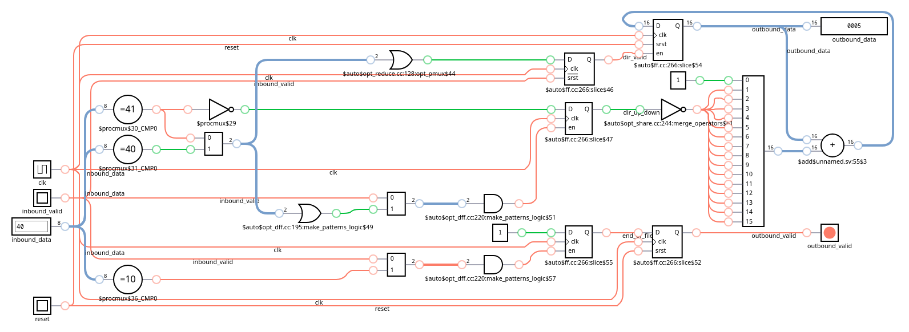

# 2015 Day 1: Not Quite Lisp

The puzzle description rates itself as a easy one, let's find out.

Status:

| Test                       | Status                |
|----------------------------|-----------------------|
| Simulation: Icarus Verilog | :white_check_mark: Ok |
| Simulation: Verilator      | :white_check_mark: Ok |
| Simulation: Vivado Xsim    | :white_check_mark: Ok |
| Synthesis: Vivado Zynq7    | :white_check_mark: Ok |
| On-board: Zynq7            | :white_check_mark: Ok |

# Lessons Learnt

- Surprised to find the simulator bundled with Vivado (xsim) being more pedantic then Icarus Verilog 

# Puzzle Statement

> An opening parenthesis, (, means he should go up one floor, and a closing parenthesis, ), means he should go down one floor.
> 
> To what floor do the instructions take Santa?

The input contents is composed of only two types of characters:

- Opening parenthesis `(`
- Closing parenthesis `)`

Finding the solution requires counting the imbalance between both types, unmatched opening parenthesis results in positive floor count and conversely outnumbering closing parenthesis in negative floor count.

# Design Space Exploration

Due to the simple nature of this puzzle I feel that doing a full blown analysis would be overkill. Counting the input contents size result in exactly 7000 chars, meaning that assuming this length remains the same for all participants the answer to this puzzle is anywhere between -7000 and 7000 (though I have doubts that the number would be negative).

Regardless of the sign, 16 bits are enough for encoding all possible arrangements.

# Implementation

The implementation relies on the common fondation with the following files copy-pasted from other puzzles:

| Module                                          | Description                      | Complexity          | Thoughts       | Remarks  |
|-------------------------------------------------|----------------------------------|---------------------|----------------|----------|
| [`user_logic_tb`](user_logic_tb.sv)             | Testbench                        | :large_blue_circle: | :kissing_smiling_eyes: Copy-paste from previous puzzle | |
| [`user_logic`](user_logic.sv)                   | Logic top-level                  | :large_blue_circle: | :relaxed: Wire harness and trivial logic | |
| [`tap_decoder`](tap_decoder.sv)                 | JTAG TAP deserializer            | :large_blue_circle: | :kissing_smiling_eyes: Copy-paste from previous puzzle | |
| [`tap_encoder`](tap_encoder.sv)                 | JTAG TAP serializer              | :large_blue_circle: | :kissing_smiling_eyes: Copy-paste from previous puzzle | |

## Base Iteration

In this iteration I will proceed to simply count the number of character bytes different from new-lines and null bytes.

The result should match 7000.

### Implementation

Directly in `user_logic.sv`:

```verilog
// from `man ascii`
typedef enum byte {
    LF_CHAR = 8'h0A,
    L_PAREN_CHAR = 8'h28, // `(`
    R_PAREN_CHAR = 8'h29 // `)`
} char_t;

always_ff @(posedge tck) begin
    dir_valid <= 1'b0;
    if (inbound_valid) begin
        unique case (inbound_data)
            L_PAREN_CHAR, R_PAREN_CHAR: begin
                dir_valid <= 1'b1;
            end
            LF_CHAR: begin
                end_of_file <= 1'b1;
            end
            default: begin
            end
        endcase
    end
end

always_ff @(posedge tck) begin
    if (test_logic_reset) begin
        outbound_valid <= 1'b0;
        outbound_data <= '0;
    end else begin
        outbound_valid <= end_of_file;
        if (dir_valid) begin
            outbound_data <= outbound_data + 1'b1;
        end
    end
end
```

### Run Times

Full simulation: compilation and runtime (low-spec laptop):

| Run Times | Icarus Verilog | Verilator | Vivado Xsim | Vivado FPGA Build |
|-----------|----------------|-----------|-------------|-------------------|
| Real      | 0.954s         | 7.475s    | 11.659s     | 2m20.856s         |
| User      | 0.918s         | 27.751s   | 11.181s     | 2m25.140s         |
| Sys       | 0.029s         | 2.696s    | 1.457s      | 0m10.786s         |

### Resource Usage

| Ref Name | Used | Functional Category |
|----------|------|---------------------|
| FDRE     |   60 |        Flop & Latch |
| LUT3     |   17 |                 LUT |
| CARRY4   |    4 |          CarryLogic |
| LUT6     |    2 |                 LUT |
| LUT5     |    2 |                 LUT |
| LUT2     |    2 |                 LUT |
| LUT4     |    1 |                 LUT |
| LUT1     |    1 |                 LUT |
| BUFG     |    1 |               Clock |
| BSCANE2  |    1 |              Others |

## Puzzle Solver Iteration

This puzzle being simple, a single iteration easily covers the complete puzzle solving logic.

### Implementation

I moved the decoding logic in a separate module [`floor_tracker`](floor_tracker.sv) module.

```diff
always_ff @(posedge tck) begin
    dir_valid <= 1'b0;
    if (inbound_valid) begin
        unique case (inbound_data)
-            L_PAREN_CHAR, R_PAREN_CHAR: begin
+            L_PAREN_CHAR: begin
                dir_valid <= 1'b1;
+            end else begin
+            R_PAREN_CHAR: begin
+                dir_valid <= 1'b1;
+            end
+            LF_CHAR: begin
+                end_of_file <= 1'b0;
            end
            default: begin
            end
        endcase
    end
end

always_ff @(posedge tck) begin
    if (test_logic_reset) begin
        outbound_valid <= 1'b0;
        outbound_data <= '0;
    end else begin
        outbound_valid <= end_of_file;
        if (dir_valid) begin
-            outbound_data <= outbound_data + 1'b1;
+        if (dir_up_down) begin
+            outbound_data <= outbound_data + 1'b1;
+        end else begin
+            outbound_data <= outbound_data - 1'b1;
        end
    end
end
```

The solving logic synthesizes nicely:


### Design Components

| Module                                          | Description                      | Complexity          | Thoughts       | Remarks  |
|-------------------------------------------------|----------------------------------|---------------------|----------------|----------|
| [`user_logic_tb`](user_logic_tb.sv)             | Testbench                        | :large_blue_circle: | :kissing_smiling_eyes: Copy-paste from previous puzzle | |
| [`user_logic`](user_logic.sv)                   | Logic top-level                  | :large_blue_circle: | :kissing_smiling_eyes: Simplified after moving logic | |
| [`tap_decoder`](tap_decoder.sv)                 | JTAG TAP deserializer            | :large_blue_circle: | :kissing_smiling_eyes: Copy-paste from previous puzzle | |
| [`floor_tracker`](floor_tracker.sv)             | Puzzle solving logic             | :large_blue_circle: | :kissing_smiling_eyes: Totaly as expected | Maps very nicely in digital logic |
| [`tap_encoder`](tap_encoder.sv)                 | JTAG TAP serializer              | :large_blue_circle: | :kissing_smiling_eyes: Copy-paste from previous puzzle | |

### Run Times

Full simulation: compilation and runtime (low-spec laptop):

| Run Times | Icarus Verilog | Verilator | Vivado Xsim | Vivado FPGA Build |
|-----------|----------------|-----------|-------------|-------------------|
| Real      | 0.847s         | 7.060s    | 12.065s     | 2m26.276s         |
| User      | 0.778s         | 27.345s   | 10.454s     | 2m31.142s         |
| Sys       | 0.048s         | 2.883s    | 1.981s      | 0m11.570s         |

### Resource Usage

| Ref Name | Used | Functional Category |
|----------|------|---------------------|
| FDRE     |   61 |        Flop & Latch |
| LUT2     |   18 |                 LUT |
| LUT3     |   17 |                 LUT |
| LUT4     |    4 |                 LUT |
| CARRY4   |    4 |          CarryLogic |
| LUT5     |    2 |                 LUT |
| LUT6     |    1 |                 LUT |
| LUT1     |    1 |                 LUT |
| BUFG     |    1 |               Clock |
| BSCANE2  |    1 |              Others |
