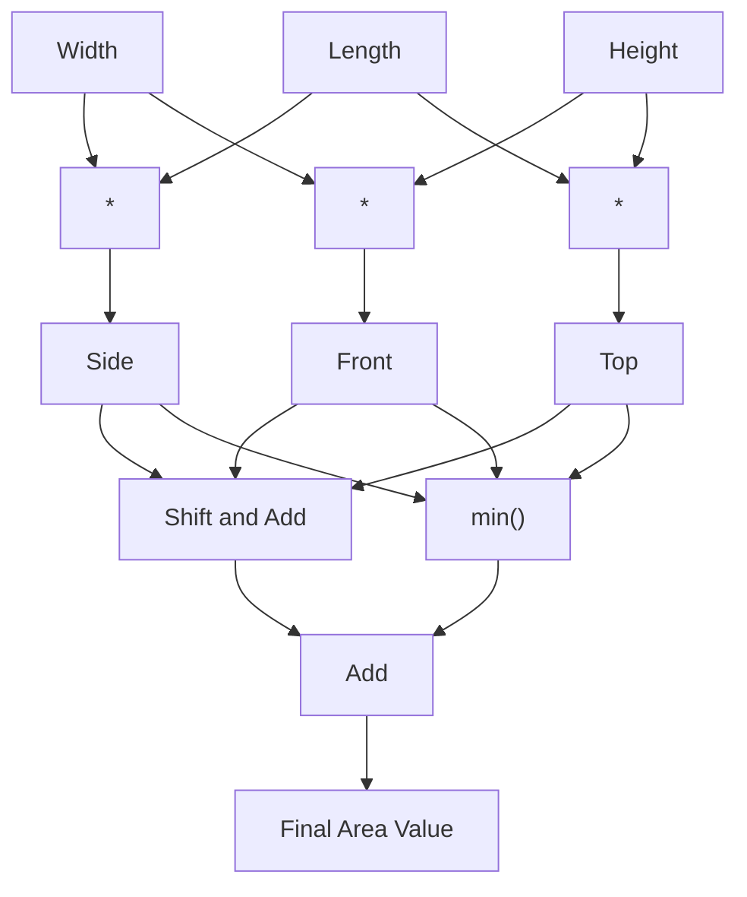
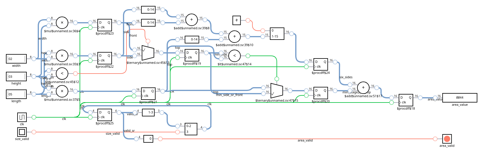

# 2015 Day 2: I Was Told There Would Be No Math - Part 1

Small problem, implemented pipelined maths for the no reasons other than a weird flex.

Status:

| Test                       | Status                |
|----------------------------|-----------------------|
| Simulation: Icarus Verilog | :white_check_mark: Ok |
| Simulation: Verilator      | :white_check_mark: Ok |
| Simulation: Vivado Xsim    | :white_check_mark: Ok |
| Synthesis: Vivado Zynq7    | :white_check_mark: Ok |
| On-board: Zynq7            | :white_check_mark: Ok |

# Lessons Learnt

- Re-read twice, implement once

# Puzzle Statement

> - A list of the dimensions (length l, width w, and height h).
> - Find the surface area of the box, which is 2*l*w + 2*w*h + 2*h*l.
> - extra paper for each present: the area of the smallest side.

I'm expected to compute the following:

$$Answer = 2 \times l \times w + 2 \times w \times h + 2 \times h \times l + min(l \times w, w \times h, h \times l)$$

# Design Space Exploration

With the help of a small Python script, I came across the following properties for my custom puzzle input:

```
Total: 1000 presents
Length: min=1
Length: max=30
Length: sum=46619
Length: avg=~15
```

The most important is the two digit maximum which impacts the complete design.

Relying on the equation above, the max result value is:

$$max(Answer) = 1000 \times (6 \times 30 \times 30 + 30) = 5430000$$

The minimum required number of bits being $$bits=clog_2(5430000)=23$$. For convience I will round-up to 32.

# Implementation

## First Iteration

The input conforms to the following format: `\d\d?x\d\d?x\d\d?`. The first implementation consists in creating a module `line_decoder` for capturing the ASCII decimals, converting them into binary and drive a strobe (valid) and end-of-file flag.

### Design Components

| Module                                          | Description                      | Complexity          | Thoughts       | Remarks  |
|-------------------------------------------------|----------------------------------|---------------------|----------------|----------|
| [`user_logic_tb`](user_logic_tb.sv)             | Testbench                        | :large_blue_circle: | :kissing_smiling_eyes: Copy-paste from previous puzzle | |
| [`user_logic`](user_logic.sv)                   | Logic top-level                  | :large_blue_circle: | :kissing_smiling_eyes: Simplified after moving logic | |
| [`tap_decoder`](tap_decoder.sv)                 | JTAG TAP deserializer            | :large_blue_circle: | :kissing_smiling_eyes: Copy-paste from previous puzzle | |
| [`line_decoder`](line_decoder.sv)               | Captures decimal chars           | :large_blue_circle: | :kissing_smiling_eyes: Straightforward | |
| [`tap_encoder`](tap_encoder.sv)                 | JTAG TAP serializer              | :large_blue_circle: | :kissing_smiling_eyes: Copy-paste from previous puzzle | |

### Resource Usage

|      Instance      |    Module    | Total LUTs | Logic LUTs | LUTRAMs | SRLs | FFs | RAMB36 | RAMB18 | DSP Blocks |
|--------------------|--------------|------------|------------|---------|------|-----|--------|--------|------------|
| shell              |        (top) |         94 |         94 |       0 |    0 | 149 |      0 |      0 |          0 |

Unsurprisingly, LUT3 usage is relatively high due to a high usage of 2:1 muxes.

| Ref Name | Used | Functional Category |
|----------|------|---------------------|
| FDRE     |  149 |        Flop & Latch |
| LUT3     |   42 |                 LUT |
| LUT2     |   38 |                 LUT |
| LUT4     |   21 |                 LUT |
| LUT5     |   18 |                 LUT |
| CARRY4   |   16 |          CarryLogic |
| LUT6     |   10 |                 LUT |
| LUT1     |    3 |                 LUT |
| BUFG     |    1 |               Clock |
| BSCANE2  |    1 |              Others |

## Second Iteration

Added the area computation logic in the [`area_compute`](area_compute.sv) module.

Due to the dimension values being held stable several cycles after the strobe is deasserted, I didn't took care of matching the cycle delays in this module.



This module implements maps quite nicely in hardware:



### Design Components

| Module                                          | Description                      | Complexity          | Thoughts       | Remarks  |
|-------------------------------------------------|----------------------------------|---------------------|----------------|----------|
| [`user_logic_tb`](user_logic_tb.sv)             | Testbench                        | :large_blue_circle: | :kissing_smiling_eyes: Copy-paste from previous puzzle | |
| [`user_logic`](user_logic.sv)                   | Logic top-level                  | :large_blue_circle: | :kissing_smiling_eyes: Simplified after moving logic | |
| [`tap_decoder`](tap_decoder.sv)                 | JTAG TAP deserializer            | :large_blue_circle: | :kissing_smiling_eyes: Copy-paste from previous puzzle | |
| [`line_decoder`](line_decoder.sv)               | Captures decimal chars           | :large_blue_circle: | :kissing_smiling_eyes: Straightforward | |
| [`area_compute`](area_compute.sv)               | Computes area per each present   | :large_blue_circle: | :kissing_smiling_eyes: No sweat | Misread initial puzzle statement, started with wrong `min()` args |
| [`tap_encoder`](tap_encoder.sv)                 | JTAG TAP serializer              | :large_blue_circle: | :kissing_smiling_eyes: Copy-paste from previous puzzle | |

### Run Times

Full simulation: compilation and runtime (low-spec laptop):

| Run Times | Icarus Verilog | Verilator | Vivado Xsim | Vivado FPGA Build |
|-----------|----------------|-----------|-------------|-------------------|
| Real      | FIXME          | FIXME     | FIXME       | FIXME             |
| User      | FIXME          | FIXME     | FIXME       | FIXME             |
| Sys       | FIXME          | FIXME     | FIXME       | FIXME             |

### Resource Usage

|      Instance      |    Module    | Total LUTs | Logic LUTs | LUTRAMs | SRLs | FFs | RAMB36 | RAMB18 | DSP Blocks |
|--------------------|--------------|------------|------------|---------|------|-----|--------|--------|------------|
| shell              |        (top) |        359 |        358 |       0 |    1 | 268 |      0 |      0 |          0 |

| Ref Name | Used | Functional Category |
|----------|------|---------------------|
| FDRE     |  268 |        Flop & Latch |
| LUT2     |  149 |                 LUT |
| LUT3     |  102 |                 LUT |
| LUT6     |  101 |                 LUT |
| LUT4     |   98 |                 LUT |
| CARRY4   |   62 |          CarryLogic |
| LUT5     |   35 |                 LUT |
| LUT1     |    3 |                 LUT |
| SRL16E   |    1 |  Distributed Memory |
| BUFG     |    1 |               Clock |
| BSCANE2  |    1 |              Others |
