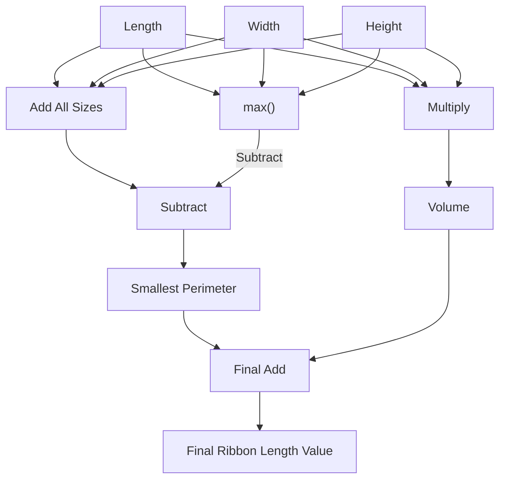

# 2015 Day 2: I Was Told There Would Be No Math - Part 2

Very close to the part 1, with differences in the operations.

Status:

| Test                       | Status                |
|----------------------------|-----------------------|
| Simulation: Icarus Verilog | :white_check_mark: Ok |
| Simulation: Verilator      | :white_check_mark: Ok |
| Simulation: Vivado Xsim    | :white_check_mark: Ok |
| Synthesis: Vivado Zynq7    | :white_check_mark: Ok |
| On-board: Zynq7            | :white_check_mark: Ok |

# Lessons Learnt

- Sometimes a problem simply stated is just that simple

# Puzzle Statement

> The ribbon required to wrap a present is the shortest distance around its sides, or the smallest perimeter of any one face. Each present also requires a bow made out of ribbon as well; the feet of ribbon required for the perfect bow is equal to the cubic feet of volume of the present. Don't ask how they tie the bow, though; they'll never tell.

The puzzle answer (total length of all the ribbons) is the cumulative sum of two terms:

- smallest perimeter of any one face
- volume of the present

The latter is trivial, but the former is a bit more complicated. Intuitively I would think that computing the max between all three dimensions and then subtracting it from the sum of all three dimensions would do the trick (without forgetting to multiply by two).

$$Smallest Perimeter = 2 \times (l + w + h - max(l, w, h))$$

Making the result being:

$$Ribbon Length = 2 \times (l + w + h - max(l, w, h)) + l \times w \times h$$

# Design Space Exploration

Computing the worst case assumes dimensions of 30x30x30, which results in a minimum permiter of $$Length = 2 \times (30 + 30)) = 180$$. The bow then measures $$Length = 30 \times 30 \times 30 = 27000$$, resulting in a total ribbon length of $$Length = 27180$$. Multiplying this value by the 1000 entries results in a total ribbon length of slightly over 27 M, which largely fits in a 32-bit range.

# Implementation

## First Iteration

The problem complexity being fair, I decided to go for the kill and directly implement the final logic.

The maths are computed in a module named [`length_compute`](length_compute.sv).

Interestingly, a DSP block was used:

|Module Name    | DSP Mapping  | A Size | B Size | C Size | D Size | P Size | AREG | BREG | CREG | DREG | ADREG | MREG | PREG | 
|---------------|--------------|--------|--------|--------|--------|--------|------|------|------|------|-------|------|------|
|length_compute | (C'+(A*B)')' | 16     | 8      | 8      | -      | 25     | 0    | 0    | 1    | -    | -     | 1    | 1    | 

### Design Components

| Module                                          | Description                      | Complexity          | Thoughts       | Remarks  |
|-------------------------------------------------|----------------------------------|---------------------|----------------|----------|
| [`user_logic_tb`](user_logic_tb.sv)             | Testbench                        | :large_blue_circle: | :kissing_smiling_eyes: Copy-paste from previous puzzle | |
| [`user_logic`](user_logic.sv)                   | Logic top-level                  | :large_blue_circle: | :kissing_smiling_eyes: Simplified after moving logic | |
| [`tap_decoder`](tap_decoder.sv)                 | JTAG TAP deserializer            | :large_blue_circle: | :kissing_smiling_eyes: Copy-paste from previous puzzle | |
| [`line_decoder`](line_decoder.sv)               | Captures decimal chars           | :large_blue_circle: | :kissing_smiling_eyes: Straightforward | |
| [`length_compute`](length_compute.sv)           | Computes length per each present | :large_blue_circle: | :kissing_smiling_eyes: A easy as it gets | Surely things will not stay this easy |
| [`tap_encoder`](tap_encoder.sv)                 | JTAG TAP serializer              | :large_blue_circle: | :kissing_smiling_eyes: Copy-paste from previous puzzle | |

### Run Times

Full simulation: compilation and runtime (low-spec laptop):

| Run Times | Icarus Verilog | Verilator | Vivado Xsim | Vivado FPGA Build |
|-----------|----------------|-----------|-------------|-------------------|
| Real      | 1.551s         | 6.619s    | 11.717s     | 2m3.673s          |
| User      | 1.490s         | 25.295s   | 11.002s     | 2m30.383s         |
| Sys       | 0.039s         | 2.468s    | 1.411s      | 0m9.142s          |

### Resource Usage

|      Instance      |    Module    | Total LUTs | Logic LUTs | LUTRAMs | SRLs | FFs | RAMB36 | RAMB18 | DSP Blocks |
|--------------------|--------------|------------|------------|---------|------|-----|--------|--------|------------|
| shell              |        (top) |        199 |        198 |       0 |    1 | 165 |      0 |      0 |          1 |

| Ref Name | Used | Functional Category |
|----------|------|---------------------|
| FDRE     |  165 |        Flop & Latch |
| LUT2     |   93 |                 LUT |
| LUT3     |   65 |                 LUT |
| LUT4     |   51 |                 LUT |
| LUT6     |   49 |                 LUT |
| CARRY4   |   31 |          CarryLogic |
| LUT5     |   11 |                 LUT |
| LUT1     |    3 |                 LUT |
| SRL16E   |    1 |  Distributed Memory |
| DSP48E1  |    1 |    Block Arithmetic |
| BUFG     |    1 |               Clock |
| BSCANE2  |    1 |              Others |
