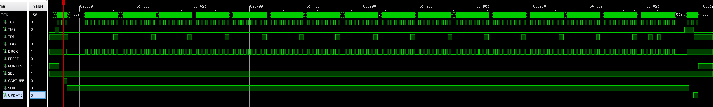

# Day 3: Perfectly Spherical Houses in a Vacuum - Part 1

# Design Space Exploration

So, let's talk about the *infinite two-dimensional grid*, at a first glance there are 8192 (triggered the power of two decimal detection part in my brain) moves. This total is a reasonable amount speaking in terms of FPGA memory.

Obviously the FPGA will get nowhere running an algorithm with a $$\mathcal{O}(n^2)$$ time complexity. Thus before thinking of coding, a look at the pattern followed by the successive moves would be useful first step.

```
Direction (0, 1): 2070 moves
Direction (1, 0): 2027 moves
Direction (-1, 0): 2092 moves
Direction (0, -1): 2003 moves
Final rest X: -65
Final rest Y: 67
Min X: -72
Min Y: -3
Max X: 27
Max Y: 73
```

# Implementation

All the moves can be boxed using coordinates between -128 and 127, resulting in a 32K address space. Since a single bit is sufficient for representing the visited status, all I need is a single 36K BRAM. Obviously this puzzle could have been a tad more complex if the amplitude of the walk was larger.

Counting the visited houses is just a question of incrementing a counter when an empty house is encountered.

# Implementation

## First Iteration

Simply counting the number of moves would be an interesting intermediate step, as the expected number of already known.

Due to the small number of combinations, I was thinking of using a one-hot encoding where each direction is represented by a single dedicated bit. This makes the `line_decoder` module trivial to implement.

### Improved JTAG Data Serialization

A sore point of my previous implementations was the relatively slow data transfer rate. This was primarily due to serializing data on a per byte basis. Removing this per byte serialization and going straight for continuously streaming the whole inputs contents should yield a significant improvement.

The overhead of handling each byte separately is significant, as the JTAG TAP state machine must go through five states every byte. This increases the number of required `tck` cycles by 62.5 %. In practice this overhead is even higher on-board due to additional TCL commands required for transitioning between states.

#### Simulation Testbench Changes

Following the creation of a small [proof-of-concept project](https://github.com/MatthieuMichon/bscan-waves) for producing real waveforms of the BSCANE2 outputs. I decided to completely overhaul the implementation of the BSCANE2 emulation in the main simulation testbench:

- Added states related to the IR shift register
- Addition of the `tms` signal with the proper values reflecting the TAP state machine transitions
- Correctly emulating the initialization of the BSCANE2 module with the proper IR value
- Continuous streaming of input contents bytes

#### Vivado TCL Script Changes

My first priority is getting the testbench to match as closely as possible the actual behavior of Xilinx's BSCANE2 primitive. I added a very deep ILA probe (128K samples) and embarked on a journey to capture the relevant events. The first one being the selection of the correct IR value.

Due to the ILA and the user logic sharing the JTAG interface, I followed this sequence for capturing the data:

- Program firmware and load probe file
- Setup a trigger for rising edge of `SEL` (`ir_is_user` in my design)
- Close the hardware manager
- Open the hardware manager in JTAG mode
- Execute the `scan_ir_hw_jtag` command with the relevant IR value
- Close the hardware manager
- Open the hardware manager in the ILA GUI
- Download the ILA capture

```tcl
# Vivado TCL console invoked using `vivado -mode tcl`
open_hw_manager
connect_hw_server
open_hw_target -jtag_mode on
set zynq7_ir_length 10
set zynq7_ir_user4 0x3e3
run_state_hw_jtag RESET
run_state_hw_jtag IDLE
scan_ir_hw_jtag $zynq7_ir_length -tdi $zynq7_ir_user4
close_hw_target
```


The second step is to ensure that the improved deserialization process behaves as expected. I opted for an incremental approach, starting with a single block of data with zero padding. I chose the at sign `@` due to its ASCII value of 0x40 making it easy to distinguish during the bit shifting operations.

While testing I discovered that the first `tdi` value received once in *SHIFT_DR* state is invalid. This is due to the JTAG TAP being downstream of the ARM DAP controller, which in *BYPASS* mode behaves as a single bit register.

For ensuring proper reusability, I decided to add a parameter `UPSTREAM_BYPASS_BITS` to the module.

```diff
module tap_decoder #(
    parameter int INBOUND_DATA_WIDTH,
+    parameter int UPSTREAM_BYPASS_BITS
)(
    // JTAG TAP Controller Signals
        input wire tck,
        input wire tms,
        input wire tdi,
        input wire test_logic_reset,
        input wire ir_is_user,
        input wire shift_dr,
        input wire update_dr,
    // Deserialized Data
        output logic inbound_alignment_error,
        output logic inbound_valid,
        output logic [INBOUND_DATA_WIDTH-1:0] inbound_data
);
```

```tcl
# Vivado TCL console invoked using `vivado -mode tcl`
open_hw_manager
connect_hw_server
open_hw_target -jtag_mode on
set zynq7_ir_length 10
set zynq7_ir_user4 0x3e3
run_state_hw_jtag RESET
run_state_hw_jtag IDLE
scan_ir_hw_jtag $zynq7_ir_length -tdi $zynq7_ir_user4
scan_dr_hw_jtag 129 -tdi 0x0a404040404040404040404040404040; # byte swapped
close_hw_target
```



The serialization process in the Vivado script `vivado.tcl` was completely revamped with the division of the file contents into blocks performed in a dedicated function `load_blocks`, and the per-block serialization process handled in the main loop of the input loading function `load_inputs`.

My initial thoughts on this matter were to use 16 byte blocks for serialization and pad the remaining bytes with null bytes. For a typical 12 kbyte input length, this implementation would cut down by 16 the number of individual TCL commands. A thing I nearly forgot was that JTAG uses a LSB-first encoding, thus the bytes in each block should be reversed prior to serialization (this process could not be implemented in the FPGA since this would require knowing in advance the number of bytes to be padded in the last block).

These changes mean breaking quite a lot of things in the TCL script, as it was operating on a per-line then per-byte basis. I changed the text file loading procedure to use blocks of N bytes instead of lines of text.

Using chunks of data instead of lines of text requires changing the translation type from the default (text) to binary.

```diff
-   set fhandle [open $file]
+   set fhandle [open $file rb]
```

Instead of looping over each line, the whole file is read in a single operation.

```diff
-while {[gets $fhandle line]>=0} {
-    lappend lines $line
-}
+set data [read $fhandle]
```

Padding length is calculated by subtracting the block size by the number of bytes sticking out after the last complete block. A modulo operation to the block size is applied to this value for handling cases where the file ends on a block boundary.

$$Padding(x)=(BlockSize-(x\%BlockSize))\%BlockSize$$

```tcl
set file_len [string length $data]
set delta_len [expr {$block_size - ($file_len % $block_size)}]
set padding_len [expr {$delta_len % $block_size}]
append data [string repeat \x00 $padding_len]
```

Iterating is done per chunk of the block size instead over each line, and following the required padding, finally the whole chunk is byte swap to comply with the JTAG protocol.

```tcl
if {$swap_bytes} {
    set hex [join [lreverse [regexp -all -inline .. $hex]] ""]
}
```

Furthermore, I was thinking of doing without having to go through the UPDATE state of the JTAG TAP controller. The documentation of the `scan_dr_hw_jtag` in the TCL command reference user-guide (ug835) calls out a method for doing so:

> To break up a long data register shift into multiple SDR shifts, specify an end_state of DRPAUSE. This will cause the first `scan_dr_hw_jtag` command to end in the DRPAUSE stable state, and then the subsequent scan_dr_hw_jtag commands will go to DREXIT2 state before going back to DRSHIFT.
