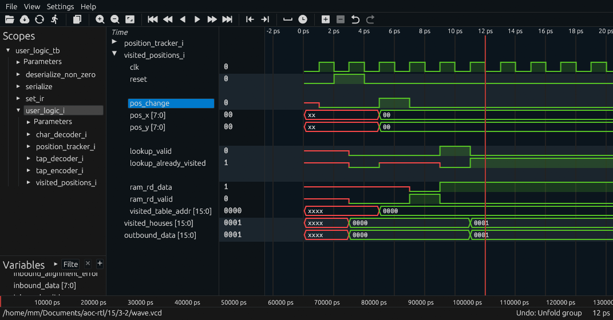
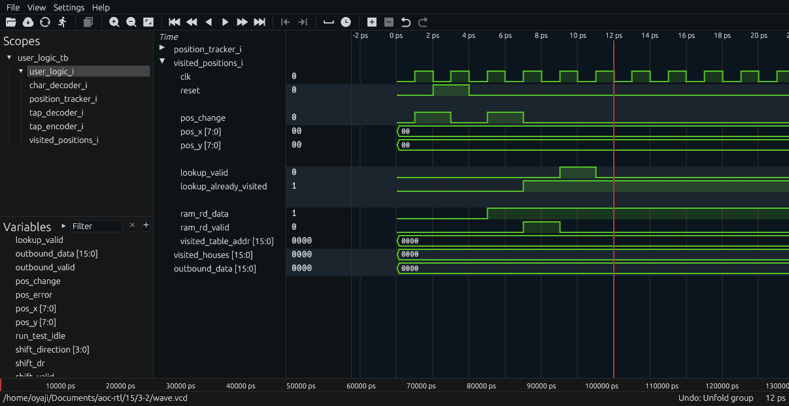

# Day 3: Perfectly Spherical Houses in a Vacuum - Part 2

Status:

| Test                       | Status                |
|----------------------------|-----------------------|
| Simulation: Icarus Verilog | :white_check_mark: Ok |
| Simulation: Verilator      | :white_check_mark: Ok |
| Simulation: Vivado Xsim    | :white_check_mark: Ok |
| Synthesis: Vivado Zynq7    | :white_check_mark: Ok |
| On-board: Zynq7            | :white_check_mark: Ok |

# Lessons Learnt

- Pay careful attention to operations launched prior to reset

# Design Space Exploration

The second part of the problem doesn't change the front-end of the design. However since there are now two separate agents operating independently, bounding the traversal space requires finding a range surrounding the trails of both agents. Updating the Python exploration script yields the following results.

```
Performing Design Space Exploration...
Total: 4096 moves
Direction (0, 1): 1027 moves
Direction (-1, 0): 1048 moves
Direction (1, 0): 1014 moves
Direction (0, -1): 1007 moves
Final rest X: -34
Final rest Y: 20
Min X: -37
Min Y: -23
Max X: 50
Max Y: 24
Total: 4096 moves
Direction (1, 0): 1013 moves
Direction (0, 1): 1043 moves
Direction (-1, 0): 1044 moves
Direction (0, -1): 996 moves
Final rest X: -31
Final rest Y: 47
Min X: -52
Min Y: 0
Max X: 9
Max Y: 61
Result: 0
```

The most important aspect is coordinate amplitudes:

| Agent      | Min X | Max X | Min Y | Max Y |
|------------|-------|-------|-------|-------|
| Santa      | -37   | 50    | -23   | 24    |
| Robo-Santa | -52   | 9     | 0     | 61    |
| Cumulative | -52   | 50    | -23   | 61    |

The last line contains values bounded in -128 to 127, meaning that eight bits are still enough.

# Implementation

## First Iteration

I will attempt to moonshot and implement the solution directly in the design.

A key insight is the independence of the two agents with regard to their position. This means that simply duplicating the coordinate tracking logic and ensuring that inbound movement data is properly forwarded to the relevant agent is sufficient. Thus only the `position_tracker` module is affected by this change.

My designed nearly worked on the first try, *but* I was bitten by the classic off-by-one error: I didn't account for the starting position being visited. I surprised that the part one of this puzzle passed with now what appears like a dirty hack of adding one to the obtained value. I applied in this part two what I believe to be a much proper solution:

```diff
always_ff @(posedge clk) begin: output_pos_update
    if (reset) begin
        pos_change <= 1'b0;
+        zero_position_sent <= 1'b0;
    end else begin
+        if (!zero_position_sent) begin
+            pos_change <= 1'b1;
+            pos_x <= '0;
+            pos_y <= '0;
+            zero_position_sent <= 1'b1;
+        end else if (santa_pos_change) begin
-        if (santa_pos_change) begin
            pos_change <= 1'b1;
            pos_x <= santa_x;
            pos_y <= santa_y;
        end else if (robo_santa_pos_change) begin
            pos_change <= 1'b1;
            pos_x <= robo_santa_x;
            pos_y <= robo_santa_y;
        end else begin
            pos_change <= 1'b0;
        end
    end
end
```

### Iverilog / Verilator / Xsim / FPGA Discrepancies 

Testing with other targets, I noticed the results were not uniform (the correct value is 2341).

| Iverilog | Verilator | Xsim | FPGA |
|----------|-----------|------|------|
| 2341     | 2340      | 2341 | 2340 |

Looking at the VCD waveform the results are obvious. The following waveform was from Iverilog showing that the position at (0, 0) is commited only once, which takes place after the reset pulse.



Conversely, with Verilator the position at (0, 0) is commited twice, once before the reset pulse and once after.



Since the information is written in a RAM it is by definition not possible to clear using the reset signal directly. Granted, scrubbing the RAM would be possible but would require holding back the inbound contents while the operation is pending.

I am confident enough that changing the reset logic ensuring it is active since the start of execution or GSR release (in case of the physical FPGA implementation) is the best way forward.

```diff

+logic reset;
+assign reset = test_logic_reset || !ir_is_user;

(...)

position_tracker #(
    .POSITION_WIDTH(POSITION_WIDTH)
) position_tracker_i (
    .clk(tck),
-    .reset(test_logic_reset),
+    .reset(reset),
    // Decoded Data
        .shift_valid(shift_valid),
```

### Design Components

| Module                                          | Description                      | Complexity          | Thoughts       | Remarks  |
|-------------------------------------------------|----------------------------------|---------------------|----------------|----------|
| [`user_logic_tb`](user_logic_tb.sv)             | Testbench                        | :large_blue_circle: | :kissing_smiling_eyes: Copy-paste from previous puzzle | |
| [`user_logic`](user_logic.sv)                   | Logic top-level                  | :green_circle:      | :slightly_smiling_face: Wire harness and trivial logic | Had to change reset logic |
| [`position_tracker`](position_tracker.sv)       | Keeps track of the coordinates   | :green_circle:      | :slightly_smiling_face: Still quite simple | Forgot corner case at init  |
| [`visited_position`](visited_position.sv)       | Tag all visited positions        | :large_blue_circle: | :kissing_smiling_eyes: Copy-paste from previous puzzle | Minus a typo|
| [`tap_decoder`](tap_decoder.sv)                 | JTAG TAP deserializer            | :green_circle:      | :slightly_smiling_face: Add proper handling of upstream bypass bits | |
| [`tap_encoder`](tap_encoder.sv)                 | JTAG TAP serializer              | :large_blue_circle: | :kissing_smiling_eyes: Copy-paste from previous puzzle | |

### Resource Usage

This second part uses about 40 % more logic resources, which matches the expected increase in complexity.

|         Instance        |       Module      | Total LUTs | Logic LUTs | LUTRAMs | SRLs | FFs | RAMB36 | RAMB18 | DSP Blocks |
|-------------------------|-------------------|------------|------------|---------|------|-----|--------|--------|------------|
| shell                   |             (top) |         91 |         91 |       0 |    0 | 151 |      2 |      0 |          0 |

| Ref Name | Used | Functional Category |
|----------|------|---------------------|
| FDRE     |  151 |        Flop & Latch |
| LUT2     |   53 |                 LUT |
| LUT3     |   35 |                 LUT |
| CARRY4   |   24 |          CarryLogic |
| LUT1     |   11 |                 LUT |
| LUT6     |    7 |                 LUT |
| LUT5     |    7 |                 LUT |
| RAMB36E1 |    2 |        Block Memory |
| LUT4     |    2 |                 LUT |
| BUFG     |    1 |               Clock |
| BSCANE2  |    1 |              Others |

### Run Times

| Run Times | Icarus Verilog | Verilator | Vivado Xsim | Vivado FPGA Build |
|-----------|----------------|-----------|-------------|-------------------|
| Real      | 1.256s         | 4.884s    | 10.970s     | 2m9.082s          |
| User      | 1.210s         | 13.906s   | 10.923s     | 2m36.573s         |
| Sys       | 0.040s         | 0.939s    | 1.035s      | 0m9.874s          |
