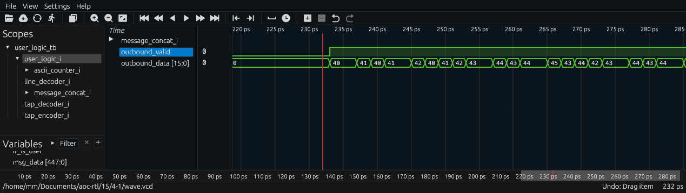
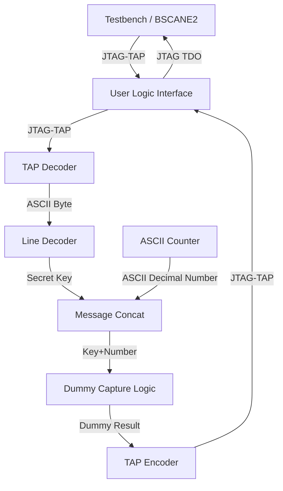
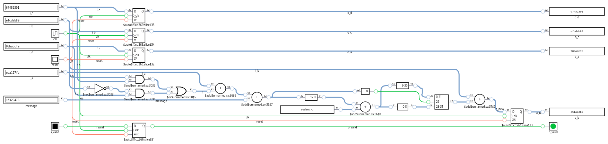
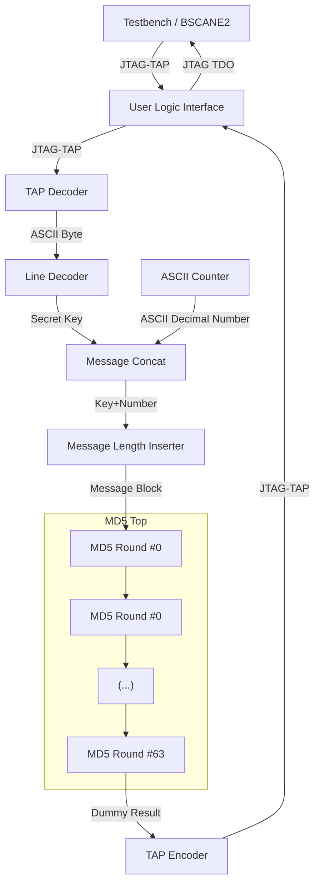
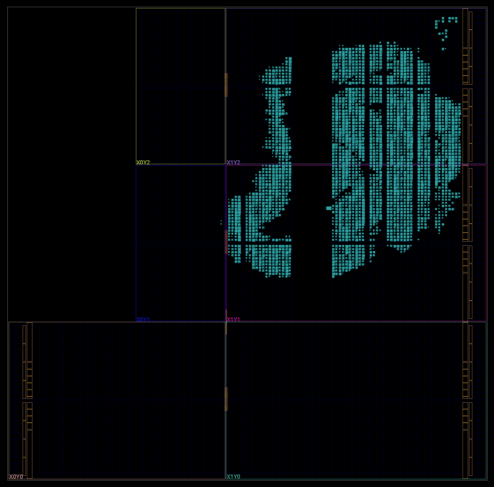
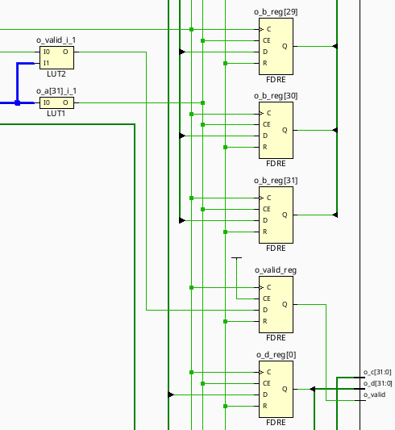
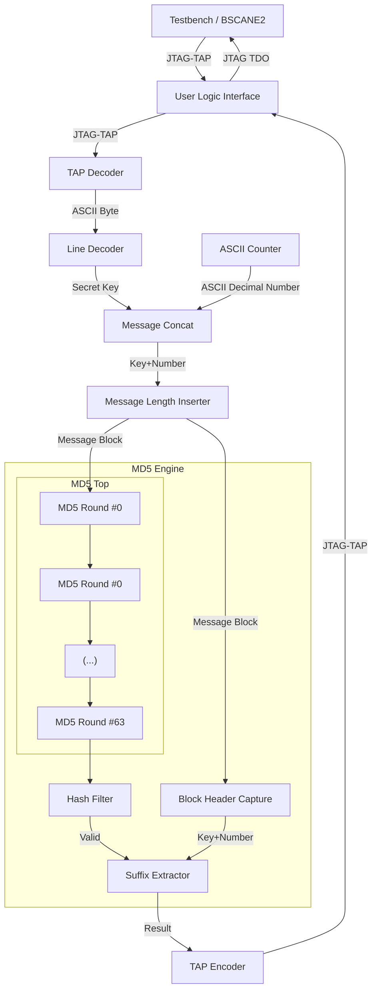

# Day 4: The Ideal Stocking Stuffer - Part 1

Status:

| Test                       | Status                |
|----------------------------|-----------------------|
| Simulation: Icarus Verilog | :white_check_mark: Ok |
| Simulation: Verilator      | :white_check_mark: Ok |
| Simulation: Vivado Xsim    | :white_check_mark: Ok |
| Synthesis: Vivado Zynq7    | :white_check_mark: Ok |
| On-board: Zynq7            | :white_check_mark: Ok |

Did a double take after reading MD5, although to be honest this one was not as bad as I first thought. Working with variable length fields at variable offsets is never easy and this puzzle didn't disappoint :upside_down_face: add to this that I somehow managed to end up with an initial implementation containing a 78-level deep :vomiting_face: timing path

# Design Space Exploration

My first intent is to start rolling a grass roots implementation of MD5 in Python. Knowing in advance the value of the expected answer is an absolute must thus, so `hashlib.md5` to the rescue.

```py
while True:
    hash = hashlib.md5(f"{secret_key}{i}".encode()).hexdigest()
    if hash.startswith(5 * "0"):
        return i
    i += 1
```

| Secret Key | Answer  | Input            | Hash                               |
|------------|---------|------------------|------------------------------------|
| `abcdef`   | 609043  | `abcdef609043`   | `000001dbbfa3a5c83a2d506429c7b00e` |
| `pqrstuv`  | 1048970 | `pqrstuv1048970` | `000006136ef2ff3b291c85725f17325c` |
| `yzbqklnj` | 282749  | `yzbqklnj282749` | `000002c655df7738246e88f6c1c43eb7` |

The value of the answer corresponds to the number of MD5 hashes required to be computed. With about one million, this begs the questions to consider whether or not it is worth using `tck` as a clock source, for this would require issuing a considerable amount of JTAG commands in the result read-back loop.

The alternative would be to use an internal clock source in order to avoid any board-level dependancies. Whatever, the first thing is to implement by hand the MD5 hash in Python first.

# Implementation

## First Iteration

Before deep diving into the MD5 hash, I decided to start with the groundwork consisting of the following operations:

- Capture of the secret key from the input contents
- Generation of the message suffix

### Secret Key Registration

A small but important subtility is that keys do not necessarily have the same number of characters. This has strong implications on how the input message is constructed. Assuming a max length of 12 chars, we get the following values:

| Input      | Secret Key Result (hex)      |
|------------|------------------------------|
| `abcdef`   | `0x616263646566000000000000` |
| `pqrstuv`  | `0x707172737475760000000000` |
| `yzbqklnj` | `0x797a62716b6c6e6a00000000` |

This filling operation is handled by a dedicated module [`line_decoder`](line_decoder.sv) which contains the following assignments:

```verilog
secret_key_bits <= secret_key_bits + 8'h8;
secret_key_value[SECRET_KEY_WIDTH-32'(secret_key_bits)-1-:INBOUND_DATA_WIDTH] <= inbound_data;
```

In essence, each new byte received from the host is appended to the secret key in a position which is shifted to the right each time a new byte is received. This differs from conventional LSB first or MSB first shifting operations, which found quite interesting.

### Message Suffix Computation

Circling back to the puzzle statement:

>  The input to the MD5 hash is your puzzle input followed by a number in decimal. You must find the lowest positive number (no leading zeroes: 1, 2, 3, ...).

Converting decimals into hexadecimal is usual for many puzzles, however doing the other way around is a first. I remember something called the [double dabble algorithm](https://en.wikipedia.org/wiki/Double_dabble), which is a method for converting binary numbers to decimal.

Thankfully the Wikipedia article contains a Verilog implementation (credits to [Ameer Abdelhadi](https://github.com/AmeerAbdelhadi)) which I will use as a base and tailor it to my needs. During the implementation I noticed that the formula for computing the number of digits $$(W+(W−4)/3)$$ yields wrong results for my use case: with a 23-bit binary number (toping at 8388607), it yields 8 digits while the correct number is 7.

It turns out the proper formula is $$D = \lceil W \cdot \log_{10}(2) \rceil$$. While implementing the BCD to ASCII conversion I realized that a match simpler approach was possible, by simply adding one to each ASCII digit and handling the carry. I left the implementation `bin2ascii` in a [Github Gist](https://gist.github.com/MatthieuMichon/f9313a34195417821a18205f2a987780) case of a future need.

### Secret Key and Counter Concatenation

Next step is merging both values into a single string+length pair which will be forwarded into the MD5 hash function. From experience, the support of backpressure (in the form of a ready signal) is mandatory as this decouples this block with the downstream implementation of the MD5 hash computation.

The implementation of this logic is quite tedious since it involves dealing with a lot of bit masking and shifting and it took several back and forth until things did behave as I wanted.

### AXI-style Backpressure

I'm quite found of the AXI-style backpressure because while it's simple to implement it has perfect composability: assuming all blocks implement it correctly, these blocks can be simply dropped into the pipeline and everything will work flawlessly from a dataflow standpoint.

Some basic rules must be followed though:

- The `ready` signal must be asserted when the block is ready to accept new data.
- The `valid` signal is asserted whenever the block has data to send, regardless if the downstream block is ready or not.
- The `valid` signal can be deasserted only after transaction completed.

For deep pipelines, timeing closure on the `ready` path may be challenging due to long combinatorial logic. However this is not a problem at this stage.

### Discrepancy Simulation vs FPGA

I returned dummy contents in order to avoid having Vivado pruning all my logic. Looking into the return value, I noticed that on-board runs produced a different value.

| Iverilog | Verilator | Xsim | FPGA |
|----------|-----------|------|------|
| 41       | 41        | 41   | 40   |

At least all three simulators agree so at least there is that. Looking at the waveform, I noticed that the `outbound_data` value varies while `outbound_valid` asserted, meaning that depending on the exact clock cycle at which the result is readback via the JTAG TAP the observed value may vary.



I changed the logic to capture the result only when `outbound_valid` is deasserted.

```diff
always_ff @(posedge tck) begin: capture_result
    if (reset) begin
        outbound_valid <= 1'b0;
        outbound_data <= '0;
    end else begin
        outbound_valid <= msg_valid;
+        if (!outbound_valid)
+            outbound_data <= RESULT_WIDTH'($countones(msg_length)) + RESULT_WIDTH'($countones(msg_data));
-        outbound_data <= RESULT_WIDTH'($countones(msg_length)) + RESULT_WIDTH'($countones(msg_data));
    end
end
```

This somewhat dirty trick worked and all methods provide the same results:

| Iverilog | Verilator | Xsim | FPGA |
|----------|-----------|------|------|
| 40       | 40        | 40   | 40   |

### Design Components

| Module                                          | Description                      | Complexity          | Thoughts       | Remarks  |
|-------------------------------------------------|----------------------------------|---------------------|----------------|----------|
| [`user_logic_tb`](user_logic_tb.sv)             | Testbench                        | :large_blue_circle: | :kissing_smiling_eyes: Copy-paste from previous puzzle | |
| [`user_logic`](user_logic.sv)                   | Logic top-level                  | :green_circle:      | :slightly_smiling_face: Wire harness and trivial logic | Had to change reset logic |
| [`tap_decoder`](tap_decoder.sv)                 | JTAG TAP deserializer            | :green_circle:      | :slightly_smiling_face: Add proper handling of upstream bypass bits | |
| [`line_decoder`](line_decoder.sv)               | Left-aligns the secret key       | :green_circle:      | :slightly_smiling_face: Straightforward | Initially forgot to handle trailling null chars |
| [`ascii_counter`](ascii_counter.sv)             | ASCII encoded decimal counter    | :green_circle:     | :slightly_smiling_face: Trivial except for the carry logic in a generate loop | Started with a bin / bcd / ascii converter before thinking of this simpler solution |
| [`message_concat`](message_concat.sv)           | Concatenates two variable length fields | :yellow_circle:     | :raised_eyebrow: First non-trivial module *so far* for the 2015 contest | Compare this to `input_str = f"{secret_key}{i}"` in Python :upside_down_face: |
| [`tap_encoder`](tap_encoder.sv)                 | JTAG TAP serializer              | :large_blue_circle: | :kissing_smiling_eyes: Copy-paste from previous puzzle | |

### Simplified Dataflow Diagram



### Resource Usage

The high LUT:FF ratio in the `message_concat` module is due to masking and barrel shifter operations..

|       Instance       |     Module     | Total LUTs | Logic LUTs | LUTRAMs | SRLs | FFs | RAMB36 | RAMB18 | DSP Blocks |
|----------------------|----------------|------------|------------|---------|------|-----|--------|--------|------------|
| shell                |          (top) |       1037 |       1037 |       0 |    0 | 424 |      0 |      0 |          0 |
|     ascii_counter_i  |  ascii_counter |         59 |         59 |       0 |    0 |  56 |      0 |      0 |          0 |
|     line_decoder_i   |   line_decoder |        240 |        240 |       0 |    0 | 101 |      0 |      0 |          0 |
|     message_concat_i | message_concat |        372 |        372 |       0 |    0 | 198 |      0 |      0 |          0 |

This design implements only the first part of the front-end, which is already quite LUT6 heavy with deep combinatory paths.

| Ref Name | Used | Functional Category |
|----------|------|---------------------|
| LUT6     |  418 |                 LUT |
| FDRE     |  409 |        Flop & Latch |
| LUT3     |  293 |                 LUT |
| LUT5     |  235 |                 LUT |
| LUT4     |  191 |                 LUT |
| LUT2     |  150 |                 LUT |
| CARRY4   |   28 |          CarryLogic |
| FDSE     |   15 |        Flop & Latch |
| LUT1     |   12 |                 LUT |
| BUFG     |    1 |               Clock |
| BSCANE2  |    1 |              Others |

I was curious about the 15 FDSE instances and decided to locate them in the RTL code.

```tcl
# vivado -mode tcl project.dcp

foreach c [get_cells -hierarchical -filter {REF_NAME == FDSE}] {
    puts [get_property FILE_NAME $c]:[get_property LINE_NUMBER $c]
}
```

Got all of them at: `ascii_counter.sv:30`, which on closer inspection is expected due to some bits not being set zero during reset (digits in ASCII being between 0x30 and 0x39). Although thinking about it, these two bits being always set they could be hardwired to VCC.

```diff
    always_ff @(posedge clk) begin
+        if (reset) begin
+            ascii_digits[8*i+:8] <= (i != 0) ? ASCII_ZERO : ASCII_ONE;
        end else if (carry[i]) begin
            if (current_digit == ASCII_NINE)
                ascii_digits[8*i+:8] <= ASCII_ZERO;
            else
                ascii_digits[8*i+:8] <= current_digit + 1;
        end
    end
```

I changed the last assignation by incrementing only the last four bits per ASCII digit:

```diff
genvar i;
generate
    for (i = 0; i < DIGITS; i++) begin: per_digit

        char_t current_digit;
        assign current_digit = char_t'(ascii_digits[8*i+:8]);

        if (i < DIGITS - 1) begin: all_but_last
            assign carry[i+1] = (current_digit == ASCII_NINE) && carry[i];
        end

        always_ff @(posedge clk) begin
            if (reset) begin
                ascii_digits[8*i+:8] <= (i != 0) ? ASCII_ZERO : ASCII_ONE;
            end else if (carry[i]) begin
                if (current_digit == ASCII_NINE)
                    ascii_digits[8*i+:8] <= ASCII_ZERO;
                else
-                    ascii_digits[8*i+:8] <= current_digit + 1;
+                    ascii_digits[8*i+:4] <= ascii_digits[8*i+:4] + 1'b1;
            end
        end
    end
endgenerate
```

This small change reduced by a quite significant amount resource usage, reminding me that notable improvements sometimes don't require changing large amounts of source code.

|       Instance       |     Module     | Total LUTs | Logic LUTs | LUTRAMs | SRLs | FFs | RAMB36 | RAMB18 | DSP Blocks |
|----------------------|----------------|------------|------------|---------|------|-----|--------|--------|------------|
| shell                |          (top) |        933 |        933 |       0 |    0 | 372 |      0 |      0 |          0 |
|     ascii_counter_i  |  ascii_counter |         34 |         34 |       0 |    0 |  28 |      0 |      0 |          0 |
|     line_decoder_i   |   line_decoder |        240 |        240 |       0 |    0 | 101 |      0 |      0 |          0 |
|     message_concat_i | message_concat |        307 |        307 |       0 |    0 | 174 |      0 |      0 |          0 |

| Ref Name | Used | Functional Category |
|----------|------|---------------------|
| FDRE     |  371 |        Flop & Latch |
| LUT6     |  314 |                 LUT |
| LUT3     |  268 |                 LUT |
| LUT5     |  199 |                 LUT |
| LUT4     |  189 |                 LUT |
| LUT2     |  182 |                 LUT |
| CARRY4   |   28 |          CarryLogic |
| LUT1     |   12 |                 LUT |
| FDSE     |    1 |        Flop & Latch |
| BUFG     |    1 |               Clock |
| BSCANE2  |    1 |              Others |

### Run Times

| Run Times | Icarus Verilog | Verilator | Vivado Xsim | Vivado FPGA Build |
|-----------|----------------|-----------|-------------|-------------------|
| Real      | 0.051s         | 4.785s    | 9.919s      | 2m30.858s         |
| User      | 0.035s         | 12.469s   | 10.124s     | 3m6.204s          |
| Sys       | 0.017s         | 0.841s    | 0.697s      | 0m11.044s         |

## Second Iteration: MD5 Hash Logic

I'm using the [MD5 algorithm from Rosetta Code](https://rosettacode.org/wiki/MD5#Python) as stepping stone to implement my proper version as an intermediate stage before implementing it in SystemVerilog.

### Content Padding

My first change is to move the padding logic into a separate function, since I will be doing the same on the FPGA implementation.

From Wikipedia's [description of the padding](https://en.wikipedia.org/wiki/MD5#Algorithm):

> The input message is broken up into chunks of 512-bit blocks (sixteen 32-bit words); the message is padded so that its length is divisible by 512.

512 bits translates to 64 bytes, which is much larger than the inputs computed in the previous section. For the sake of simplicity, I intend to drop support for multi-block messages.

Its implementation being (edited knowing that all messages are smaller than 448 bits):

> The padding works as follows: first, a single bit, `1`, is appended to the end of the message. This is followed by as many zeros as are required to bring the length of the message up to 64 bits fewer than 512 bits. The remaining bits are filled up with 64 bits representing the length of the original message.

```py
def pad_message(msg: bytes) -> bytearray:
    msg_len_bits = 8 * len(msg)
    msg_buf = bytearray(msg) # copy into a mutable buffer
    msg_buf.append(0x80)  # Single MSB bit
    while len(msg_buf) != 56:
        msg_buf.append(0x00)
    msg_buf += msg_len_bits.to_bytes(8, byteorder="little")
    print(msg_buf.hex())
    return msg_buf
```

For reference, `msg_buf` = 0x616263646566308000(0x00 repeated)3800000000000000, which decomposes in "abcdef0<0x80>(<0x00> repeated)<7 * 8>(<0x00> repeated)". For a `msg` longer then 15 bytes, say 17 bytes, the trailing length field would look like "<0x01><0x10>(<0x00> repeated)" due to little-endian shenanigans.

Expected FPGA implementation complexity: 2/10, most of the difficulty lies upstream for computing the suffix. Adding this feature required modifying the upstream module `message_concat` for handling the payload delimiter insertion.

### Single Step MD5 Implementation

The Rosetta Code website features a Python implementation. The code corresponding to a single step is as following:

```py
for i in range(64):
    f = functions[i](b, c, d)
    g = index_functions[i](i)
    to_rotate = a + f + constants[i] + int.from_bytes(chunk[4*g:4*g+4], byteorder='little')
    new_b = (b + left_rotate(to_rotate, rotate_amounts[i])) & 0xFFFFFFFF
    a, b, c, d = d, new_b, b, c
for i, val in enumerate([a, b, c, d]):
    hash_pieces[i] += val
    hash_pieces[i] &= 0xFFFFFFFF
```

The `function` variable being:

```py
functions = 16*[lambda b, c, d: (b & c) | (~b & d)] + \
            16*[lambda b, c, d: (d & b) | (~d & c)] + \
            16*[lambda b, c, d: b ^ c ^ d] + \
            16*[lambda b, c, d: c ^ (b | ~d)]
```

I started by converting this last assignation in Systemverilog, with all input words prefixed with `i_` for simplifying the parent module instantiating 64 times this code:

```verilog
unique case (MODE)
    2'b00: f = (i_b & i_c) | (~i_b & i_d);
    2'b01: f = (i_b & i_d) | (i_c & ~i_d);
    2'b10: f = i_b ^ i_c ^ i_d;
    2'b11: f = i_c ^ (i_b | ~i_d);
    default: f = '0;
endcase
```

The overall code being suspiciously simple:

```verilog
always_comb begin: update_b_word
    unique case (MODE)
        2'b00: f = (i_b & i_c) | (~i_b & i_d);
        2'b01: f = (i_b & i_d) | (i_c & ~i_d);
        2'b10: f = i_b ^ i_c ^ i_d;
        2'b11: f = i_c ^ (i_b | ~i_d);
        default: f = '0;
    endcase
    a_sum = (i_a + f + message + T_CONST);
    b_new = i_b + {a_sum[WORD_BITS-LROT_BITS-1:0], a_sum[WORD_BITS-1:WORD_BITS-LROT_BITS]};
end

always_ff @(posedge clk) begin: output_register
    if (reset) begin
        o_valid <= 1'b0;
    end else begin
        o_valid <= i_valid;
        o_a <= i_d;
        o_b <= b_new;
        o_c <= i_b;
        o_d <= i_c;
    end
end
```

Same remark with the FPGA implementation:



### First Round Output Discrepancy Python vs Simulation

Comparing the outputs on the first step between the Python and RTL simulation shows a difference for the `B` value which involves the internal processing logic. Other three values are as expected showing that the constants are properly assigned.

| Mode   | A          | B          | C          | D          |
|--------|------------|------------|------------|------------|
| Python | 0x10325476 | 0x565d23ad | 0xefcdab89 | 0x98badcfe |
| FPGA   | 0x10325476 | 0x62511fb1 | 0xefcdab89 | 0x98badcfe |
| Diff   | Ok         | Error      | Ok         | Ok         |

- The `B` value computation first starts with using the initial `A` value which is `0x67452301` in both Python and the RTL.
- The message word forwarded to the first round is `0x71627a79` in Python, while it is `0x797a6271` in the RTL meaning that a byte swap operation is missing.

Adding the byte-swap operation fixes this discrepancy.

### 16th Round Message Input Discrepancy Python vs Simulation

The MD5 hash has four different implementation of message slicing applied to the 64 rounds. I noticed that the message received by the 16th round was not the one expected: `0x6a6e6c6b` vs `0x00000000` for Python and RTL respectively. In all likelyhood, the RTL message slicing logic is incorrect.

Turn out while taking care of replacing magic numbers, for instance `16` by `ROUNDS/4`, I left out the parentheses around `ROUNDS/4`. Due to operator precedence, the greedy `%` captures `ROUNDS` instead of `ROUNDS/4` causing the calculation to yield invalid results.

```diff
function int get_msg_word_index(int step);
    if (step < ROUNDS*1/4) begin
        get_msg_word_index = step;
    end else if (step < ROUNDS*2/4) begin
-        get_msg_word_index = (5*step+1) % ROUNDS/4;
+        get_msg_word_index = (5*step+1) % (ROUNDS/4);
    end else if (step < ROUNDS*3/4) begin
-        get_msg_word_index = (3*step+5) % ROUNDS/4;
+        get_msg_word_index = (3*step+5) % (ROUNDS/4);
    end else if (step < ROUNDS*4/4) begin
-        get_msg_word_index = (7*step) % ROUNDS/4;
+        get_msg_word_index = (7*step) % (ROUNDS/4);
    end else begin
        $fatal(1, "Invalid step index");
    end
endfunction
```

### Simplified Dataflow Diagram



### Resource Usage

Each MD5 round uses 4x32 FFs plus one for the valid signal, meaning that a single MD5 engine will eat 8256 FFs.

| Ref Name | Used | Functional Category |
|----------|------|---------------------|
| FDRE     | 9040 |        Flop & Latch |
| LUT5     | 3055 |                 LUT |
| LUT4     | 2360 |                 LUT |
| LUT2     | 2259 |                 LUT |
| LUT3     | 1449 |                 LUT |
| LUT6     | 1222 |                 LUT |
| CARRY4   | 1083 |          CarryLogic |
| LUT1     |  164 |                 LUT |
| FDSE     |    1 |        Flop & Latch |
| BUFG     |    1 |               Clock |
| BSCANE2  |    1 |              Others |

These figures are inline with the reported resource usage during the synthesis stage:

```
Module md5_step 
Detailed RTL Component Info : 
+---Adders : 
	   4 Input   32 Bit       Adders := 1     
	   2 Input   32 Bit       Adders := 1     
+---Registers : 
	               32 Bit    Registers := 4     
	                1 Bit    Registers := 1     
```

Looking at the floorplan I believe that fitting four instances of the MD5 pipeline will be tight, still have some work before crossing this bridge.



Vivado complained quite a lot regarding not being able to push inverters:

```
INFO: [Opt 31-677] Could not push inverter user_logic_i/md5_top_i/per_step[0].md5_step_i/o_a[31]_i_1 to load user_logic_i/md5_top_i/per_step[0].md5_step_i/o_a_reg[0] because inversion is not supported on the pin CE
```

Looking at the schematic post-mapping I noticed an interesting implementation of the reset signal:



I'm aware of limitations regarding reset polarity in Xilinx's 7-series FPGA but this reset being active high I thought that I was in the clear. I used a relaxed implementation directive, so maybe I should try cranking things up and see where this leaves me.

While reviewing the timing results, I noticed the setup time slack being quite large at over 5 ns. This pushed me to modify the MD5 rounds by removing the output register stage for every even stage. The results were good: the timings were still good while the number of registers was reduced by 40 %.

| Ref Name | Used | Functional Category |
|----------|------|---------------------|
| FDRE     | 5328 |        Flop & Latch |
| LUT5     | 2499 |                 LUT |
| LUT4     | 2450 |                 LUT |
| LUT2     | 2270 |                 LUT |
| LUT3     | 1477 |                 LUT |
| LUT6     | 1302 |                 LUT |
| CARRY4   | 1089 |          CarryLogic |
| LUT1     |  160 |                 LUT |
| FDSE     |    1 |        Flop & Latch |
| BUFG     |    1 |               Clock |
| BSCANE2  |    1 |              Others |

|            Instance           |           Module          | Total LUTs | Logic LUTs |  FFs |
|-------------------------------|---------------------------|------------|------------|------|
| shell                         |                     (top) |       8085 |       8085 | 5329 |
|   (shell)                     |                     (top) |          0 |          0 |    0 |
|   user_logic_i                |                user_logic |       8085 |       8085 | 5329 |
|     (user_logic_i)            |                user_logic |          3 |          3 |  129 |
|     ascii_counter_i           |             ascii_counter |         32 |         32 |   28 |
|     line_decoder_i            |              line_decoder |        292 |        292 |  101 |
|     md5_top_i                 |                   md5_top |       7357 |       7357 | 4414 |
|       (md5_top_i)             |                   md5_top |         66 |         66 |  310 |

## Third Iteration: Hash Filter

The answer to this puzzle is the number used as a suffix which causes the hash to match the puzzle requirement of 5 leading zeroes. I could add a bus carrying the binary value from the `ascii_counter` module, but figured this was too much of an hassle. Instead, I'll add a small module for filtering the results.

Although the later module is trivial, it provides an accurate measurement of the time required for iterating through all the hashes. For instance, I measured using my custom input `yzbqklnj` to take approximatively 11.2 seconds, which gives a hashing rate of 25250 hashes per second.

There are solutions for increasing this result, the most obvious one being using the internal configuration clock instead of `tck` which toggled at a low frequency since it requires looping over a couple of TCL commands.

### Design Components

| Module                                          | Description                      | Complexity          | Thoughts       | Remarks  |
|-------------------------------------------------|----------------------------------|---------------------|----------------|----------|
| [`user_logic_tb`](user_logic_tb.sv)             | Testbench                        | :large_blue_circle: | :kissing_smiling_eyes: Copy-paste from previous puzzle | |
| [`user_logic`](user_logic.sv)                   | Logic top-level                  | :green_circle:      | :slightly_smiling_face: Wire harness and trivial logic | Had to change reset logic |
| [`tap_decoder`](tap_decoder.sv)                 | JTAG TAP deserializer            | :green_circle:      | :slightly_smiling_face: Add proper handling of upstream bypass bits | |
| [`line_decoder`](line_decoder.sv)               | Left-aligns the secret key       | :green_circle:      | :slightly_smiling_face: Straightforward | Initially forgot to handle trailling null chars |
| [`ascii_counter`](ascii_counter.sv)             | ASCII encoded decimal counter    | :green_circle:     | :slightly_smiling_face: Trivial except for the carry logic in a generate loop | Started with a bin / bcd / ascii converter before thinking of this simpler solution |
| [`message_concat`](message_concat.sv)           | Concatenates two variable length fields | :yellow_circle:     | :raised_eyebrow: First non-trivial module *so far* for the 2015 contest | Compare this to `input_str = f"{secret_key}{i}"` in Python :upside_down_face: |
| [`md5_core`](md5_core.sv)                       | Complete MD5 hash of a single block | :green_circle: | :kissing_smiling_eyes: Danting at first but wasn't such a big deal to implement | |
| [`md5_step`](md5_step.sv)                       | Single MD5 hash round            | :green_circle:      | :slightly_smiling_face: Basically translated the Python code source | |
| [`hash_filter`](hash_filter.sv)                 | Detects the valid hash           | :large_blue_circle: | :kissing_smiling_eyes: Trivial logic | |
| [`tap_encoder`](tap_encoder.sv)                 | JTAG TAP serializer              | :large_blue_circle: | :kissing_smiling_eyes: Copy-paste from previous puzzle | |

## Fourth Iteration: Filtered Hash / Counter Suffix Reconciliation

As stated above, the answer to this puzzle is the number appended to the secret key to produce a valid hash. Since the MD5 hash engine is pipelined and generates backpressure on its input interface, the data containing the number suffix must be captured and held until the hash value is checked. In addition the suffix number must be extracted from the hash value and forwarded to the output interface via the TAP encoder.

### Simplified Dataflow Diagram



### Resource Usage

Initial (foreshadowing intended) build had the following resource usage:

|             Instance            |           Module          | Total LUTs | Logic LUTs |  FFs |
|---------------------------------|---------------------------|------------|------------|------|
| shell                           |                     (top) |       8960 |       8960 | 4949 |
|   (shell)                       |                     (top) |          0 |          0 |    0 |
|   user_logic_i                  |                user_logic |       8960 |       8960 | 4949 |
|     (user_logic_i)              |                user_logic |          1 |          1 |    0 |
|     ascii_counter_i             |             ascii_counter |         29 |         29 |   28 |
|     line_decoder_i              |              line_decoder |         97 |         97 |  101 |
|     md5_engine_i                |                md5_engine |       8520 |       8520 | 4245 |
|       (md5_engine_i)            |                md5_engine |          0 |          0 |  120 |
|       hash_filter_i             |               hash_filter |          5 |          5 |    1 |
|       md5_top_i                 |                   md5_top |       6585 |       6585 | 4039 |
|         (md5_top_i)             |                   md5_top |          8 |          8 |  183 |
|         per_step[0].md5_step_i  |                  md5_step |         52 |         52 |    0 |
|         per_step[1].md5_step_i  |  md5_step__parameterized0 |         74 |         74 |   65 |
|         per_step[2].md5_step_i  |  md5_step__parameterized1 |        119 |        119 |    0 |
|         per_step[59].md5_step_i | md5_step__parameterized58 |        108 |        108 |  129 |
|         per_step[60].md5_step_i | md5_step__parameterized59 |        109 |        109 |    0 |
|         per_step[61].md5_step_i | md5_step__parameterized60 |          2 |          2 |   25 |
|         per_step[63].md5_step_i | md5_step__parameterized62 |          2 |          2 |   25 |
|       suffix_extractor_i        |          suffix_extractor |       1932 |       1932 |   85 |
|     message_concat_i            |            message_concat |        228 |        228 |  161 |
|     message_length_inserter_i   |   message_length_inserter |          2 |          2 |  161 |
|     tap_decoder_i               |               tap_decoder |         20 |         20 |   41 |
|     tap_encoder_i               |               tap_encoder |         65 |         65 |  212 |

I'm surprised by the heavy LUT usage of the `suffix_extractor` module. This one quite simple leaving no doubts regarding the lines responsible:

```verilog
always_comb begin
    result_cnt = '0;
    for (int i = BLOCK_HEADER_WIDTH/8-1; i >= 0; i--) begin
        char = block_header_data[i*8+:8];
        if (is_digit(char)) begin: ascii_digit
            result_cnt = 10*result_cnt + RESULT_WIDTH'(char - ASCII_ZERO);
        end
    end
end
```

Looking in details to how the logic is implemented we can see a few hundred of carry primitives:

```tcl
report_utilization -cells [get_cells -hierarchical -regexp ".*suffix_extractor.*"]
```

| Ref Name | Used | Functional Category |
|----------|------|---------------------|
| LUT2     |  764 |                 LUT |
| LUT5     |  740 |                 LUT |
| LUT3     |  419 |                 LUT |
| CARRY4   |  356 |          CarryLogic |
| LUT6     |  176 |                 LUT |
| LUT4     |  147 |                 LUT |
| FDRE     |   85 |        Flop & Latch |
| LUT1     |    4 |                 LUT |

Thinking more about it, the nested multiply and accumulate operations over 16 iterations are indeed quite heavy, making me think that I should better check the timings. So, I pulled up the report and oh boy wtf :upside_down_face:

```
Slack (VIOLATED) :        -33.578ns  (required time - arrival time)
  Source:                 user_logic_i/md5_engine_i/filtered_digest_header_reg[117]/C
                            (rising edge-triggered cell FDRE clocked by TCK  {rise@0.000ns fall@10.000ns period=20.000ns})
  Destination:            user_logic_i/md5_engine_i/suffix_extractor_i/result_data_reg[82]/D
                            (rising edge-triggered cell FDRE clocked by TCK  {rise@0.000ns fall@10.000ns period=20.000ns})
  Path Group:             TCK
  Path Type:              Setup (Max at Slow Process Corner)
  Requirement:            20.000ns  (TCK rise@20.000ns - TCK rise@0.000ns)
  Data Path Delay:        53.703ns  (logic 27.181ns (50.613%)  route 26.522ns (49.387%))
  Logic Levels:           78  (CARRY4=44 LUT2=13 LUT3=1 LUT4=2 LUT5=13 LUT6=5)
  Clock Path Skew:        0.079ns (DCD - SCD + CPR)
    Destination Clock Delay (DCD):    5.042ns = ( 25.042 - 20.000 ) 
    Source Clock Delay      (SCD):    5.448ns
    Clock Pessimism Removal (CPR):    0.485ns
  Clock Uncertainty:      0.035ns  ((TSJ^2 + TIJ^2)^1/2 + DJ) / 2 + PE
    Total System Jitter     (TSJ):    0.071ns
    Total Input Jitter      (TIJ):    0.000ns
    Discrete Jitter          (DJ):    0.000ns
    Phase Error              (PE):    0.000ns
```

To be honest this is not so for the 78-level deep timing path :sunglasses: Thankfully the data presented on the inputs of this module are held for dozen of clock cycles, resulting in firmware behaving as expected and delivering the correct value. I still prefer to tidy up such loose ends.

I reworked the bit logic logic responsible for this whole mess:

```verilog
always_comb begin: tag_digits
    logic has_captured_digit = 1'b0;
    header_mask = '0;
    shift_digits = '0;
    for (int i = 0; i < DIGITS; i = i + 1) begin
        char = block_header_data[i*8+:8];
        header_mask[i*8+:8] = {8{is_digit(char)}};
        if (!has_captured_digit && is_digit(char)) begin
            has_captured_digit = 1'b1;
            shift_digits = $bits(shift_digits)'(i);
        end
    end
end

always_ff @(posedge clk) header_aligned <= (block_header_data & header_mask) >> (8*shift_digits);

genvar i; generate
for (i = 0; i < DIGITS; i = i + 1) begin
    localparam int MULT_FACTOR = 10**i;
    always_ff @(posedge clk) begin: per_digit_mac
        if (i == 0) begin: first_digit
            sum_at_digit[i] <= (4*DIGITS)'(header_aligned[4-1:0]);
        end else begin: higher_digit
            sum_at_digit[i] <= (sum_at_digit[i-1]) + MULT_FACTOR * header_aligned[i*8+:4];
        end
    end
end endgenerate

assign final_sum = sum_at_digit[DIGITS-1];
```

And I am glad that the firmware now closes timing with a couple of ns to spare. This says a lot for timing-driven synthesis and PnR, since zero efforts are taken when the worst timing slack is positive.

The updated module now uses only one third of the LUTs, conversely it is quite more register heavy with a LUT:FF ratio of about 6:5. Since some large multiplicands are involved I'm not surprised to see a bunch of DSPs being used.

|             Instance   | Total LUTs | Logic LUTs | SRLs |  FFs | DSP Blocks |
|------------------------|------------|------------|------|------|------------|
| Old `suffix_extractor` |       1932 |       1932 |    0 |   85 |          0 |
| New `suffix_extractor` |        612 |        611 |    1 |  506 |         14 |

LUT usage from the `suffix_extractor` module are now more inline with what I would expect:

| Ref Name | Used | Functional Category |
|----------|------|---------------------|
| FDRE     |  506 |        Flop & Latch |
| LUT2     |  388 |                 LUT |
| CARRY4   |  138 |          CarryLogic |
| LUT6     |   87 |                 LUT |
| LUT5     |   75 |                 LUT |
| LUT3     |   60 |                 LUT |
| LUT4     |   51 |                 LUT |
| LUT1     |   23 |                 LUT |
| DSP48E1  |   14 |    Block Arithmetic |
| SRL16E   |    1 |  Distributed Memory |

### Design Components

| Module                                          | Description                      | Complexity          | Thoughts       | Remarks  |
|-------------------------------------------------|----------------------------------|---------------------|----------------|----------|
| [`user_logic_tb`](user_logic_tb.sv)             | Testbench                        | :large_blue_circle: | :kissing_smiling_eyes: Copy-paste from previous puzzle | |
| [`user_logic`](user_logic.sv)                   | Logic top-level                  | :green_circle:      | :slightly_smiling_face: Wire harness and trivial logic | Had to change reset logic |
| [`tap_decoder`](tap_decoder.sv)                 | JTAG TAP deserializer            | :green_circle:      | :slightly_smiling_face: Add proper handling of upstream bypass bits | |
| [`line_decoder`](line_decoder.sv)               | Left-aligns the secret key       | :green_circle:      | :slightly_smiling_face: Straightforward | Initially forgot to handle trailling null chars |
| [`ascii_counter`](ascii_counter.sv)             | ASCII encoded decimal counter    | :green_circle:     | :slightly_smiling_face: Trivial except for the carry logic in a generate loop | Started with a bin / bcd / ascii converter before thinking of this simpler solution |
| [`message_concat`](message_concat.sv)           | Concatenates two variable length fields | :yellow_circle:     | :raised_eyebrow: First non-trivial module *so far* for the 2015 contest | Compare this to `input_str = f"{secret_key}{i}"` in Python :upside_down_face: |
| [`md5_engine`](md5_engine.sv)                   | Simple hierarchical container     | :large_blue_circle: | :kissing_smiling_eyes: Wire harness and trivial logic | |
| [`md5_core`](md5_core.sv)                       | Complete MD5 hash of a single block | :green_circle: | :kissing_smiling_eyes: Danting at first but wasn't such a big deal to implement | |
| [`md5_step`](md5_step.sv)                       | Single MD5 hash round            | :green_circle:      | :slightly_smiling_face: Basically translated the Python code source | |
| [`hash_filter`](hash_filter.sv)                 | Detects the valid hash           | :large_blue_circle: | :kissing_smiling_eyes: Trivial logic | |
| [`suffix_extractor`](suffix_extractor.sv)       | Extracts numbers for variable length string | :yellow_circle: | :raised_eyebrow: Slicing and dicing data at variable indexes is not trivial | The first attempt had severe timing issues |
| [`tap_encoder`](tap_encoder.sv)                 | JTAG TAP serializer              | :large_blue_circle: | :kissing_smiling_eyes: Copy-paste from previous puzzle | |

## Board Issue

I got an incorrect value while re-running the test after fixing the start offset:

```
Result readback: 8284740 (0x000000000000000000000000007e6a44)
```

The change is innocuous and I doubt it has something to do with this issue:

```diff
--localparam logic [8*DIGITS-1:0] ASCII_CNT_INIT = 56'h30323832373430; // TB: init few counts before result
++//localparam logic [8*DIGITS-1:0] ASCII_CNT_INIT = 56'h30323832373430; // TB: init few counts before result
--//localparam logic [8*DIGITS-1:0] ASCII_CNT_INIT = {{DIGITS-1{ASCII_ZERO}}, ASCII_ONE};
++localparam logic [8*DIGITS-1:0] ASCII_CNT_INIT = {{DIGITS-1{ASCII_ZERO}}, ASCII_ONE};
```

To recap the firmware captured 8284740 instead of 282749, meaning that it skipped the intended value. First thing is I will retry using the TB offset. This starts the counter with a value much closer to the intended one producing the wanted hash in order to have a reasonable simulation runtime.
