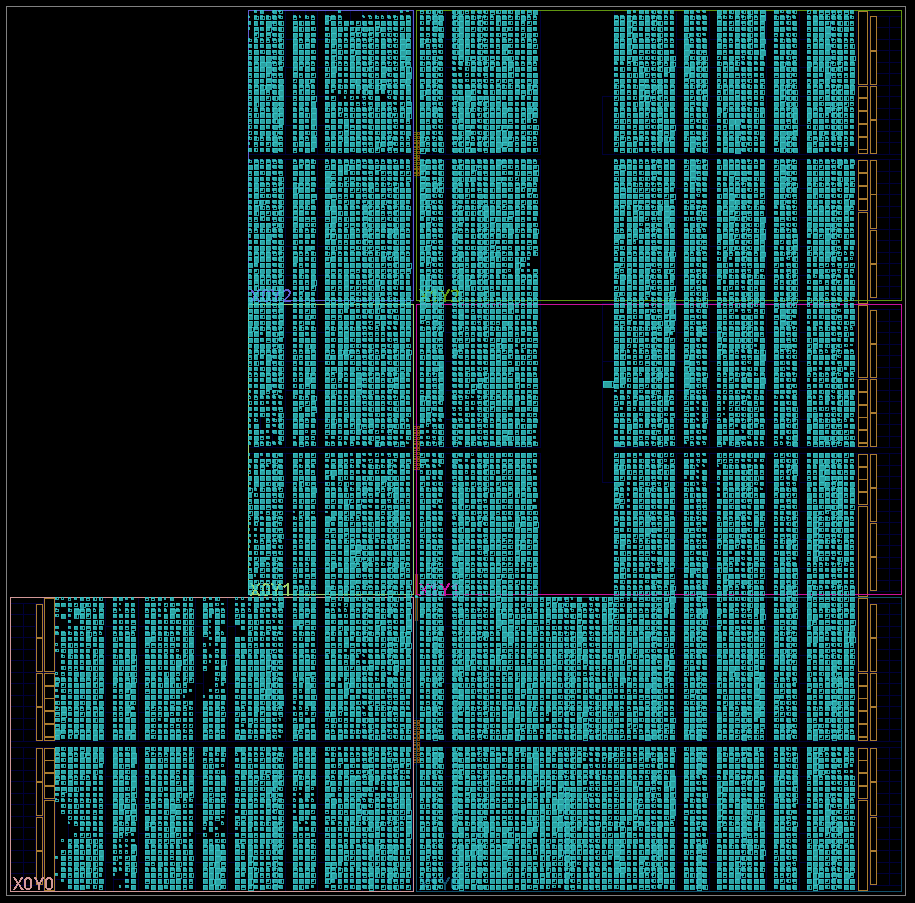
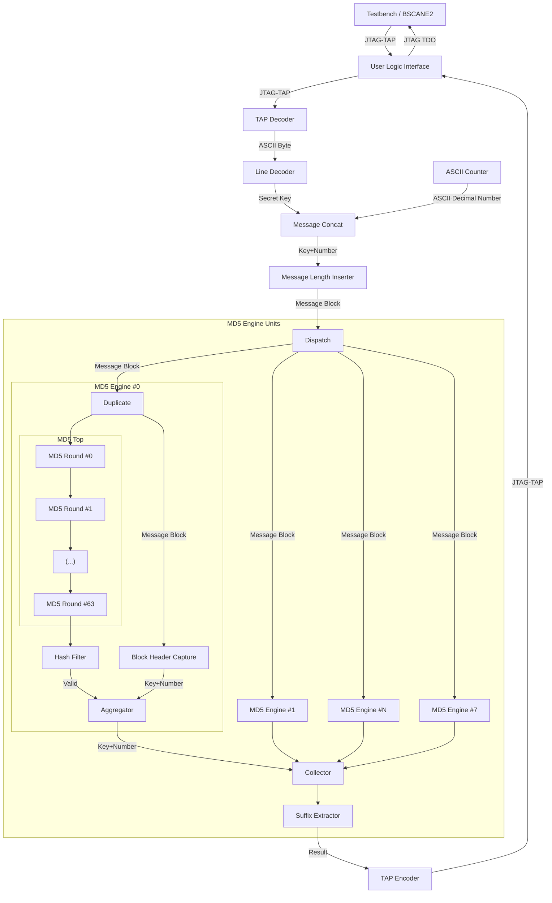

# Day 4: The Ideal Stocking Stuffer - Part 2

This second part increases the number of leading zeros which the digest shall match. Since each hexadecimal carries 16 combinations, the required runtime should increase by the same amount assuming an uniform distribution.


# Design Space Exploration

Using the Python script from part one and tweaking it for a digest with six leading zeros, I get the following results:

| Secret Key | Answer  | Input             | Hash                               |
|------------|---------|-------------------|------------------------------------|
| `yzbqklnj` | 9962624 | `yzbqklnj9962624` | `0000004b347bf4b398b3f62ace7cd301` |

I sometimes happen to trust but will always verify.

```bash
echo -n "yzbqklnj9962624" | md5sum
0000004b347bf4b398b3f62ace7cd301  -
```

A simple rule of three yields an on-board processing time of $$9962624 / 282749 \times 11.2 sec$$, approx 6 minutes and a half.

I could run the same firmware with the modification for accounting the extra digit, but this would be far too easy and the FPGA is not even 70 % full, this must be corrected.

# Implementation

## First Iteration

I added a basic dispatcher:

```verilog
assign md5_block_ready = ((per_unit_block_ready & per_unit_sel) != '0);
assign handshake_occured = md5_block_ready && md5_block_valid;

osedge clk) begin : dispatch_to_units
    if (handshake_occured) begin
        per_unit_sel <= {per_unit_sel[MD5_TOP_UNITS-2:0], per_unit_sel[MD5_TOP_UNITS-1]};
    end
end
```

Since only a single output event is generated, the output fetch logic is trivial:

```verilog
// Works because only one engine will match the correct result

always_ff @(posedge clk) begin
    result_valid <= 1'b0;
    for (int j = 0; j < MD5_TOP_UNITS; j++) begin
        if (per_unit_result_valid[j]) begin
            result_valid <= 1'b1;
            result_data <= per_unit_result_data[j];
        end
    end
end
```

### Resource Usage

I tried cramming eight instances of the MD5 core, but this didn't fit in the Zynq-7020. Reducing to seven did fit but barely:

```
WARNING: [Place 30-34] Design utilization is very high. Please run report_utilization command to see design utilization.
```

I paid for these slices, I will want to use them.

|                  Site Type                 |  Used | Fixed | Prohibited | Available | Util% |
|--------------------------------------------|-------|-------|------------|-----------|-------|
| Slice                                      | 13212 |     0 |          0 |     13300 | 99.34 |
|   SLICEL                                   |  8899 |     0 |            |           |       |
|   SLICEM                                   |  4313 |     0 |            |           |       |
| LUT as Logic                               | 49666 |     0 |          0 |     53200 | 93.36 |
|   using O5 output only                     |    21 |       |            |           |       |
|   using O6 output only                     | 41835 |       |            |           |       |
|   using O5 and O6                          |  7810 |       |            |           |       |
| LUT as Memory                              |    91 |     0 |          0 |     17400 |  0.52 |
|   LUT as Distributed RAM                   |     0 |     0 |            |           |       |
|     using O5 output only                   |     0 |       |            |           |       |
|     using O6 output only                   |     0 |       |            |           |       |
|     using O5 and O6                        |     0 |       |            |           |       |
|   LUT as Shift Register                    |    91 |     0 |            |           |       |
|     using O5 output only                   |    84 |       |            |           |       |
|     using O6 output only                   |     7 |       |            |           |       |
|     using O5 and O6                        |     0 |       |            |           |       |
| Slice Registers                            | 32003 |     0 |          0 |    106400 | 30.08 |
|   Register driven from within the Slice    | 16925 |       |            |           |       |
|   Register driven from outside the Slice   | 15078 |       |            |           |       |
|     LUT in front of the register is unused |   714 |       |            |           |       |
|     LUT in front of the register is used   | 14364 |       |            |           |       |

Floorplan didn't disappoint:



## Second Iteration: Logic Optimization

Reviewing the module hierarchy, I noticed the `suffix_extractor` module was instantiated in each MD5 engine. Since only one of all the engines will yield a result passing through the `hash_filter` module, I decided that I could factorize this module. Doing so I also found a nasty latent bug just hidden thanks to just the right sequence of events.

In all this optimization allowed me to spare some resource usage but sadly not enough to shoe-horn an extra MD5 engine instance. Meaning I'm still stuck with seven of these.

|          Site Type         |  Used | Fixed | Prohibited | Available | Util% |
|----------------------------|-------|-------|------------|-----------|-------|
| Slice LUTs                 | 48353 |     0 |          0 |     53200 | 90.89 |
| Slice Registers            | 30236 |     0 |          0 |    106400 | 28.42 |

Few of the LUTs are used outside of the MD5 units.

|                Instance               |             Module            | Total LUTs | Logic LUTs | SRLs |  FFs  |
|---------------------------------------|-------------------------------|------------|------------|------|-------|
| shell                                 |                         (top) |      48353 |      48339 |   14 | 30236 |
|   (shell)                             |                         (top) |          0 |          0 |    0 |     0 |
|   user_logic_i                        |                    user_logic |      48353 |      48339 |   14 | 30236 |
|     (user_logic_i)                    |                    user_logic |          1 |          1 |    0 |     0 |
|     ascii_counter_i                   |                 ascii_counter |         30 |         30 |    0 |    28 |
|     line_decoder_i                    |                  line_decoder |         74 |         74 |    0 |   101 |
|     md5_engine_units_i                |              md5_engine_units |      47980 |      47966 |   14 | 29662 |
|       (md5_engine_units_i)            |              md5_engine_units |        369 |        369 |    0 |   128 |
|       per_md5_top[0].md5_engine_i     |                 md5_engine__1 |       6654 |       6654 |    0 |  4160 |
|         (per_md5_top[0].md5_engine_i) |                 md5_engine__1 |          0 |          0 |    0 |   120 |
|         hash_filter_i                 |                hash_filter__1 |          5 |          5 |    0 |     1 |
|         md5_top_i                     |                    md5_top__1 |       6649 |       6649 |    0 |  4039 |
|       per_md5_top[1].md5_engine_i     |                 md5_engine__2 |       6752 |       6752 |    0 |  4160 |
|         (per_md5_top[1].md5_engine_i) |                 md5_engine__2 |          0 |          0 |    0 |   120 |
|         hash_filter_i                 |                hash_filter__2 |          5 |          5 |    0 |     1 |
|         md5_top_i                     |                    md5_top__2 |       6747 |       6747 |    0 |  4039 |
|       per_md5_top[2].md5_engine_i     |                 md5_engine__3 |       6662 |       6662 |    0 |  4160 |
|         (per_md5_top[2].md5_engine_i) |                 md5_engine__3 |          0 |          0 |    0 |   120 |
|         hash_filter_i                 |                hash_filter__3 |          5 |          5 |    0 |     1 |
|         md5_top_i                     |                    md5_top__3 |       6657 |       6657 |    0 |  4039 |
|       per_md5_top[3].md5_engine_i     |                 md5_engine__4 |       6690 |       6690 |    0 |  4160 |
|         (per_md5_top[3].md5_engine_i) |                 md5_engine__4 |          0 |          0 |    0 |   120 |
|         hash_filter_i                 |                hash_filter__4 |          5 |          5 |    0 |     1 |
|         md5_top_i                     |                    md5_top__4 |       6685 |       6685 |    0 |  4039 |
|       per_md5_top[4].md5_engine_i     |                 md5_engine__5 |       6680 |       6680 |    0 |  4160 |
|         (per_md5_top[4].md5_engine_i) |                 md5_engine__5 |          0 |          0 |    0 |   120 |
|         hash_filter_i                 |                hash_filter__5 |          5 |          5 |    0 |     1 |
|         md5_top_i                     |                    md5_top__5 |       6675 |       6675 |    0 |  4039 |
|       per_md5_top[5].md5_engine_i     |                 md5_engine__6 |       6654 |       6654 |    0 |  4160 |
|         (per_md5_top[5].md5_engine_i) |                 md5_engine__6 |          0 |          0 |    0 |   120 |
|         hash_filter_i                 |                hash_filter__6 |          5 |          5 |    0 |     1 |
|         md5_top_i                     |                    md5_top__6 |       6649 |       6649 |    0 |  4039 |
|       per_md5_top[6].md5_engine_i     |                    md5_engine |       6670 |       6670 |    0 |  4160 |
|         (per_md5_top[6].md5_engine_i) |                    md5_engine |          0 |          0 |    0 |   120 |
|         hash_filter_i                 |                   hash_filter |          5 |          5 |    0 |     1 |
|         md5_top_i                     |                       md5_top |       6665 |       6665 |    0 |  4039 |
|       suffix_extractor_i              |              suffix_extractor |        850 |        836 |   14 |   414 |
|     message_concat_i                  |                message_concat |        227 |        227 |    0 |   161 |
|     message_length_inserter_i         |       message_length_inserter |          2 |          2 |    0 |   161 |
|     tap_decoder_i                     |                   tap_decoder |         20 |         20 |    0 |    41 |
|     tap_encoder_i                     |                   tap_encoder |         22 |         22 |    0 |    82 |

## Third Iteration: Internal Configuration Clock

Two device configuration related primitives provide an internal clock signal: STARTUPE2 and USR_ACCESSE2. Instead of being gated from the host like the JTAG `tck` clock, these two former clocks are free running and should be able to provide continuous clock cycle at about 65 MHz.

Of course dealing with more than one clock means caring about *clock domain crossing*. Thankfully the whole design exposes some boundaries at which the information remains quite stable, specially in this puzzle with such short input contents.

The constraints file had to be modified for accommodating these changes:

```tcl
# clock constraints

    create_clock -name TCK -period 20 [get_pins */TCK]
    create_clock -name CFGCLK -period 15 [get_pins */CFGCLK]

# declare timing exceptions

    set_max_delay -from [get_clocks TCK] -to [get_clocks CFGCLK] -datapath_only [get_property PERIOD [get_clocks CFGCLK]]
    set_max_delay -from [get_clocks CFGCLK] -to [get_clocks TCK] -datapath_only [get_property PERIOD [get_clocks TCK]]
```

### Simplified Dataflow Diagram


