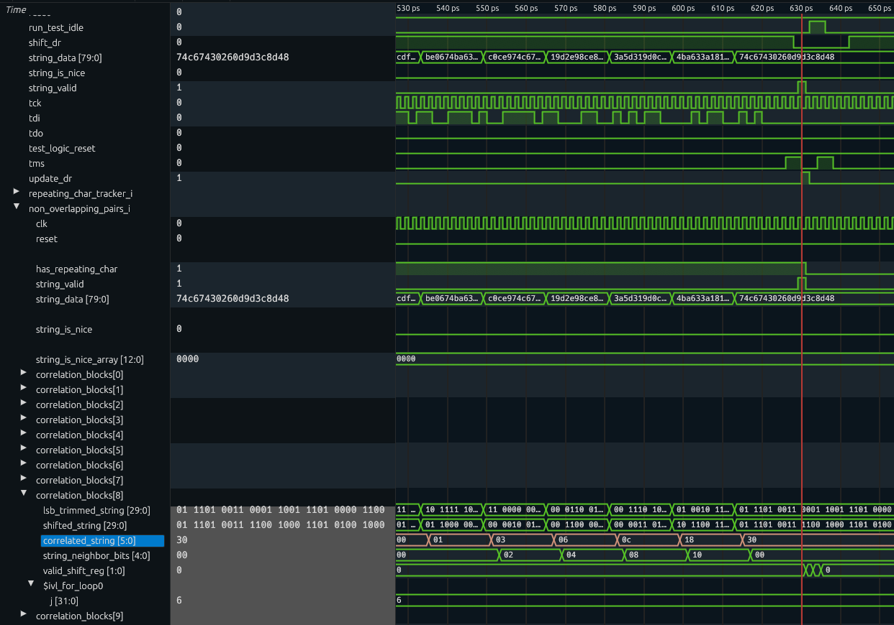

# Day 5: Doesn't He Have Intern-Elves For This? - Part 2

Status:

| Test                       | Status                |
|----------------------------|-----------------------|
| Reference: Python script   | :white_check_mark: Ok |
| Simulation: Icarus Verilog | :white_check_mark: Ok |
| Simulation: Verilator      | :white_check_mark: Ok |
| Simulation: Vivado Xsim    | :white_check_mark: Ok |
| Synthesis: Vivado Zynq7    | :white_check_mark: Ok |
| On-board: Zynq7            | TBD |

# Lessons Learnt

- Off by one errors are not limited to software.
- Decomposing processing in several stages with signals greatly helps identifying unexpected behavior.

# Design Space Exploration

My first thought was to run a cross-correlation on the strings using an increasing byte shift amount for this first requirement pertaining to the pair of letters. The shift amount starts at two bytes since the pairs must not overlapping and stops when there is only one pair of bytes left to correlate.

```py
for shift_amount in range(2, len(string) - 2):
    string_head = string[:-shift_amount]
    string_tail = string[shift_amount:]
    matching_chars = [h == t for h, t in zip(string_head, string_tail)]
```

The matching characters can obviously be other things than a pair, thus a second cross-correlation with a single byte shift is used for detecting the presence of repeating matching chars which identifies the presence of a pair of letters. Thus the full implementation for the first requirement is as follows:

```py
for shift_amount in range(2, len(string) - 2):
    string_head = string[:-shift_amount]
    string_tail = string[shift_amount:]
    matching_chars = [h == t for h, t in zip(string_head, string_tail)]
    match_head = matching_chars[:-1]
    match_tail = matching_chars[1:]
    pair = any(h and t for h, t in zip(match_head, match_tail))
```

The second requirement consists in finding any character with an offset of two bytes. This is far simpler to implement:

```py
    string_head = string[:-2]
    string_tail = string[2:]
    repeat = any(h == t for h, t in zip(string_head, string_tail))
```

For reference, using my custom input contents I obtain the following results:

| pair and repeat | pair | repeat |
|-----------------|------|--------|
| 69              | 129  | 431    |

## Non-overlapping Pair Tracking

At a first glance I see two approaches to this feature:

- Hash table (when in doubt this is usually the goto solution in AoC)
- Two consecutive cross-correlations (detecting identical characters and detecting consecutive matches, i.e pairs)

### Hash Table Approach

The figures for the hash table approach are totally within the realms of small FPGAs:

- Address space: 2^10 (32*32 since we want to store pairs of characters)
- Entry: byte offset corresponding to the entry

The main challenge with the hash table is the handling of the clearing mechanism which must be performed once each string is processed. Since I do not plan to enforce backpressure (or rely on a very large buffer) on the inbound interface and the clearing mechanism likely will requires at least 16 clocks to clear the entries, a second instance of the processing unit will be required.

```py
MIN_PAIR_DISTANCE = 2  # non-overlapping pair
CHAR_BITS = math.ceil(math.log2(26))
ASCII_LOWER_A = ord("a")

def has_repeated_pairs_ht(string: str) -> bool:
    # Hash table approach
    pair_table = [-1] * 2**CHAR_BITS * 2**CHAR_BITS
    identical_pairs = False
    for i in range(len(string) - MIN_PAIR_DISTANCE + 1):
        pair = string[i : i + MIN_PAIR_DISTANCE]
        msb = ord(pair[0]) - ASCII_LOWER_A
        lsb = ord(pair[1]) - ASCII_LOWER_A
        index = (msb << CHAR_BITS) | lsb
        new_pair = pair_table[index] == -1
        if new_pair:
            pair_table[index] = i
        else:
            overlapping = i - pair_table[index] < MIN_PAIR_DISTANCE
            identical_pairs = identical_pairs or not overlapping
    # Hash table clearing and verification
    for i in range(len(string) - MIN_PAIR_DISTANCE + 1):
        pair = string[i : i + MIN_PAIR_DISTANCE]
        msb = ord(pair[0]) - ASCII_LOWER_A
        lsb = ord(pair[1]) - ASCII_LOWER_A
        index = (msb << CHAR_BITS) | lsb
        pair_table[index] = -1
    for entry in pair_table:
        assert entry == -1, "Hash table not cleared"
    return identical_pairs
```

The implementation of the *hash* table is straightforward, the inbound characters are masked to keep only the lower 5 bits of the ASCII code. Doing so reduces the exhaustive pair table to a size of 1024 entries. Each entry simply contains the offset and at each newly received character a lookup is performed using the last and current character as key.

As already mentioned, clearing the table is likely the most complex operation.

### Dual Cross-Correlation Approach

The first correlation stage requires running 14 steps once the string is completely received. The second stage uses the results from the first one but only a single offset must be run.

```py
MIN_PAIR_DISTANCE = 2  # non-overlapping pair

def has_repeated_pairs_dcc(string: str) -> bool:
    # Dual cross correlation approach
    start_offset = MIN_PAIR_DISTANCE
    stop_offset = len(string) - MIN_PAIR_DISTANCE
    identical_pairs = False
    for char_offset in range(start_offset, stop_offset):
        char_map = zip(string, string[char_offset:])
        identical_chars = [top == bot for top, bot in char_map]
        identical_pairs = identical_pairs or any(
            identical_chars[i] and identical_chars[i + 1]
            for i in range(len(identical_chars) - 1)
        )
    return identical_pairs
```

This implementation highlights the presence of a sliding window (from an offset of 2 up to 14), with each step followed by a matching neighbor check. The limited number of configurations makes a parallel implementation possible, where 13 matching units being instantiated.

## Repeating Character Tracking

I decided to implement the simplest requirement first, which consists in finding matching characters with an arbitrary one in the middle. Since this condition can happen anywhere in the string, once it occurs it must flip a variable remaining in this new state until the end of line is reached. Each string presenting this condition results in the `result` variable being incremented.

```py
REPEAT_CHAR_DISTANCE = 2

def has_repeated_chars(string: str) -> bool:
    string_long_enough: bool = len(string) - REPEAT_CHAR_DISTANCE > 0
    if string_long_enough:
        is_last_char_repeated = string[-1] == string[-1 - REPEAT_CHAR_DISTANCE]
        return is_last_char_repeated
    return False
```

# FPGA Implementation

The implementation work can be nicely be split into two parts corresponding to the two requirements detailed in the previous section.

## First Iteration: Repeating Characters Tracking

This requirement operates on a per-byte basis resulting in minimal changes from the user logic module.

The logic implemented in Python maps very nicely to RTL, the core logic being quite simple:

```verilog
always_ff @(posedge clk) begin: check_repeating_chars
    if (reset) begin
        has_repeating_char <= 1'b0;
    end else begin
        if (string_valid) begin
            has_repeating_char <= 1'b0;
        end
        if (inbound_valid) begin
            if (is_char_letter(inbound_data) &&
                    is_char_letter(char_history[0]) &&
                    is_char_letter(char_history[1])) begin
                if (inbound_data == char_history[1]) begin
                    has_repeating_char <= 1'b1;
                end
            end
        end
    end
end
```

### Logic Resource Usage

The amount of resources used is inline with the design complexity which is rather low for this first iteration.

| Ref Name | Used | Functional Category |
|----------|------|---------------------|
| FDRE     |   81 |        Flop & Latch |
| LUT3     |   19 |                 LUT |
| LUT6     |   10 |                 LUT |
| LUT4     |    8 |                 LUT |
| LUT5     |    7 |                 LUT |
| LUT2     |    5 |                 LUT |
| CARRY4   |    4 |          CarryLogic |
| LUT1     |    1 |                 LUT |
| BUFG     |    1 |               Clock |
| BSCANE2  |    1 |              Others |

|           Instance           |         Module         | Total LUTs | FFs |
|------------------------------|------------------------|------------|-----|
| shell                        |                  (top) |         37 |  81 |
|   (shell)                    |                  (top) |          0 |   0 |
|   user_logic_i               |             user_logic |         37 |  81 |
|     (user_logic_i)           |             user_logic |          3 |  17 |
|     repeating_char_tracker_i | repeating_char_tracker |         18 |  19 |
|     tap_decoder_i            |            tap_decoder |          7 |  13 |
|     tap_encoder_i            |            tap_encoder |          9 |  32 |

Of course this design is nowhere near the danger zone:

| Criteria                                                  | Guideline | Actual | Status |
|-----------------------------------------------------------|-----------|--------|--------|
| LUT                                                       | 70%       | 0.07%  | OK     |
| FD                                                        | 50%       | 0.08%  | OK     |
| LUTRAM+SRL                                                | 25%       | 0.00%  | OK     |
| MUXF7                                                     | 15%       | 0.00%  | OK     |
| DSP                                                       | 80%       | 0.00%  | OK     |
| RAMB/FIFO                                                 | 80%       | 0.00%  | OK     |
| DSP+RAMB+URAM (Avg)                                       | 70%       | 0.00%  | OK     |
| BUFGCE* + BUFGCTRL                                        | 24        | 1      | OK     |
| DONT_TOUCH (cells/nets)                                   | 0         | 0      | OK     |
| MARK_DEBUG (nets)                                         | 0         | 0      | OK     |
| Control Sets                                              | 998       | 6      | OK     |
| Average Fanout for modules > 100k cells                   | 4         | 2.62   | OK     |
| Max Average Fanout for modules > 100k cells               | 4         | 0      | OK     |
| Non-FD high fanout nets > 10k loads                       | 0         | 0      | OK     |

## Second Iteration: Non-overlapping Pairs

I opted for the dual cross-correlation approach which I feel is more interesting due to involving some parallelism. A drawback of the alternate approach is that it requires implementing a memory scrubbing mechanism which due to the number of accesses required, will not be able to complete before new inbound data is received. This situation could be handled by simply adding a FIFO, but dropping FIFOs in the hot path seems a little too easy.

My first implementation was returning incorrect values:

```
Overriding input filename: input.txt
file_size: 17000 bytes
Loaded 17000 bytes
Transferred 17000 bytes
Result: 59 (0x003b)
Finished after 136095 cycles
```

The expected value is 69 instead of 59, meaning that I made a mistake somewhere. Bisecting the input contents and comparing the results between the Python and RTL implementations revealed the first discrepancy with the string `nscghlafavnsycjh`. Looking at the waveforms, I noticed the repeating character with a distance of three `afa` is correctly identified.

The question now is why did the RTL implementation failed to match with an offset of ten characters:

```
nscghlafavnsycjh----------
----------nscghlafavnsycjh
          ^^
```



It is apparent that cross-corelation with an offset of ten characters (`correlated_string`) behaves as expected. Oppositely, the second stage with `string_neighbor_bits` does not, meaning the issue lays with the followig assignation:

```verilog
(CORRELATED_BITS/BITS_PER_CHAR-1)'({correlated_string, 1'b0} & {1'b0, correlated_string})
```

In hindsight the problem is obvious, I added a superfluous bit at LSB, this shifted the whole calculation with one bit off resulting in missing strings with the first pair of chars matching other pairs. The fix is shamelessly simple:

```diff
-        always_ff @(posedge clk) string_neighbor_bits <= (CORRELATED_BITS/BITS_PER_CHAR-1)'({correlated_string, 1'b0} & {1'b0, correlated_string});
+        always_ff @(posedge clk) string_neighbor_bits <= (CORRELATED_BITS/BITS_PER_CHAR-1)'(correlated_string & (correlated_string >> 1));
```

### Final Logic Resource Usage

The mapping into device primitives exhibits a relative high usage of LUT6 and LUT5, which is not really surprising since the design makes heavy use of bitwise comparisons with operands with a length sweeping from ten up to 70.

| Ref Name | Used | Functional Category |
|----------|------|---------------------|
| FDRE     |  396 |        Flop & Latch |
| LUT6     |  162 |                 LUT |
| LUT5     |  140 |                 LUT |
| LUT2     |  107 |                 LUT |
| LUT3     |   57 |                 LUT |
| LUT4     |   19 |                 LUT |
| CARRY4   |   15 |          CarryLogic |
| MUXF7    |    2 |               MuxFx |
| LUT1     |    2 |                 LUT |
| BUFG     |    1 |               Clock |
| BSCANE2  |    1 |              Others |

Hierarchical usage is totally as expected.

|           Instance           |             Module            | Total LUTs | Logic LUTs | FFs |
|------------------------------|-------------------------------|------------|------------|-----|
| shell                        |                         (top) |        402 |        402 | 396 |
|   (shell)                    |                         (top) |          0 |          0 |   0 |
|   user_logic_i               |                    user_logic |        402 |        402 | 396 |
|     (user_logic_i)           |                    user_logic |          3 |          3 |  17 |
|     non_overlapping_pairs_i  | non_overlapping_pairs_tracker |        362 |        362 | 235 |
|     repeating_char_tracker_i |        repeating_char_tracker |         21 |         21 |  99 |
|     tap_decoder_i            |                   tap_decoder |          7 |          7 |  13 |
|     tap_encoder_i            |                   tap_encoder |          9 |          9 |  32 |
