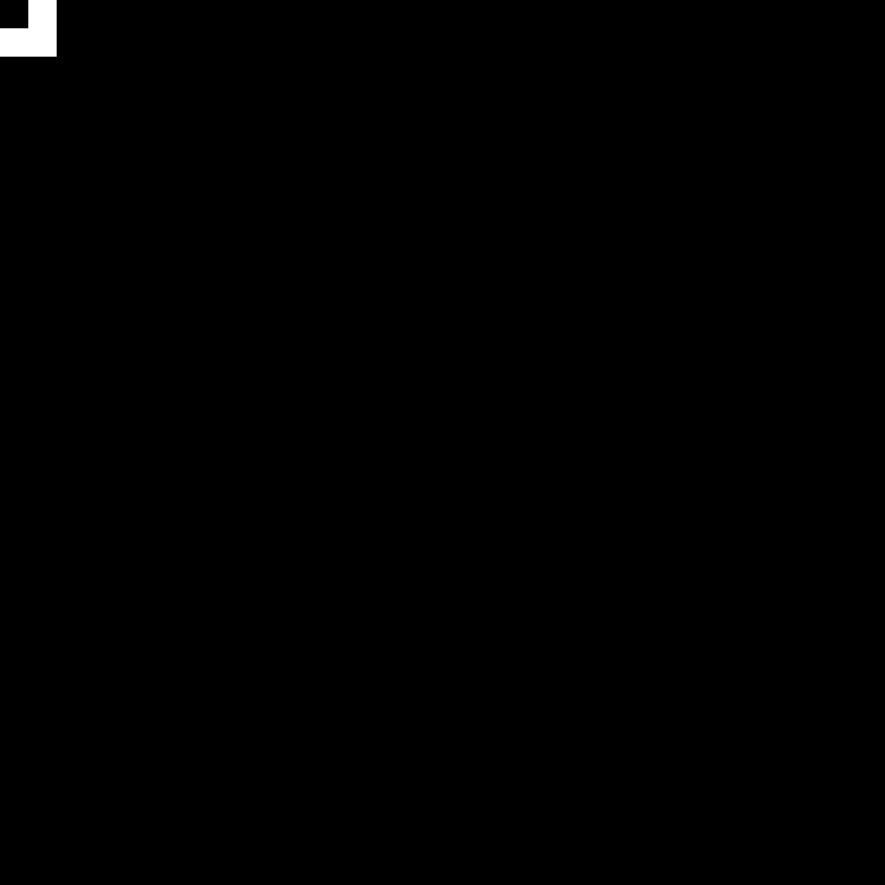
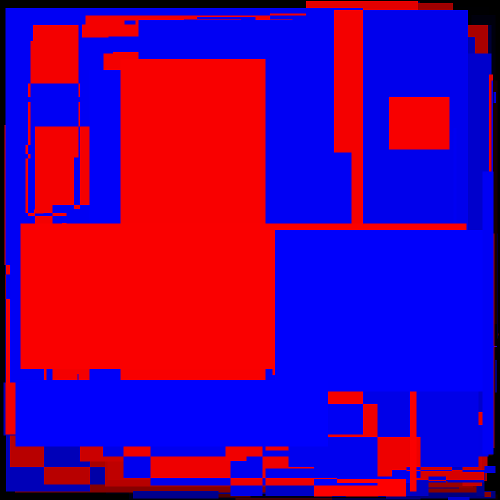

# Day 6: Probably a Fire Hazard - Part 1

Status:

| Test                       | Status                |
|----------------------------|-----------------------|
| Reference: Python script   | :white_check_mark: Ok |
| RTL Concept: Python script | TBD |
| Simulation: Icarus Verilog | TBD |
| Simulation: Verilator      | TBD |
| Simulation: Vivado Xsim    | TBD |
| Synthesis: Vivado Zynq7    | TBD |
| On-board: Zynq7            | TBD |

# Lessons Learnt

- Python is the boss for prototyping.

# Design Space Exploration

I was quite taken back by the size of working set: 1000x1000. Such a large amount of data renders any implementation relying on full parallelization unpractical on any FPGAs but the most expensive ones. With that out of the way I implemented the reference solution which is not intended for testing the implementation but rather get the correct answer.

For instance, with my custom input, the expected result is `569999`.

There is not much to write about the reference implementation, it starts with a regex for extracting the information from the input file:

```py
INPUT_REGEX = (
    r"(turn )?(?P<action>\w+) "
    r"(?P<corner0>\d+,\d+) through (?P<corner1>\d+,\d+)"
)
```

The core processing brute forces through each instruction, line and column:

```py
for instr in instructions:
    for x in range(instr["x0"], instr["x1"] + 1):
        for y in range(instr["y0"], instr["y1"] + 1):
            if "on" == instr["action"]:
                lit_lights[(x, y)] = True
            elif "off" == instr["action"]:
                lit_lights[(x, y)] = False
            elif "toggle" == instr["action"]:
                lit_lights[(x, y)] = not lit_lights.get((x, y), False)
return sum(lit_lights.values())
```

Obviously there is room for improvements but this is beside the point.

Circling back to the problem, I have 300 lines corresponding to *instructions* according to the problem statement. Each instruction is composed of three parts: action and two sets of two-dimensional coordinates. I added calculations to the script and came back with the following results:

- Instructions are fairly balanced in terms of action distribution.
- All the corners are sorted, with the first one using smaller coordinates for both axes.
- In total 23'163'958 *lights* were updated.
- Each instruction on average affects about 77'000 *ligths*, with min and max of respectively 4 and 798'395.

I also wanted to gather additional information regarding the sequence of actions, for getting a feel of the distribution of updates across the grid. Thankfully due to the *batteries included* of Python, this was quite easy by requiring just a couple of lines:

```py
LIGHT_GRID_SIZE = (1000, 1000)

def dump_lit_lights(lit_lights: dict) -> None:
    pixels_img = Image.new("1", LIGHT_GRID_SIZE, 0)
    updates_img = Image.new("RGB", LIGHT_GRID_SIZE, 0x000000)
    pixels = pixels_img.load()
    updates = updates_img.load()
    for (x, y), (is_on, depth) in lit_lights.items():
        pixels[x, y] = 1 if is_on else 0
        updates[x, y] = (
            int(depth * 255 / 300) << 16 if is_on else int(depth * 255 / 300)
        )
    pixels_img.save("lit_lights.png")
    updates_img.save("light_updates.png")
```

The final grid configuration is shown below:



The following image shows the index at which each pixel was last updated (foreshadowing the FPGA implementation):



Yeah so this just confirmed that starting from the end makes quite a lot of sense. Altough I could brute force using the shear bandwidth of BRAM units,
