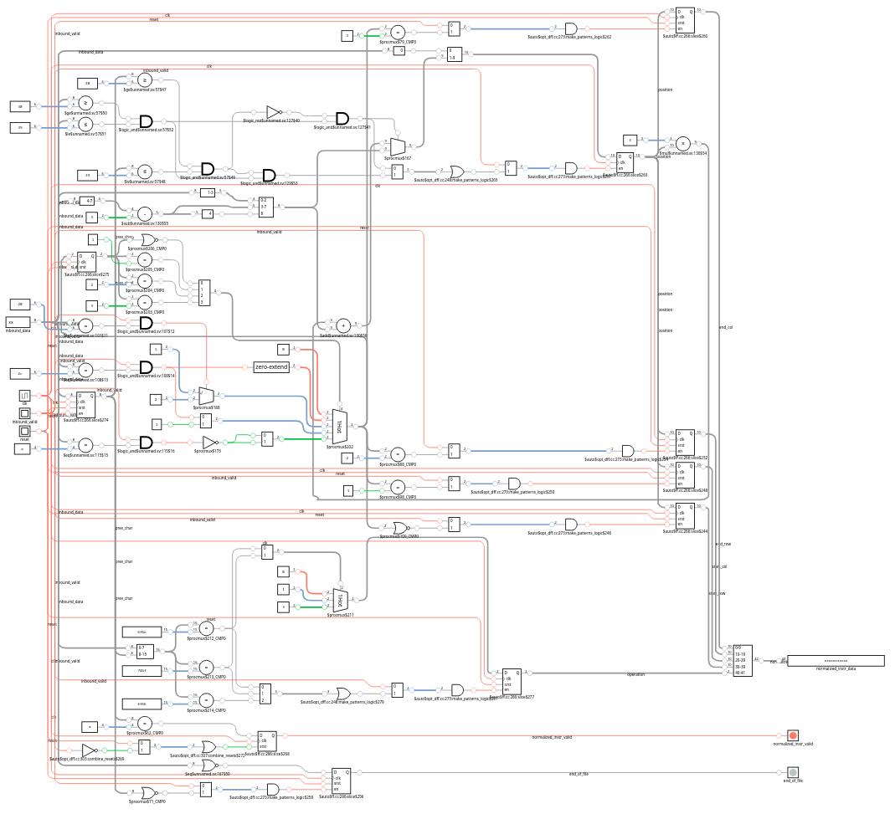
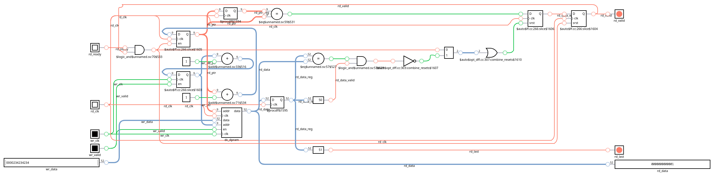
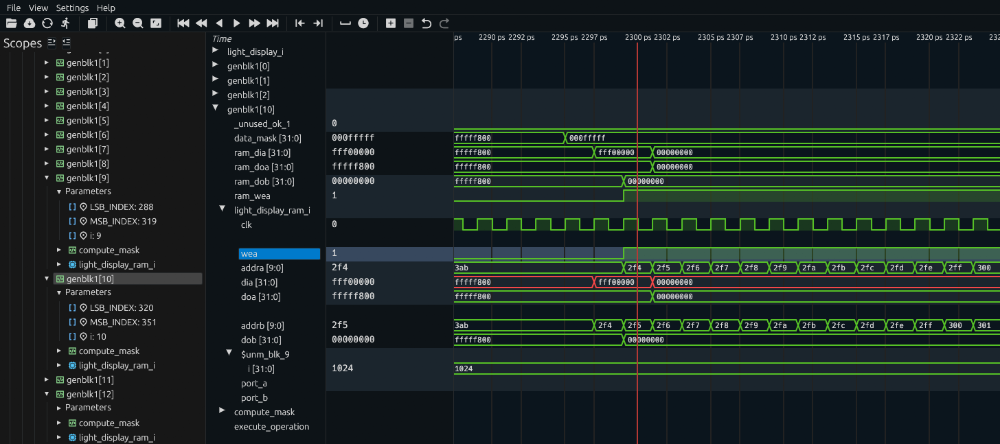
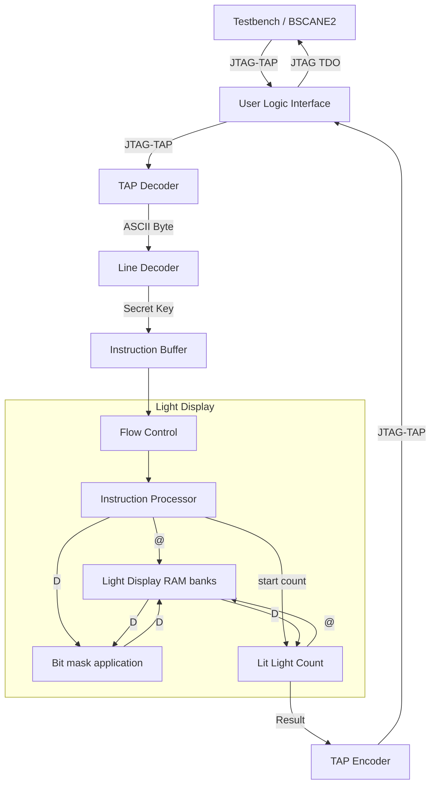

# Day 6: Probably a Fire Hazard - Part 1

Status:

| Test                       | Status                |
|----------------------------|-----------------------|
| Reference: Python script   | :white_check_mark: Ok |
| RTL Concept: Python script | :white_check_mark: Ok |
| Simulation: Icarus Verilog | :white_check_mark: Ok |
| Simulation: Verilator      | :white_check_mark: Ok |
| Simulation: Vivado Xsim    | :white_check_mark: Ok |
| Synthesis: Vivado Zynq7    | :white_check_mark: Ok |
| On-board: Zynq7            | :white_check_mark: Ok |

# Lessons Learnt

- Python is the boss for prototyping.
- Ensure data/valid sequence is clean, especially with a CDC

# Design Space Exploration

## Reference Design

I was quite taken back by the size of working set: 1000x1000. Such a large amount of data renders any implementation relying on full parallelization unpractical on any FPGAs but the most expensive ones. With that out of the way I implemented the reference solution which is not intended for testing the implementation but rather get the correct answer.

For instance, with my custom input, the expected result is `569999`.

There is not much to write about the reference implementation, it starts with a regex for extracting the information from the input file:

```py
INPUT_REGEX = (
    r"(turn )?(?P<action>\w+) "
    r"(?P<corner0>\d+,\d+) through (?P<corner1>\d+,\d+)"
)
```

The core processing brute forces through each instruction, line and column:

```py
for instr in instructions:
    for x in range(instr["x0"], instr["x1"] + 1):
        for y in range(instr["y0"], instr["y1"] + 1):
            if "on" == instr["action"]:
                lit_lights[(x, y)] = True
            elif "off" == instr["action"]:
                lit_lights[(x, y)] = False
            elif "toggle" == instr["action"]:
                lit_lights[(x, y)] = not lit_lights.get((x, y), False)
return sum(lit_lights.values())
```

Obviously there is room for improvements but this is beside the point.

## Input Contents Properties

Circling back to the problem, I have 300 lines corresponding to *instructions* according to the problem statement. Each instruction is composed of three parts: action and two sets of two-dimensional coordinates. I added calculations to the script and came back with the following results:

- Instructions are fairly balanced in terms of action distribution.
- All the corners are sorted, with the first one using smaller coordinates for both axes.
- In total 23'163'958 *lights* were updated.
- Each instruction on average affects about 77'000 *ligths*, with min and max of respectively 4 and 798'395.

## Final Status

I also wanted to gather additional information regarding the sequence of actions, for getting a feel of the distribution of updates across the grid. Thankfully due to the *batteries included* of Python, this was quite easy by requiring just a couple of lines:

```py
LIGHT_GRID_SIZE = (1000, 1000)

def dump_lit_lights(lit_lights: dict) -> None:
    pixels_img = Image.new("1", LIGHT_GRID_SIZE, 0)
    updates_img = Image.new("RGB", LIGHT_GRID_SIZE, 0x000000)
    pixels = pixels_img.load()
    updates = updates_img.load()
    for (x, y), (is_on, depth) in lit_lights.items():
        pixels[x, y] = 1 if is_on else 0
        updates[x, y] = (
            int(depth * 255 / 300) << 16 if is_on else int(depth * 255 / 300)
        )
    pixels_img.save("lit_lights.png")
    updates_img.save("light_updates.png")
```

The final grid configuration is shown below:


The following image shows the index at which each pixel was last updated (foreshadowing the FPGA implementation):


Yeah so this just confirmed that starting from the end makes quite a lot of sense. Altough I could brute force using the shear bandwidth of BRAM units.

## Choosing the RTL Implementation

Contrary to most previous puzzles, this one cannot be solved at line rate simply due to an amount of calculation vastly superior to the number of cycles between each instruction. Rather I see two approaches depending on the ordering of instructions used.

Beginning the processing from the start requires updating the complete grid at each instruction, the *lights* array would be accessed in a row-major order allowing for updating multiple light elements at once for much better performance.

Conversely, starting from the end allows the processing to stop updating *light* elements as soon as an instruction setting the light on or off is encountered. No further processing would be required for such *light* elements. This improved design however has two drawbacks:

- Needs for storing the per-light calculation state (known; unknown untoggled or unknown toggled)
- As the iteration goes deeper back in time, the instruction area must be masked as to not overlap known light states.

For all these reasons, I believe that the approach beginning from the start is the most practical.

## RTL Design Implementation

BRAM on Xilinx's 7-series supports a number of different port configurations, ranging from 32K single bit to 512 words of 72 bits.

| BRAM Mode | Min Instances | Total Size |
|-----------|---------------|------------|
| 32K x 1   | 1000          | 32 Mb      |
| 16K x 2   | 500           | 16 Mb      |
| 8K x 4    | 250           | 8 Mb       |
| 4K x 8    | 125           | 4 Mb       |
| 2K x 16   | 63            | 2 Mb       |
| 1K x 32   | 32            | 1 Mb       |
| 512 x 72  | 28            | ~1 Mb      |

The usecase corresponding to this puzzle is updating all 1000 bits in a single clock cycle for design complexity reasons while avoiding wasting unused bits.

Taking the extremes, the single-bit 32K deep requires 1000 instances resulting in a total of 32Mbit which worse then being extremely wasteful doesn't even fit in the Zynq-7020. Conversely, the 72-bit wide 512 deep requires a 72 bit masking operations.

I believe the sweet spot is the 1K x 32 configuration, which offers no wasted capacity and much simpler address decoding logic than the 72-bit wide configuration. The Python implementation of the FPGA logic is fairly simple. It uses a three level deep iterations:

- Iteration per-instruction
- Iteration per row
- Iteration per memory instance

```py
    for instr in instructions:
        for row in range(instr["y0"], instr["y1"] + 1):
            start_col = instr["x0"] // WORD_WIDTH
            end_col = instr["x1"] // WORD_WIDTH
            for i, ram_word in enumerate(lit_lights[row]):
                # Loop over all BRAM instances
```

The inner execution flow depdends if the current BRAM is affected or not by the instruction and in this case if so is it in an edge case or not:

```py
                if (i < start_col) or (i > end_col):
                    continue
                if i == start_col:
                    start_bit = WORD_WIDTH - 1 - (instr["x0"] % WORD_WIDTH)
                else:
                    start_bit = WORD_WIDTH - 1
                if i < end_col:
                    end_bit = 0
                else:
                    end_bit = WORD_WIDTH - 1 - (instr["x1"] % WORD_WIDTH)
```

The remainder of the inner loop is the execution of the instruction on the affected data word, which is some simple boolean logic:

```py
                # bit mask calculation, a true minefield of "off by one" errors
                bit_count = start_bit - end_bit + 1
                bit_mask = ((1 << bit_count) - 1) << end_bit
                if instr["action"] == "on":
                    lit_lights[row][i] |= bit_mask
                elif instr["action"] == "off":
                    lit_lights[row][i] &= ~bit_mask
                elif instr["action"] == "toggle":
                    lit_lights[row][i] ^= bit_mask
```

The final operation on the FPGA algorithm is the calculation of all the lit lights:

```py
    lit_light_sum = 0
    for row in lit_lights:
        for cell in row:
            lit_light_sum += cell.bit_count()
    return lit_light_sum
```

For reference, I hit a snag with the logic updating the lit lights array. It turns out that I was bit by a shallow copy mistake:

```py
# shallow copy
lit_lights = [[0x00000000] * COLS] * LIGHT_GRID_SIZE[1]

# deep copy
lit_lights = [[0x00000000] * COLS for _ in range(LIGHT_GRID_SIZE[1])]
```

Instead of trying to make sense of this situation, simply checking the `id` of two rows at difference index would have indicated my obvious mistake:

```py
id(lit_lights[0])
139884236147648
id(lit_lights[1])
139884236147648
```

Having fixed this issue, I obtain perfect results:

```
Result: 569999
FPGA-style impl result: 569999
```

# RTL Implementation

## First Iteration: Input Normalization

This step was overglossed in the Python implementation but is essential non the less.

Instructions impacting a very large number of elements (several dozens of thousands or more) cannot be handled before the following instruction lands. The only way around this is to store all the instructions in a buffer while instructions are processed.

Sizing the memory is the obvious first step. Each instruction contains the following fields:

- `action`: The requested operation
  - One out of three choices (`turn on`, `turn off`, or `toggle`)
- `start_row`: The starting row of the instruction
  - A decimal number in ASCII from one to three digits long
- `start_col`: The starting column of the instruction
  - A decimal number in ASCII from one to three digits long
- `end_row`: The ending row of the instruction
  - A decimal number in ASCII from one to three digits long
- `end_col`: The ending column of the instruction
  - A decimal number in ASCII from one to three digits long

The exact formatting of the input is as follows:

```
<action> <start_row>,<start_col> thorugh <end_row>,<end_col>
```

The decoding of the action is simple since it requires matching a sequence of two characters:

- turn **on** yields `0b11`
- turn **of**f yields `0b00`
- **to**ggle yields `0b10`

| Action   | Binary |
|----------|--------|
| turn on  | `0b11` |
| turn off | `0b00` |
| toggle   | `0b10` |

For the next step, there is nothing imposing the order between rows and columns. I decided to go with the row as major order since the implementation iterates over rows first.

The ASCII number to binary conversion reuses the work done in past puzzles so nothing new here. The main difference is that four binary values must be presented on the output interface.

| Output Value | Bits |
|--------------|------|
| Last         |  1   |
| Valid        |  1   |
| Action       |  2   |
| Start Row    | 12   |
| Start Col    | 12   |
| End Row      | 12   |
| End Col      | 12   |

> [!NOTE]
> Although position values could fit using 10 bits, I increased their width to 12 bits for improved QoL, as using multiples of four makes inspection of the generated values much easier. The following step with regards to memory usage is located at 72 bits, thus there are no real downsides using a couple more bits.

The schematic of the line decoder is quite busy:



Vivado provides the following break-down. Although there are quite a lot going on, nothing stands out:

```
Module line_decoder 
Detailed RTL Component Info : 
+---Adders : 
	   3 Input   12 Bit       Adders := 1     
	   2 Input   12 Bit       Adders := 1     
+---Registers : 
	               12 Bit    Registers := 5     
	                8 Bit    Registers := 1     
	                2 Bit    Registers := 1     
	                1 Bit    Registers := 2     
+---Multipliers : 
	               4x12  Multipliers := 1     
+---Muxes : 
	   2 Input   12 Bit        Muxes := 1     
	   2 Input    2 Bit        Muxes := 4     
	   4 Input    2 Bit        Muxes := 2     
	   2 Input    1 Bit        Muxes := 5     
	   3 Input    1 Bit        Muxes := 2     
	   4 Input    1 Bit        Muxes := 4     
```

I'm also provisionning two extra bits for storing a delayed signal signifiying the entry is valid and an other informing signifying the last entry. The delayed signal greatly simplifies the implementation of a dual clock design which I believe is likely to be required.

The puzzle asks for the number of lit lights out of a 1000x1000 grid. The worst case answer being greater then 2^16 but smaller then 2^24, thus the result width is set to 24.

### Design Components

| Module                                          | Description                      | Complexity          | Thoughts       | Remarks  |
|-------------------------------------------------|----------------------------------|---------------------|----------------|----------|
| [`user_logic_tb`](user_logic_tb.sv)             | Testbench                        | :large_blue_circle: | :kissing_smiling_eyes: Copy-paste from previous puzzle | |
| [`user_logic`](user_logic.sv)                   | Logic top-level                  | :large_blue_circle: | :kissing_smiling_eyes: Wire harness and trivial logic | Had to change reset logic |
| [`tap_decoder`](tap_decoder.sv)                 | JTAG TAP deserializer            | :large_blue_circle: | :kissing_smiling_eyes: Copy-paste from previous puzzle | |
| [`line_decoder`](line_decoder.sv)               | Converts into instruction array  | :green_circle:      | :slightly_smiling_face: Several moving parts | Multiple fields to decode and keep track of |
| [`tap_encoder`](tap_encoder.sv)                 | JTAG TAP serializer              | :large_blue_circle: | :kissing_smiling_eyes: Copy-paste from previous puzzle | |

### Resource Usage

The user logic module contains a `$countones` applied to the instruction array data to avoid it being pruned during optimization. This is refleted in the by module breakdown.

|      Instance      |    Module    | Total LUTs | Logic LUTs | LUTRAMs | SRLs | FFs | RAMB36 | RAMB18 | DSP Blocks |
|--------------------|--------------|------------|------------|---------|------|-----|--------|--------|------------|
| shell              |        (top) |        147 |        147 |       0 |    0 | 160 |      0 |      0 |          0 |
|   (shell)          |        (top) |          0 |          0 |       0 |    0 |   0 |      0 |      0 |          0 |
|   user_logic_i     |   user_logic |        147 |        147 |       0 |    0 | 160 |      0 |      0 |          0 |
|     (user_logic_i) |   user_logic |         74 |         74 |       0 |    0 |  25 |      0 |      0 |          0 |
|     line_decoder_i | line_decoder |         53 |         53 |       0 |    0 |  74 |      0 |      0 |          0 |
|     tap_decoder_i  |  tap_decoder |          7 |          7 |       0 |    0 |  13 |      0 |      0 |          0 |
|     tap_encoder_i  |  tap_encoder |         13 |         13 |       0 |    0 |  48 |      0 |      0 |          0 |

| Ref Name | Used | Functional Category |
|----------|------|---------------------|
| FDRE     |  160 |        Flop & Latch |
| LUT3     |   77 |                 LUT |
| LUT6     |   41 |                 LUT |
| LUT2     |   31 |                 LUT |
| LUT5     |   30 |                 LUT |
| CARRY4   |   30 |          CarryLogic |
| LUT4     |   16 |                 LUT |
| BUFG     |    1 |               Clock |
| BSCANE2  |    1 |              Others |

## Second Iteration: Instruction Buffer

Instructions are received every 184 to 272 TCK clock cycles, depending on their length. The rate at which the downstream logic is able to process these instructions depends on the number of rows affected by each instruction and the request operation and can vary across three orders of magnitude, exceeding 1000 clock cycles. Thus, even using a faster clock the downstream is not guaranteed to keep up with the inbound instruction rate. An instruction buffer is therefore mandatory.



I'm glad that Vivado hadn't any trouble picking up the buffer.

| Memory Name                                     | Primitive | Port 1 Dimension / Map | Port 2 Dimension / Map | Port A Type | Port A Requirement (ns) | Port B Type | Port B Requirement (ns) |
|-------------------------------------------------|-----------|------------------------|------------------------|-------------|-------------------------|-------------|-------------------------|
| user_logic_i/instruction_buffer_i/dc_dpram      |           | 512x52                 | 512x52                 |             |                         |             |                         |
|  user_logic_i/instruction_buffer_i/dc_dpram_reg | RAMB36E1  |  B:B:512x51            |  A:A:512x51            |        Read |                    15.0 |       Write |                    20.0 |

## Third Iteration: Low-effort CDC and Flow Control Check

I expect a significant computational effort for this puzzle, and would rather do the required clock and reset plumbing for supporting dual clock operations right from the start.

Just like with the puzzle of day 4 part 2, I use a crude CDC approach by simply delaying the strobe signal by a couple of clock cycles. The data having time to settle long before being captured is sufficient for my needs. On the ingress side the CDC barrier is implemented by the dual clock DPRAM and also a single cycle delay ensuring the `valid` bit wasn't caught in advance with the rest of the bits arriving at the following clock cycle.

When implementing backpressure, I tend to favor the AXI-style with zero-cycle latency. Doing so requires quite a lot more effort, however this allows seamless integration into any AXI-compliant design and being stateless (no dependencies on the prior clock cycles) and easy to verify. This requires the following implementation guidelines to be met:

- A transfer only occurs when both `TVALID` and `TREADY` are asserted. Either or both can be asserted first in the same clock cycle.
- A Transmitter is not permitted to wait until `TREADY` is asserted before asserting `TVALID`.
- Once `TVALID` is asserted, it must remain asserted until the handshake occurs.
- A Receiver is permitted to wait for `TVALID` to be asserted before asserting `TREADY`.
- It is permitted that aReceiver asserts and deasserts `TREADY` without `TVALID` being asserted.

My initial implementation had the transmitter waiting for the `ready` signal to be asserted before asserting `valid` which is not an compliant design since it fails the second requirement above. I reworked it ensuring it is now fully compliant, although it still has limitations not being able to operate at full line-rate (not that this matters here).

Checking the resource usage, I noticed that two SRLs are used in the user logic module.

|         Instance         |       Module       | Total LUTs | Logic LUTs | LUTRAMs | SRLs | FFs | RAMB36 | RAMB18 | DSP Blocks |
|--------------------------|--------------------|------------|------------|---------|------|-----|--------|--------|------------|
| shell                    |              (top) |        146 |        144 |       0 |    2 | 266 |      1 |      0 |          0 |
|   (shell)                |              (top) |          0 |          0 |       0 |    0 |   0 |      0 |      0 |          0 |
|   user_logic_i           |         user_logic |        146 |        144 |       0 |    2 | 266 |      1 |      0 |          0 |
|     (user_logic_i)       |         user_logic |          3 |          1 |       0 |    2 |   2 |      0 |      0 |          0 |

As usual the log spells it out:

|Module Name | RTL Name                            | Length | Width | Reset Signal | Pull out first Reg | Pull out last Reg | SRL16E | SRLC32E | 
|------------|-------------------------------------|--------|-------|--------------|--------------------|-------------------|--------|---------|
|user_logic  | outbound_valid_tck_shift_reg_reg[2] | 3      | 1     | NO           | NO                 | YES               | 1      | 0       | 
|user_logic  | reset_cclk_shift_reg_reg[2]         | 3      | 1     | NO           | NO                 | YES               | 1      | 0       | 

It turns out they were used for CDC-related shift registers. This is not considered a good practice as SRLs have poorer timing characteristics compared to FFs thus resulting in weaker MTBF rather regardless the number of stages.

```diff
-logic [CDC_SYNC_STAGES-1:0] reset_cclk_shift_reg = '0;
+(* ASYNC_REG = "TRUE" *) logic [CDC_SYNC_STAGES-1:0] reset_cclk_shift_reg = '0;
(...)
-logic [CDC_SYNC_STAGES-1:0] outbound_valid_tck_shift_reg = '0;
+(* ASYNC_REG = "TRUE" *) logic [CDC_SYNC_STAGES-1:0] outbound_valid_tck_shift_reg = '0;
```

Thanks to this extra attribute the SRL16 are gone.

### Resource Usage

Nothing worth noting.

|         Instance         |       Module       | Total LUTs | Logic LUTs | LUTRAMs | SRLs | FFs | RAMB36 | RAMB18 | DSP Blocks |
|--------------------------|--------------------|------------|------------|---------|------|-----|--------|--------|------------|
| shell                    |              (top) |        144 |        144 |       0 |    0 | 270 |      1 |      0 |          0 |
|   (shell)                |              (top) |          0 |          0 |       0 |    0 |   0 |      0 |      0 |          0 |
|   user_logic_i           |         user_logic |        144 |        144 |       0 |    0 | 270 |      1 |      0 |          0 |
|     (user_logic_i)       |         user_logic |          1 |          1 |       0 |    0 |   6 |      0 |      0 |          0 |
|     instruction_buffer_i | instruction_buffer |         42 |         42 |       0 |    0 |  90 |      1 |      0 |          0 |
|     light_display_i      |      light_display |         30 |         30 |       0 |    0 |  38 |      0 |      0 |          0 |
|     line_decoder_i       |       line_decoder |         51 |         51 |       0 |    0 |  75 |      0 |      0 |          0 |
|     tap_decoder_i        |        tap_decoder |          7 |          7 |       0 |    0 |  13 |      0 |      0 |          0 |
|     tap_encoder_i        |        tap_encoder |         13 |         13 |       0 |    0 |  48 |      0 |      0 |          0 |

Same thing here, everything is as expected.

|   Ref Name   | Used | Functional Category |
|--------------|------|---------------------|
| FDRE         |  269 |        Flop & Latch |
| LUT6         |   47 |                 LUT |
| LUT2         |   42 |                 LUT |
| LUT3         |   37 |                 LUT |
| LUT5         |   26 |                 LUT |
| LUT4         |   21 |                 LUT |
| CARRY4       |   21 |          CarryLogic |
| LUT1         |    3 |                 LUT |
| BUFG         |    2 |               Clock |
| USR_ACCESSE2 |    1 |              Others |
| RAMB36E1     |    1 |        Block Memory |
| FDSE         |    1 |        Flop & Latch |
| BSCANE2      |    1 |              Others |

### Fourth Iteration: Lit Lights RAM array

I decided that the next big step would be instantiating the RAM array containing the status for all grid of lights. Being of a size of 1000x1000, it must be somehow broken into smaller units, for not knowing better I used units matching single BRAMs. At this stage the source code contains the bare minimum for instantiating the RAM array and some remaining scaffolding which generates incorrect results for avoiding having Vivado pruning all the logic resources.

The RAM usage matches expectations:

| Memory Type              | Total Used | Available | Util% | Inferred% |
|--------------------------|------------|-----------|-------|-----------|
| BlockRAM                 |         33 |       140 | 23.57 |    100.00 |
|  RAMB36E1                |         33 |           |       |    100.00 |
| LUTMs as Distributed RAM |          0 |     17400 |  0.00 |      0.00 |

At the same time Vivado complains:

```
SYNTH-6#1 Warning
Timing of a RAM block might be sub-optimal  
The timing for the instance user_logic_i/instruction_buffer_i/dc_dpram_reg, implemented as a RAM block, might be sub-optimal as no output register was merged into the block.
Related violations: <none>
```

Since the clock frequency is quite low, at this stage I am not concerned by this warning.

### Resource Usage

Nothing crazy here neither.

|                Instance               |         Module        | Total LUTs | Logic LUTs |  FFs | RAMB36 |
|---------------------------------------|-----------------------|------------|------------|------|--------|
| shell                                 |                 (top) |       1948 |       1948 | 1489 |     33 |
|   (shell)                             |                 (top) |          0 |          0 |    0 |      0 |
|   user_logic_i                        |            user_logic |       1948 |       1948 | 1489 |     33 |
|     (user_logic_i)                    |            user_logic |          1 |          1 |    6 |      0 |
|     instruction_buffer_i              |    instruction_buffer |         42 |         42 |   90 |      1 |
|     light_display_i                   |         light_display |       1842 |       1842 | 1283 |     32 |
|       (light_display_i)               |         light_display |       1842 |       1842 | 1283 |      0 |
|     line_decoder_i                    |          line_decoder |         50 |         50 |   75 |      0 |
|     tap_decoder_i                     |           tap_decoder |          6 |          6 |   13 |      0 |
|     tap_encoder_i                     |           tap_encoder |          7 |          7 |   22 |      0 |

## Fifth Iteration: State Changes

With all the main infrastructure laid out, the only remaining piece was supporting the state change of the lights.

I figured it would simplify the processing by latching (meaning doing a sample/hold) the instruction data. Doing so insures that the processing logic is not affected by any changes to the instruction data from the upstream module. It being transferred through an AXI-style bus, once the transaction is complete the transmitter is under no obligation to maintain the data until the following transaction event.

I did ending up doing a rather large rework of the RAM integration. Since all the operations require a read-modify-write cycle, either due to the operation itself for `toogle` instructions or simply when not all the bits are enabled in the bitmask. Both of these operations turning out to be easier to implement than I expected.

```verilog
always_comb begin: compute_mask
    data_mask = '0;
    for (integer j = LSB_INDEX; j <= MSB_INDEX; j = j + 1) begin
        data_mask[j - LSB_INDEX] = (j >= start_col) && (j <= end_col);
    end
end

always_ff @(posedge clk) begin: execute_operation
    if (reset) begin
        ram_wea <= '0;
        ram_dia <= '0;
    end else begin
        ram_wea <= readback_pending & (|data_mask);
        unique case (operation)
            TURN_OFF: ram_dia <= ram_dob & ~data_mask;
            TOGGLE: ram_dia <= ram_dob ^ data_mask;
            TURN_ON: ram_dia <= ram_dob | data_mask;
            default: ram_dia <= ram_dob;
        endcase
    end
end
```

The dual-port nature of the RAM allows back-to-back operations in a pipelined fashion: first the word is read from port B from `ram_dob`, then the logic change is applied before writing it back through the port A with `ram_dia`.

### Unexpected Simulation Behavior

Small scale testing showed the implementation behaving as expected, however running my custom puzzle input file I got a result which was slightly off.

| Python Reference | Python RTL-friendly | Icarus | Verilator | Xsim   |
|------------------|---------------------|--------|-----------|--------|
| 569999           | 569999              | 569955 | 569955    | 569955 |

The minute difference suggests a mishandling of a corner case, which is interesting since I did check for literal corner cases (first and last row/column) and noticed no issues. As usual I will narrow the issue by performing runs with bissecting the input contents.

| Instructions | Python Reference | Python RTL-friendly | Icarus | Verilator | Xsim   | Status             |
|--------------|------------------|---------------------|--------|-----------|--------|--------------------|
| 100          | 507581           | 507581              | 507635 | 507635    | 507635 | :x:                |
| 50           | 391269           | 391269              | 392013 | 392013    | 392013 | :x:                |
| 20           | 448325           | 448325              | 448262 | 448262    | 448262 | :x:                |
| 10           | 202518           | 202518              | 202557 | 202557    | 202557 | :x:                |
| 5 (0:4)      | 247770           | 247770              | 247770 | 247770    | 247770 | :white_check_mark: |
| 5 (5:9)      | 5934             | 5934                | 5946   | 5946      | 5946   | :x:                |
| 3 (5:7)      | 4338             | 4338                | 4350   | 4350      | 4350   | :x:                |
| 2 (5:6)      | 4338             | 4338                | 4350   | 4350      | 4350   | :x:                |
| 1 (5)        | 4338             | 4338                | 4338   | 4338      | 4338   | :white_check_mark: |

The last two entries are interesting, the corresponding instructions are:

```
turn on 931,331 through 939,812
turn off 756,53 through 923,339
```

The second instruction does not overlap with the first, and since the light grid starts with all lights off, the second instruction has no effect as observed with the Python implementation. What is most interesting is swapping the order of the instructions changes the result computed by the RTL implementation which now matches the values from the Python implementation. Again since both areas do not overlap this should have no effect.

I opened the VCD waveform and took a close look on the second instruction:

- [x] flow control of the inbound instruction data behaves as expected
- [x] the instruction fields are set to the expected values
- [x] no pending operations on the RAM
- [x] RAM mask value calculation

| RAM Generate Index | MSB | LSB | Mask       | Status             | Remarks |
|--------------------|-----|-----|------------|--------------------|---------|
| 0                  | 31  |   0 | 0x00000000 | :white_check_mark: |         |
| 1                  | 63  |  32 | 0xffe00000 | :white_check_mark: | Bits 53+ are set as expected |
| 2                  | 95  |  64 | 0xffffffff | :white_check_mark: |         |
| 9                  | 319 | 288 | 0xffffffff | :white_check_mark: |         |
| 10                 | 351 | 320 | 0x000fffff | :white_check_mark: | Bits 339- are set as expected |

- [ ] RAM value contents: UNEXPECTED BEHAVIOR

Looking at the data bus written to an active RAM instance, the issue became clear:



A non-zero value was written which should not have happened since the lit lights area do not overlap. An interesting observation is that the mask is properly applied but the data value readback simply arrives a single clock cycle too late. The fix was trivial and simply consisted in delaying by a single clock cycle the write address and enable.

### Design Components

| Module                                          | Description                      | Complexity          | Thoughts       | Remarks  |
|-------------------------------------------------|----------------------------------|---------------------|----------------|----------|
| [`user_logic_tb`](user_logic_tb.sv)             | Testbench                        | :large_blue_circle: | :kissing_smiling_eyes: Copy-paste from previous puzzle | |
| [`user_logic`](user_logic.sv)                   | Logic top-level                  | :large_blue_circle: | :kissing_smiling_eyes: Wire harness and trivial logic | Dual-clock support |
| [`tap_decoder`](tap_decoder.sv)                 | JTAG TAP deserializer            | :large_blue_circle: | :kissing_smiling_eyes: Copy-paste from previous puzzle | |
| [`line_decoder`](line_decoder.sv)               | Converts into instruction array  | :green_circle:      | :slightly_smiling_face: Several moving parts | Multiple fields to decode and keep track of |
| [`instruction_buffer`](instruction_buffer.sv)   | Stores all the instructions      | :large_blue_circle: | :kissing_smiling_eyes: Basic dual-clock RAM | Allows downstream to process at a slower rate |
| [`light_display`](light_display.sv)             | Processes instructions           | :yellow_circle:     | :raised_eyebrow: Made clever use of DPRAM | Read-Modify-Write with mask application at full speed |
| [`light_display_ram`](light_display_ram.sv)     | DPRAM                            | :large_blue_circle: | :kissing_smiling_eyes: Basic DPRAM |  |
| [`tap_encoder`](tap_encoder.sv)                 | JTAG TAP serializer              | :large_blue_circle: | :kissing_smiling_eyes: Copy-paste from previous puzzle | |

### Simplified Diagram



### Resource Usage

The light display module is quite LUT heavy, which is not surprising given that each of the 1000 elements of the column must be masked individually.

|                Instance               |         Module        | Total LUTs | Logic LUTs | LUTRAMs | SRLs |  FFs | RAMB36 | RAMB18 | DSP Blocks |
|---------------------------------------|-----------------------|------------|------------|---------|------|------|--------|--------|------------|
| shell                                 |                 (top) |       4668 |       4668 |       0 |    0 | 1631 |     33 |      0 |          0 |
|   (shell)                             |                 (top) |          0 |          0 |       0 |    0 |    0 |      0 |      0 |          0 |
|   user_logic_i                        |            user_logic |       4668 |       4668 |       0 |    0 | 1631 |     33 |      0 |          0 |
|     (user_logic_i)                    |            user_logic |          1 |          1 |       0 |    0 |    6 |      0 |      0 |          0 |
|     instruction_buffer_i              |    instruction_buffer |         42 |         42 |       0 |    0 |   90 |      1 |      0 |          0 |
|     light_display_i                   |         light_display |       4557 |       4557 |       0 |    0 | 1407 |     32 |      0 |          0 |
|       (light_display_i)               |         light_display |       4557 |       4557 |       0 |    0 | 1407 |      0 |      0 |          0 |
|       genblk1[0].light_display_ram_i  |  light_display_ram__1 |          0 |          0 |       0 |    0 |    0 |      1 |      0 |          0 |
|       genblk1[1].light_display_ram_i  |  light_display_ram__2 |          0 |          0 |       0 |    0 |    0 |      1 |      0 |          0 |
|       genblk1[2].light_display_ram_i  |  light_display_ram__3 |          0 |          0 |       0 |    0 |    0 |      1 |      0 |          0 |
|       genblk1[31].light_display_ram_i |     light_display_ram |          0 |          0 |       0 |    0 |    0 |      1 |      0 |          0 |
|     line_decoder_i                    |          line_decoder |         50 |         50 |       0 |    0 |   75 |      0 |      0 |          0 |
|     tap_decoder_i                     |           tap_decoder |          7 |          7 |       0 |    0 |   13 |      0 |      0 |          0 |
|     tap_encoder_i                     |           tap_encoder |         11 |         11 |       0 |    0 |   40 |      0 |      0 |          0 |

The high number of LUT6 is certainly from the mask calculation logic:

```verilog
always_comb begin: compute_mask
    data_mask = '0;
    for (integer j = LSB_INDEX; j <= MSB_INDEX; j = j + 1) begin
        data_mask[j - LSB_INDEX] = (j >= start_col) && (j <= end_col);
    end
    end
```

|   Ref Name   | Used | Functional Category |
|--------------|------|---------------------|
| LUT6         | 2054 |                 LUT |
| LUT4         | 1646 |                 LUT |
| FDRE         | 1630 |        Flop & Latch |
| LUT5         |  790 |                 LUT |
| LUT3         |  750 |                 LUT |
| LUT2         |  135 |                 LUT |
| CARRY4       |   64 |          CarryLogic |
| RAMB36E1     |   33 |        Block Memory |
| LUT1         |    3 |                 LUT |
| BUFG         |    2 |               Clock |
| USR_ACCESSE2 |    1 |              Others |
| FDSE         |    1 |        Flop & Latch |
| BSCANE2      |    1 |              Others |

To be honest I was expecting an even higher resource usage.

### Simulation / On-board mismatch

Running on the FPGA yields a non-matching value:

```
Waiting for non-zero result... done in 634 microseconds.
Result readback: 1027109 (0x0fac25)
```

| FPGA    | Simulations |
|---------|-------------|
| 1027109 | 569999      |

Even much worse, the returned value is not consistent across multiple runs. In such situations I usually tend to suspect a clocking issue or stale external memory. The latter is not relevant here since the design uses only internal memories, leaving the clocking issues as a possibility.

The timing reports points to decent timing margins which although I am using an internal clock input with a quite wide frequency range, I my timing constraints are conservative enough that I would rate this cause as highly unlikely. On the other hand my design uses a somewhat low-effort CDC scheme for the output value.

Looking at the simulation waveforms, I noticed that the output value strobe was erroneously asserted much too early while the results were not calculated yet. Since the results values are initialized to zero, the script will continuously pull until a non-zero value is returned. The transition from zero to final value was happening while the script was reading the value which is likely to generate artifacts.

The fix was simple: I simply fixed the logic computing the `lit_count_done` flag. Following this change the FPGA now yields the expected results.
