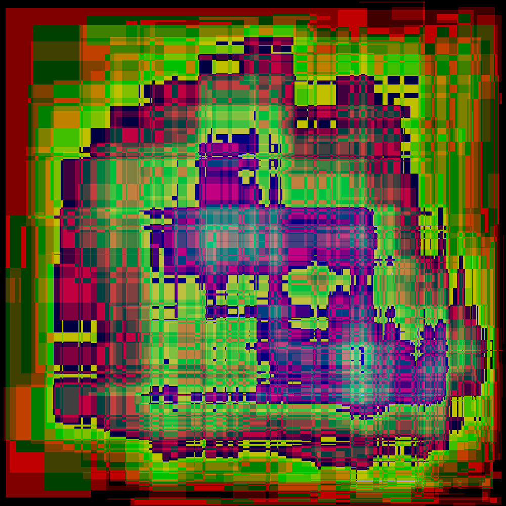
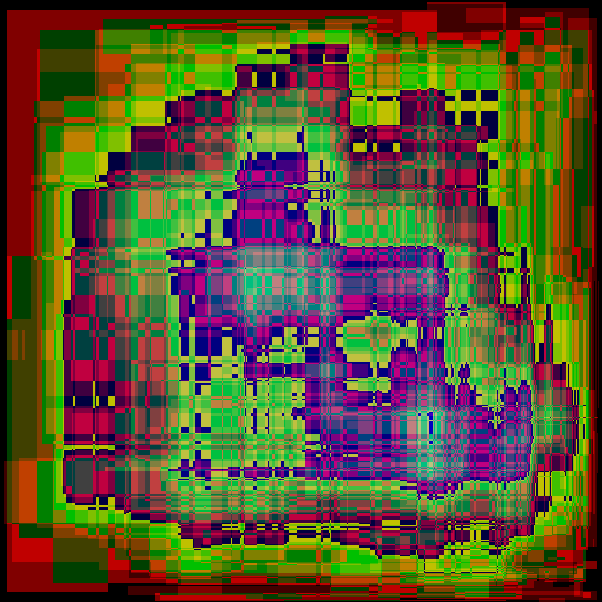

# Day 6: Probably a Fire Hazard - Part 2

Status:

| Test                       | Status                |
|----------------------------|-----------------------|
| Reference: Python script   | :white_check_mark: Ok |
| RTL Concept: Python script | :white_check_mark: Ok |
| Simulation: Icarus Verilog | *To be done* |
| Simulation: Verilator      | *To be done* |
| Simulation: Vivado Xsim    | *To be done* |
| Synthesis: Vivado Zynq7    | *To be done* |
| On-board: Zynq7            | *To be done* |

# Lessons Learnt

- *To be done*

# Design Space Exploration

## Python Reference Design

The second part changes the instruction semantics:

| Instruction | Part One | Part Two   |
|-------------|----------|------------|
| on          | 1        | +1         |
| off         | 0        | max(0, -1) |
| toggle      | xor 1    | +2         |

The obvious question is the maximum value obtained during the course of the processing. This value as direct impact on the required FPGA memory usage and may require using a different approach for reducing memory usage at the cost of increase time.

The change to the reference design is straightforward, the following snippet shows how the new value is calculated and also how the peak value is kept track of:

```py
old_value = lit_lights.get((x, y), [0, 0])[0]
if "on" == instr["action"]:
    new_value = old_value + 1
    lit_lights[(x, y)] = [new_value, new_value]
elif "off" == instr["action"]:
    new_value = max(old_value - 1, 0)
    lit_lights[(x, y)] = [new_value, old_value]
elif "toggle" == instr["action"]:
    new_value = old_value + 2
    lit_lights[(x, y)] = [new_value, new_value]
```

Mapping the final and peak intensities yields interesting pictures:





## Python RTL Friendly Implementation

For my custom input, I obtain a peak value across all the the lights of `49`. Right of the bat, this results in a six fold ($$\lceil\log_2(49)\rceil=6$$) memory requirement increase if the same implementation is required. Based on the resource usage of the previous implementation this requires 193 BRAM instances.

The main challenge is the computing of per light changes which are now much more resource heavy due to the simple bitmask operations being replaced by 6-bit arithemetics and a max operation.

Instead of 32 instances of 32x1000 storage elements, an optimized storage strategy would keep the 1000-deep elements but use 36 bits devided in 6 lights with 6-bit worth of intensity. Doing so requires 167 BRAM instances which is slightly less than figure from above thanks to using the extra bits (36 instead of 32).

In practice, the Python implementation consists of multiple nested loops, the first iterating over all the instructions and the second over each row from each single instruction. This matches the temporal behavior of the RTL implementation. The next iterations are spatial ones, the first being for each RAM instance and finally the most inner interation is for each light of a given RAM instance.

I also used two shortcuts `ram_select` and `ram_i_light_select` for speeding up the processing. In the FPGA implementation they will simply be operations performed with zero side effects (ie. null operations).

Testing of this implementation showed some minor copy/paste errors which were easy to fix, after which the implementation was tested against the reference design and found to be behave as expected.

# RTL Implementation

As usual this second part borrows heavily from the first half of the puzzle. The following modules are directly reused without modifications:

| Module                                          | Description                      | Complexity          | Thoughts       | Remarks  |
|-------------------------------------------------|----------------------------------|---------------------|----------------|----------|
| [`user_logic_tb`](user_logic_tb.sv)             | Testbench                        | :large_blue_circle: | :kissing_smiling_eyes: Copy-paste from previous puzzle | |
| [`user_logic`](user_logic.sv)                   | Logic top-level                  | :large_blue_circle: | :kissing_smiling_eyes: Copy-paste from previous puzzle | |
| [`tap_decoder`](tap_decoder.sv)                 | JTAG TAP deserializer            | :large_blue_circle: | :kissing_smiling_eyes: Copy-paste from previous puzzle | |
| [`line_decoder`](line_decoder.sv)               | Converts into instruction array  | :large_blue_circle: | :kissing_smiling_eyes: Copy-paste from previous puzzle | |
| [`instruction_buffer`](instruction_buffer.sv)   | Stores all the instructions      | :large_blue_circle: | :kissing_smiling_eyes: Copy-paste from previous puzzle | |
| [`tap_encoder`](tap_encoder.sv)                 | JTAG TAP serializer              | :large_blue_circle: | :kissing_smiling_eyes: Copy-paste from previous puzzle | |

## First Iteration: Generate Loop

This second part swaps the two-state light state with a discrete intensity value covering a range between 0 and 49. Furthermore the operational logic is more resource intensive as it includes addition, subtraction and a min() function.

The design space consists in a grid of 1000x1000, and as such handling a single dimension fully in parallel is at the same time manageable in a entry-level FPGA and by definition maps well to the design space. This requires instantiating 1000 times the logic required for decoding and updating the light intensities. Furthermore the total intensity calculation is much more complex than simply counting the number of bits set.

I started working by reusing the implementation from the previous part but very rapidly finished in a dead-end which was much too heavy and complex to make out. I decided to start from a clean slate and implement a very simple first iteration.

This was enough to raise an annoying pedantic error with Icarus Verilog in which it forbids mixing procedural with continuous assignments. Thus the following code will not simulate with Icarus (Verilator has no complains).

```verilog
logic [BANKS:0] cascade_valid_array;

always_ff @(posedge clk) begin: wait_last_cmd_done
    cascade_valid_array[0] <= 1'b1;
end

genvar i;
generate for (i = 0; i < BANKS; i++) begin

    light_bank light_bank_i(
(...)
        // Intensity Total
            .cascade_in_valid(cascade_valid_array[i]),
            .cascade_in_intensity(cascade_intensity_array[i]),
            .cascade_out_valid(cascade_valid_array[1+i]),
            .cascade_out_intensity(cascade_intensity_array[1+i])
    );

end endgenerate
```

The only way around is to use an intermediate signal and assign it outside of an `always_ff` block.

```
assign cascade_valid_array[0] = cascade_valid_array_entry;
```

In the end I refactored the code and ended up with something at least producing results in Verilator.
