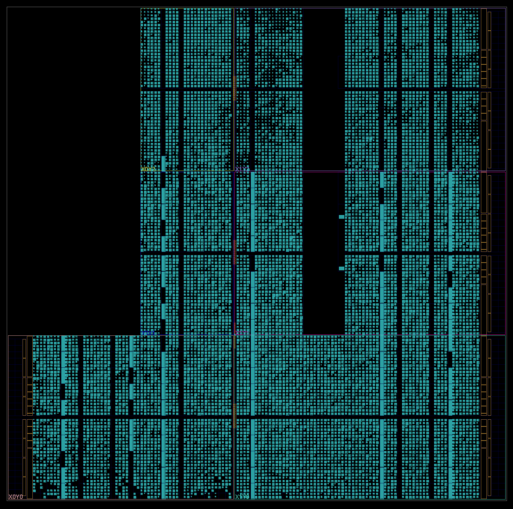

# Day 6: Probably a Fire Hazard - Part 2

Status:

| Test                       | Status                |
|----------------------------|-----------------------|
| Reference: Python script   | :white_check_mark: Ok |
| RTL Concept: Python script | :white_check_mark: Ok |
| Simulation: Icarus Verilog | *To be done* |
| Simulation: Verilator      | *To be done* |
| Simulation: Vivado Xsim    | *To be done* |
| Synthesis: Vivado Zynq7    | *To be done* |
| On-board: Zynq7            | *To be done* |

# Lessons Learnt

- Xilinx lists BRAM resources in RAMB18 units, not in RAMB36

# Design Space Exploration

## Python Reference Design

The second part changes the instruction semantics:

| Instruction | Part One | Part Two   |
|-------------|----------|------------|
| on          | 1        | +1         |
| off         | 0        | max(0, -1) |
| toggle      | xor 1    | +2         |

The obvious question is the maximum value obtained during the course of the processing. This value as direct impact on the required FPGA memory usage and may require using a different approach for reducing memory usage at the cost of increase time.

The change to the reference design is straightforward, the following snippet shows how the new value is calculated and also how the peak value is kept track of:

```py
old_value = lit_lights.get((x, y), [0, 0])[0]
if "on" == instr["action"]:
    new_value = old_value + 1
    lit_lights[(x, y)] = [new_value, new_value]
elif "off" == instr["action"]:
    new_value = max(old_value - 1, 0)
    lit_lights[(x, y)] = [new_value, old_value]
elif "toggle" == instr["action"]:
    new_value = old_value + 2
    lit_lights[(x, y)] = [new_value, new_value]
```

Mapping the final and peak intensities yields interesting pictures:


## Python RTL Friendly Implementation

For my custom input, I obtain a peak value across all the the lights of `49`. Right of the bat, this results in a six fold ($$\lceil\log_2(49)\rceil=6$$) memory requirement increase if the same implementation is required. Based on the resource usage of the previous implementation this requires 193 BRAM instances.

The main challenge is the computing of per light changes which are now much more resource heavy due to the simple bitmask operations being replaced by 6-bit arithemetics and a max operation.

Instead of 32 instances of 32x1000 storage elements, an optimized storage strategy would keep the 1000-deep elements but use 36 bits devided in 6 lights with 6-bit worth of intensity. Doing so requires 167 BRAM instances which is slightly less than figure from above thanks to using the extra bits (36 instead of 32).

In practice, the Python implementation consists of multiple nested loops, the first iterating over all the instructions and the second over each row from each single instruction. This matches the temporal behavior of the RTL implementation. The next iterations are spatial ones, the first being for each RAM instance and finally the most inner interation is for each light of a given RAM instance.

I also used two shortcuts `ram_select` and `ram_i_light_select` for speeding up the processing. In the FPGA implementation they will simply be operations performed with zero side effects (ie. null operations).

Testing of this implementation showed some minor copy/paste errors which were easy to fix, after which the implementation was tested against the reference design and found to be behave as expected.

# RTL Implementation

As usual this second part borrows heavily from the first half of the puzzle. The following modules are directly reused without modifications:

| Module                                          | Description                      | Complexity          | Thoughts       | Remarks  |
|-------------------------------------------------|----------------------------------|---------------------|----------------|----------|
| [`user_logic_tb`](user_logic_tb.sv)             | Testbench                        | :large_blue_circle: | :kissing_smiling_eyes: Copy-paste from previous puzzle | |
| [`user_logic`](user_logic.sv)                   | Logic top-level                  | :large_blue_circle: | :kissing_smiling_eyes: Copy-paste from previous puzzle | |
| [`tap_decoder`](tap_decoder.sv)                 | JTAG TAP deserializer            | :large_blue_circle: | :kissing_smiling_eyes: Copy-paste from previous puzzle | |
| [`line_decoder`](line_decoder.sv)               | Converts into instruction array  | :large_blue_circle: | :kissing_smiling_eyes: Copy-paste from previous puzzle | |
| [`instruction_buffer`](instruction_buffer.sv)   | Stores all the instructions      | :large_blue_circle: | :kissing_smiling_eyes: Copy-paste from previous puzzle | |
| [`tap_encoder`](tap_encoder.sv)                 | JTAG TAP serializer              | :large_blue_circle: | :kissing_smiling_eyes: Copy-paste from previous puzzle | |

## First Iteration: Generate Loop

This second part swaps the two-state light state with a discrete intensity value covering a range between 0 and 49. Furthermore the operational logic is more resource intensive as it includes addition, subtraction and a min() function.

The design space consists in a grid of 1000x1000, and as such handling a single dimension fully in parallel is at the same time manageable in a entry-level FPGA and by definition maps well to the design space. This requires instantiating 1000 times the logic required for decoding and updating the light intensities. Furthermore the total intensity calculation is much more complex than simply counting the number of bits set.

I started working by reusing the implementation from the previous part but very rapidly finished in a dead-end which was much too heavy and complex to make out. I decided to start from a clean slate and implement a very simple first iteration.

This was enough to raise an annoying pedantic error with Icarus Verilog in which it forbids mixing procedural with continuous assignments. Thus the following code will not simulate with Icarus (Verilator has no complains).

```verilog
logic [BANKS:0] cascade_valid_array;

always_ff @(posedge clk) begin: wait_last_cmd_done
    cascade_valid_array[0] <= 1'b1;
end

genvar i;
generate for (i = 0; i < BANKS; i++) begin

    light_bank light_bank_i(
(...)
        // Intensity Total
            .cascade_in_valid(cascade_valid_array[i]),
            .cascade_in_intensity(cascade_intensity_array[i]),
            .cascade_out_valid(cascade_valid_array[1+i]),
            .cascade_out_intensity(cascade_intensity_array[1+i])
    );

end endgenerate
```

The only way around is to use an intermediate signal and assign it outside of an `always_ff` block.

```
assign cascade_valid_array[0] = cascade_valid_array_entry;
```

In the end I refactored the code and ended up with something at least producing results in Verilator. Following some minor fixes, I obtained the same results accross all three simulators and wanted to do a sanity check by building the FPGA firmware.

### FPGA Build Issue

The first try ended up with a failure which didn't surprise me, however the reason of the error left me a bit puzzled.

```
ERROR: [DRC UTLZ-1] Resource utilization: RAMD64E over-utilized in Top Level Design (This design requires more RAMD64E cells than are available in the target device. This design requires 21504 of such cell types but only 17400 compatible sites are available in the target device. Please analyze your synthesis results and constraints to ensure the design is mapped to Xilinx primitives as expected. If so, please consider targeting a larger device.)
INFO: [Vivado_Tcl 4-198] DRC finished with 3 Errors
INFO: [Vivado_Tcl 4-199] Please refer to the DRC report (report_drc) for more information.
ERROR: [Vivado_Tcl 4-23] Error(s) found during DRC. Placer not run.
```

I had no explanations as to why distributed RAM would be used, let alone with `more RAMD64E cells than are available in the target device`. My design was specifically arranged for inferring BRAMs as shown in the synthesis log:

```
Module light_display_ram 
Detailed RTL Component Info : 
+---Registers : 
	               36 Bit    Registers := 1     
+---RAMs : 
	              36K Bit	(1024 X 36 bit)          RAMs := 1     
```

The synthesizer did notice the RAM and inferred the correct parameters, so this is really strange. Further down the log, I noticed that these RAMs were mapped in RAMB36:

|Module Name                                                          | RTL Object   | PORT A (Depth x Width) | W | R | PORT B (Depth x Width) | W | R | Ports driving FF | RAMB18 | RAMB36 | 
|---------------------------------------------------------------------|--------------|------------------------|---|---|------------------------|---|---|------------------|--------|--------|
|\per_ram[0].light_display_ram_i                                      | ram_reg      | 1 K x 36(READ_FIRST)   | W |   | 1 K x 36(WRITE_FIRST)  |   | R | Port A and B     | 0      | 1      | 

Scrolling down the log, the distributed RAM mapping report made me do a double take (only the first entry of the 28 is shown):

|Module Name                                                         | RTL Object | Inference | Size (Depth x Width) | Primitives    | 
|--------------------------------------------------------------------|------------|-----------|----------------------|---------------|
|user_logic_i/light_display_i/i_0/\per_ram[60].light_display_ram_i   | ram_reg    | Implied   | 1 K x 36             | RAM64M x 192  | 

I struggled to find a reason why Vivado would switch to RAMB36, the device is listed with 220 block RAMs so surely this is not because all the RAMs were used right? After all this is what is reported in the cell usage table:

|Index |Cell         |Count |
|------|-------------|------|
|1     |BSCANE2      |     1|
|2     |CARRY4       | 12704|
|3     |LUT1         |  1264|
|4     |LUT2         | 26789|
|5     |LUT3         | 10387|
|6     |LUT4         |  5566|
|7     |LUT5         |  5312|
|8     |LUT6         | 11240|
|9     |MUXF7        |  2016|
|10    |MUXF8        |  1008|
|11    |RAM64M       |  5376|
|12    |RAMB36E1     |   139|
|13    |RAMB36E1_1   |     1|
|14    |USR_ACCESSE2 |     1|
|15    |FDRE         | 27393|
|16    |FDSE         |     1|

Looking at the numbers I noticed that a total of 140 BRAMs, which is exactly half of the available 280 BRAMs:


```
Part Resources:
DSPs: 220 (col length:60)
BRAMs: 280 (col length: RAMB18 60 RAMB36 30)
```

Interesting that RAMB18 is mentioned, surely the count of 280 is in RAMB36 units, right? Remembering a rule of marketing is to use the metric which reflects in the best value, I understood I was toasted. For good measure I added a utilization report after synthesis which confirmed my suspicions:

|     Site Type     | Used | Fixed | Prohibited | Available |  Util% |
|-------------------|------|-------|------------|-----------|--------|
| Block RAM Tile    |  140 |     0 |          0 |       140 | 100.00 |
|   RAMB36/FIFO*    |  140 |     0 |          0 |       140 | 100.00 |

Vivado used all the BRAM units and fallback to LUTRAM for the remaining instances, which resulted in a design unable to fit in the Zynq-7020:

|          Site Type         |  Used | Fixed | Prohibited | Available |  Util% |
|----------------------------|-------|-------|------------|-----------|--------|
| Slice LUTs*                | 69733 |     0 |          0 |     53200 | 131.08 |
|   LUT as Logic             | 48229 |     0 |          0 |     53200 |  90.66 |
|   LUT as Memory            | 21504 |     0 |          0 |     17400 | 123.59 |
|     LUT as Distributed RAM | 21504 |     0 |            |           |        |
| Slice Registers            | 27394 |     0 |          0 |    106400 |  25.75 |
|   Register as Flip Flop    | 27394 |     0 |          0 |    106400 |  25.75 |

Well at least there is no point in wasting time trying to salvage this design :sweat_smile:

# Revisited FPGA Implementation

Halfing the number of columns to be stored in memory results in 3 Mbits, which represents 84 RAMB36 or 167 out of 220 available RAMB16 instances and therefore will fit in the Zynq-7020. Sadly this requires reworking several parts of the design.

- The instruction memory must be readback twice instead of once.
- At the end of each readback the total intensity value must be computed.
- All the memory contents used for storing light intensities must be scrubbed after the first readback.
- The total obtained at each readback must be tallied and then reported back once the last readback is completed.

## First Iteration: Clean-up

Before throwing myself into refactoring the backend I thought that it would be wise to tidy up things left and right. Thus I got rid of the redundant `last` and `valid` fields from the instruction structure. I followed by implementing the required changes in the instruction buffer module for allowing multiple readbacks of the stored instructions. I could have changed the upstream logic for simply pushing twice the instruction list but I felt that doing so was not in proper spirit of these challenges, thus I opted for the hard way.

Repurposing the memory array in order to use only half of the columns but running the instructions twice required a quite large redesign of the light display module. I also took the opportunity to implement a proper skid-buffer allowing for reading the contents of BRAM in a synchronous fashion while using a bus with a zero-cycle latency (AXI-stream style ready/valid flow-control).

In the end small-scale simulation behave as expected. I tried runing a FPGA firmware build a got some adequate results resource-wise:

|   Ref Name   |  Used | Functional Category |
|--------------|-------|---------------------|
| FDRE         | 39718 |        Flop & Latch |
| LUT2         | 13617 |                 LUT |
| LUT6         | 11098 |                 LUT |
| LUT3         |  9462 |                 LUT |
| CARRY4       |  6403 |          CarryLogic |
| MUXF7        |  3468 |               MuxFx |
| LUT4         |  2846 |                 LUT |
| LUT5         |  2548 |                 LUT |
| MUXF8        |  1632 |               MuxFx |
| LUT1         |   311 |                 LUT |
| RAMB36E1     |    84 |        Block Memory |
| BUFG         |     2 |               Clock |
| USR_ACCESSE2 |     1 |              Others |
| FDSE         |     1 |        Flop & Latch |
| BSCANE2      |     1 |              Others |

Totally as expected, the light display module is quite hungry, and having a few logic constructs replicated 500-ish times is totally fair.

```
Module light_display 
Detailed RTL Component Info : 
+---Adders : 
	   2 Input   26 Bit       Adders := 84    
	   6 Input   19 Bit       Adders := 84    
	   2 Input   12 Bit       Adders := 2     
	   2 Input   11 Bit       Adders := 503   
	   2 Input    7 Bit       Adders := 1     
+---Registers : 
	               50 Bit    Registers := 1     
	               26 Bit    Registers := 85    
	               12 Bit    Registers := 3     
	                7 Bit    Registers := 1     
	                6 Bit    Registers := 504   
	                3 Bit    Registers := 1     
	                1 Bit    Registers := 8     
+---Muxes : 
	  11 Input   12 Bit        Muxes := 3     
	   2 Input    9 Bit        Muxes := 1     
	  11 Input    7 Bit        Muxes := 1     
	   4 Input    6 Bit        Muxes := 504   
	   2 Input    6 Bit        Muxes := 504   
	  11 Input    4 Bit        Muxes := 2     
	   2 Input    4 Bit        Muxes := 5     
	   2 Input    3 Bit        Muxes := 3     
	  11 Input    3 Bit        Muxes := 1     
	   3 Input    3 Bit        Muxes := 1     
	   2 Input    2 Bit        Muxes := 1     
	   2 Input    1 Bit        Muxes := 3     
	  11 Input    1 Bit        Muxes := 11    
```

The QoR report warns me that I'm starting to strech the device resources:

| Name                                           | Threshold | Actual | Used  | Available | Score | Status |
|------------------------------------------------|-----------|--------|-------|-----------|-------|--------|
| Utilization                                    |           |        |       |           |   4.0 |        |
| *  Registers                                   |     55.00 |  37.33 | 39719 |    106400 |       |     OK |
| *  LUTs                                        |     70.00 |  59.98 | 31910 |     53200 |       |     OK |
| *  Memory LUTs                                 |     30.00 |   0.00 |     0 |     17400 |       |     OK |
| *  MUXF7                                       |     15.00 |  13.04 |  3468 |     26600 |       |     OK |
| *  CARRY8                                      |     25.00 |   0.00 |     0 |         0 |       |     OK |
| *  RAMBs                                       |     80.00 |  60.00 |    84 |       140 |       |     OK |
| *  URAMs                                       |     80.00 |   0.00 |     0 |         0 |       |     OK |
| *  DSPs                                        |     80.00 |   0.00 |     0 |       220 |       |     OK |
| *  Max LUT Combined                            |     20.00 |  24.98 |  7972 |     31910 |       | REVIEW |
| *  Min LUT Combined                            |     <2.00 |  24.98 |  7972 |     31910 |       |     OK |
| *  DSPs + Block RAM + Ultra RAM                |     70.00 |  23.33 |    84 |       360 |       |     OK |
| *  Control Sets                                |      7.50 |   4.03 |   536 |     13300 |       |     OK |

Timing wise I have a nasty route delay of 14.087ns:

```
Max Delay Paths
--------------------------------------------------------------------------------------
Slack (MET) :             0.313ns  (required time - arrival time)
  Source:                 user_logic_i/light_display_i/sum_row_sweep_pending_reg/C
                            (rising edge-triggered cell FDRE clocked by CFGCLK  {rise@0.000ns fall@7.500ns period=15.000ns})
  Destination:            user_logic_i/light_display_i/per_ram[65].per_col_per_ram[2].per_col_acc_reg[2][12]/CE
                            (rising edge-triggered cell FDRE clocked by CFGCLK  {rise@0.000ns fall@7.500ns period=15.000ns})
  Path Group:             CFGCLK
  Path Type:              Setup (Max at Slow Process Corner)
  Requirement:            15.000ns  (CFGCLK rise@15.000ns - CFGCLK rise@0.000ns)
  Data Path Delay:        14.543ns  (logic 0.456ns (3.136%)  route 14.087ns (96.864%))
  Logic Levels:           0  
  Clock Path Skew:        0.096ns (DCD - SCD + CPR)
    Destination Clock Delay (DCD):    3.626ns = ( 18.626 - 15.000 ) 
    Source Clock Delay      (SCD):    3.823ns
    Clock Pessimism Removal (CPR):    0.293ns
```

These results suggests that the routing was somewhat challenging and thought that the floorplan would be worth a look. Indeed it didn't disappoint :grin:



### Invalid Results

| Lines   | Reference | Simulation | Results | Remarks   |
|---------|-----------|------------|---------|-----------|
| 300     | 17836115  | 1077762    | :x: NG  | Full file |
| 150     | 10211132  | 10215078   | :x: NG  | Much closer |
| 75      | 3911906   | 3913498    | :x: NG  |  |
| 37      | 1156964   | 1158667    | :x: NG  |  |
| 18      | 906532    | 907216     | :x: NG  |  |
| 10      | 225924    | 226693     | :x: NG  |  |
| 5       | 265242    | 266106     | :x: NG  |  |
| 2       | 1626      | 1626       | :white_check_mark: OK |  |
| 4       | 177882    | 177882     | :white_check_mark: OK |  |
| 1 (5:5) | 87360     | 87360      | :white_check_mark: OK |  |
| 4 (1:5) | 263616    | 264480     | :x: NG  |  |
| 2 (4:5) | 263616    | 264480     | :x: NG  | Removed `off` instruction which had no effect due to the `min` logic |

The two following instructions cause the FPGA implementation to behave unexpectedly:

```
turn on 774,14 through 977,877
turn on 410,146 through 864,337
```

Manually computing the expected result:

```
(977-774+1)*(877-14+1)=176256
(864-410+1)*(337-146+1)=87360
176256+87360=263616
```

I tried to reduce the area by dividing by ten and got 2747 vs 2834 with the following:

```
turn on 77,1 through 97,87
turn on 41,14 through 86,33
```

Interestingly, only rows below 504 are used meaning that the dual pass logic is not at fault for this specific case.
