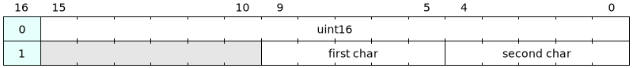

# Day 7: Some Assembly Required - Part 1

# Design Space Exploration

A quick check of the [input contents file](input.txt) shows 339 instructions and wires with name two characters long. The encoding of each instruction is non trivial with 5-bit for the operator, and operands being encoded as either two lowercase letters or a number requiring 16-bit. This results in a worst case of 39 bits corresponding to two RAMB36 blocks.

## Python Reference Design

After giving some thoughts, the decoding turned out to be simpler than expected. This is the case with Python, the FPGA implementation will likely be quite challenging.

Assuming the following operations:

```py
OPERATORS = {
    "AND",
    "LSHIFT",
    "NOT",
    "OR",
    "RSHIFT",
}
```

And the related decoding logic:

```py
def decode_inputs(file: Path) -> Iterator[tuple[str, dict]]:
    with open(file) as fh:
        for i, line in enumerate(fh):
            (lhs, rhs) = line.strip().split(" -> ")
            lhs = lhs.split(" ")
            if len(lhs) == 1:
                lhs = {
                    "operator": "let",
                    "operands": [lhs[0]],
                }
            elif len(lhs) == 2:
                assert lhs[0] == "NOT"
                lhs = {
                    "operator": "invert",
                    "operands": [lhs[1]],
                }
            else:
                assert len(lhs) == 3
                assert lhs[1] in OPERATORS - {
                    "NOT",
                }
                lhs = {"operator": lhs[1].lower(), "operands": [lhs[0], lhs[2]]}
            yield (rhs, lhs)
```

The core logic is a simple recursion loop:

```py
def user_logic(file: Path) -> int:
    def get_signal(wire: str) -> int:
        if wire in lut:
            return lut[wire]
        if wire.isdigit():
            return int(wire)
        instruction = instructions[wire]
        operator = instruction["operator"]
        if operator in ("let", "forward"):
            value = get_signal(instruction["operands"][0])
            lut[wire] = value
        elif operator == "invert":
            raw_value = get_signal(instruction["operands"][0])
            value = ~raw_value & 65535
            lut[wire] = value
        elif operator == "and":
            value1 = get_signal(instruction["operands"][0])
            value2 = get_signal(instruction["operands"][1])
            value = value1 & value2
            lut[wire] = value
        elif operator == "or":
            value1 = get_signal(instruction["operands"][0])
            value2 = get_signal(instruction["operands"][1])
            value = value1 | value2
            lut[wire] = value
        elif operator == "lshift":
            value = get_signal(instruction["operands"][0]) << get_signal(
                instruction["operands"][1]
            )
            lut[wire] = value
        elif operator == "rshift":
            value = get_signal(instruction["operands"][0]) >> get_signal(
                instruction["operands"][1]
            )
            lut[wire] = value
        else:
            assert False, f"Unknown operator: {operator}"
        print(f"{wire=}, {instruction=} -> {value=}")
        return value

    lut = {}
    instructions = dict(decode_inputs(file=file))
    retval = get_signal("a")
    return retval
```

Result using my custom input contents: **16076**

### FPGA-friendly Python Implementation

Doing some basic checks yields some insights:

```
Instruction count 339
Operators: operator=Counter({'and': 112, 'or': 80, 'rshift': 64, 'invert': 48, 'lshift': 32, 'let': 3})
Individual wires per length: Counter({2: 313, 1: 26})
```

#### Instruction Translation

Since recursion is involved, the solving logic will not be able to process inbound data on the fly, meaning that instructions will have to be stored in BRAM. With 339 instructions and some mix of uint16, dual-char strings and variable instructions some thoughts will have to be put in the instruction decoding. Starting with the following instruction table:

| Instruction | Short Hand | Encoding | First Operand                 | Second Operand                  | Remarks                          |
|-------------|------------|----------|-------------------------------|---------------------------------|----------------------------------|
| Null        | NOOP       | 0b000    | N/A                           | N/A                             | No further instructions in BRAM  |
| Assign      | LOAD       | 0b010    | Wire (10-bit) or Int (16-bit) | N/A                             |                                  |
| Invert      | NOT        | 0b011    | Wire (10-bit)                 | N/A                             |                                  |
| And         | AND        | 0b100    | Wire (10-bit)                 | Wire (10-bit) or Int (16-bit)   |                                  |
| Or          | OR         | 0b101    | Wire (10-bit)                 | Wire (10-bit) or Int (16-bit)   |                                  |
| Left Shift  | LSHIFT     | 0b110    | Wire (10-bit)                 | Int (16-bit)                    | Second operand value < 16        |
| Right Shift | RSHIFT     | 0b111    | Wire (10-bit)                 | Int (16-bit)                    | Second operand value < 16        |


[//]: # (
{reg: [
  {bits: 3,  name: 'RSHIFT'},
  {bits: 10,  name: 'First Operand \(wire\)'},
  {bits: 6,  type:1},
  {bits: 1,  name: '1'},
  {bits: 16, name: 'Second Operand \(uint16\)'},
  {bits: 1,  name: '0'},
  {bits: 3,  name: 'LSHIFT'},
  {bits: 10,  name: 'First Operand \(wire\)'},
  {bits: 6,  type:1},
  {bits: 1,  name: '1'},
  {bits: 16, name: 'Second Operand \(uint16\)'},
  {bits: 1,  name: '0'},
  {bits: 3,  name: 'OR'},
  {bits: 10,  name: 'First Operand \(wire\)'},
  {bits: 6,  type:1},
  {bits: 1,  name: '1'},
  {bits: 16, name: 'Second Operand \(wire or uint16\)'},
  {bits: 1,  name: 'T'},
  {bits: 3,  name: 'AND'},
  {bits: 10,  name: 'First Operand \(wire\)'},
  {bits: 6,  type:1},
  {bits: 1,  name: '1'},
  {bits: 16, name: 'Second Operand \(wire or uint16\)'},
  {bits: 1,  name: 'T'},
  {bits: 3,  name: 'NOT'},
  {bits: 10,  name: 'First Operand \(wire\)'},
  {bits: 6,  type:1},
  {bits: 1,  name: '1'},
  {bits: 17,  type: 1},
  {bits: 3,  name: 'LOAD'},
  {bits: 16, name: 'First Operand \(wire or uint16\)'},
  {bits: 1,  name: 'T'},
  {bits: 17,  type: 1},
  {bits: 3,  name: 'NOOP'},
  {bits: 34,  type: 1},
],
config: {lanes: 7, compact: true}
}
)

Operands are shown to be of two different types: integers or chars. I decided to use an extra bit for differentiating between these two types, which results in the following encodings:



[//]: # (
{reg: [
  {bits: 5,  name: 'second char'},
  {bits: 5,  name: 'first char'},
  {bits: 6, type: 1},
  {bits: 1,  name: '1', type: 4},
  {bits: 16,  name: 'uint16'},
  {bits: 1,  name: '0', type: 4},
],
config: {lanes: 2, compact: true}
}
)
