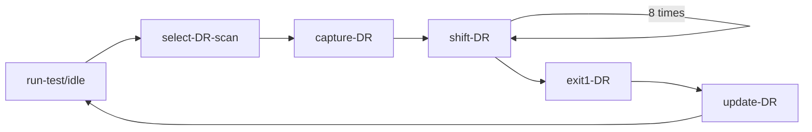
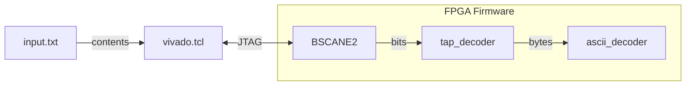

# Day 1: Secret Entrance

Solved **only the first half** of the puzzle. The second part requires removal of an optimization (modulo 100) requiring rework which may take more time than trying to solve a first half of an other day.

# Quick Start

## Simulation

> [!NOTE]
> The simulation is quite large and `gtkwave` may end up crashing with the complete input file.

- Update `input.txt` with contents from your own puzzle input

```shell
make sim
# make sim INPUT_FILE=example.txt
gtkwave wave.fst
```

## On-board

- Update `input.txt` with contents from your own puzzle input
- Connect a USB cable to the ZC702 JTAG USB port
- Power-on the board and invoke `make`

# Design Walkthrough

I opted for separating design from contents. In practice, this allows using the same FPGA firmware regardless of the input contents.

This choice requires a solution for getting data in and out of the device. Since the firmware is loaded through JTAG, the obvious and simplest choice is to rely on this interface for streaming the contents.

FPGA vendors offer a range of methods for exchanging data through the JTAG interface. In the case of Xilinx usual choices are VIO for GPIO-like signals and JTAG/AXI Master for AXI4 memory-mapped transactions. I thought of trying something different, and decided to go through uncharted territory (here be dragons!) and slap a BSCANE2 instance in my design for playing with raw JTAG.

## Input Data Loading

The input data for day 1 puzzle is a list of commands following a simple format:

```
^[LR]\d+$
```

The whole concept is doing the process in FPGA, meaning zero pre-processing on the host other then serializing data through JTAG. The operation is handled by the `::load_inputs` function in the [`vivado.tcl`](vivado.tcl) script. The whole file is serialized byte per byte with line endings encoded as ASCII 0x0A (LF).

Following initialization of the JTAG chain and selection of the proper `BSCANE2` endpoint, each byte of data is loaded using the `scan_dr_hw_jtag` command. Used in combination with `run_state_hw_jtag`, the TCL script manages the JTAG TAP state machine in the FPGA for streaming content bits (a similar process is used for loading the FPGA configuration bitstream).

The following TCL source code shows the main nested loops responsible for transfering the contents:

```tcl
    foreach rotation $rotations {
        set len [string length $rotation]
        for {set i 0} {$i<$len} {incr i} {
            scan [string index $rotation $i] %c char
            set hex_char [format "%02x" $char]
            scan_dr_hw_jtag 9 -tdi 0${hex_char}
            run_state_hw_jtag IDLE; # run through state `UPDATE`
        }
        scan_dr_hw_jtag 9 -tdi $new_line
        run_state_hw_jtag IDLE; # run through state `UPDATE`
    }
```

The corresponding code on the System Verilog testbench is much more verbose:

```verilog
    for (int i=0; i<num_bytes; i++) begin

        // transition from `run-test/idle` to `capture-DR`

            test_logic_reset = 1'b0;
            capture_dr = 1'b0;
            shift_dr = 1'b0;
            update_dr = 1'b0;
            @(posedge tck); // `run-test/idle`
            test_logic_reset = 1'b0;
            capture_dr = 1'b0;
            shift_dr = 1'b0;
            update_dr = 1'b0;
            @(posedge tck); // `select-DR-scan`
            test_logic_reset = 1'b0;
            capture_dr = 1'b1; // set bit
            shift_dr = 1'b0;
            update_dr = 1'b0;
            @(posedge tck); // `capture-DR`

        // transition to `shift-DR`

            test_logic_reset = 1'b0;
            capture_dr = 1'b0;
            shift_dr = 1'b1; // set bit
            update_dr = 1'b0;

        // shift eight bits

            char = rotations[i];
            for (int j=0; j<8; j++) begin
                tdi = char[j];
                @(posedge tck); // commit bit shift
            end

        // transition to `update-DR`

            test_logic_reset = 1'b0;
            capture_dr = 1'b0;
            shift_dr = 1'b0;
            update_dr = 1'b0;
            @(posedge tck); // `exit1-DR`
            test_logic_reset = 1'b0;
            capture_dr = 1'b0;
            shift_dr = 1'b0;
            update_dr = 1'b1; // set bit
            @(posedge tck); // `update-DR`

    end

    // transition to `run-test/idle`

        test_logic_reset = 1'b0;
        capture_dr = 1'b0;
        shift_dr = 1'b0;
        update_dr = 1'b0;
        @(posedge tck); // `run-test/idle`
```

The TAP sequence used for uploading the data being the following:



> NXP has published [an article with a comprehensive explanation](https://www.nxp.com/docs/en/supporting-information/BeyondBits2article05.pdf) of the JTAG TAP state machine, which compliments nicely the Xilinx documentation which is a bit terse on this topic.

On the FPGA side, the design shell module [`shell.sv`](shell.sv) instantiates a `BSCANE2` primitive exposing the interface to the JTAG TAP controller and connects its signals to the `user_logic` module which implements all the processing logic. The `tap_decoder` module in turn receives the signals from the `BSCANE2` instance and decodes the serialized data into bytes.



Synthesis of the `tap_decoder` module results in differing implementations between Vivado and Yosys. [Vivado's implementation](tap_decode_vivado.png) for the valid signal avoids the flip-flop's dedicated reset pin (R). By routing test_logic_reset through the logic input, Vivado forces the use of a LUT3, whereas [Yosys would use a simpler LUT2](tap_decode_yosys.png). This difference has no practical impact on performance due to the non-critical nature and generous timing margins of the JTAG path, however it is worth noting the heuristics of both tools differ even on a trivial module.

## Command Decoding

ASCII command decoding is performed using a state machine for the reason that it allows for simple tracking of the rotation direction (clock-wise and counter clock-wise). The puzzle states that the dial has 100 steps, meaning that any order larger than 100 can be safely ignored since it simply rollovers. Thus only the two last ASCII digits need to be stored (see the `ascii_digit_capture` process) as they correspond to units and dozens.

Looking at the implementations, Vivado's heuristics continue to surprise with its ability to optimize even the simplest logic. Yosys, on the other hand, remains much more consistent in its approach, always using the most straightforward solution.

## Output Data Retrieval

The output data retrieval process is even simpler, with the only subtle difference being the capture of the output data being performed twice: one using the internal `valid` and the second upon the TAP controller entering the capture state.

# Files

## Puzzle Inputs

| Filename | Description | Remarks |
|----------|-------------|---------|
| `example.txt` | Rotation commands listed in the puzzle description | - |
| `input.txt` | Requested rotation commands | Unique to each participant |

## Firmware Sources

| Filename | Description | Remarks |
|----------|-------------|---------|
| `shell.sv` | Root of the FPGA firmware hierachy | Instantiates vendor primitives and top user logic |
| `user_logic.sv` | Contains the main logic | User logic top-level; instantiated by the testbench |
| `tap_decoder.sv` | Contains the main logic | User logic top-level; instantiated by the testbench |
| `tap_decoder_tb.sv` | JTAG deserializing logic | - |
| `ascii_decoder.sv` | Command byte decoding and processing | Depends on the puzzle logic |
| `tap_encoder_tb.sv` | JTAG serializing logic | - |

| Filename | Description | Remarks |
|----------|-------------|---------|
| `constraints.xdc` | Vivado constraints file | Defines `tck` frequency |
| `vivado.tcl` | Vivado execution script | Compatibile only with Vivado's TCL interpreter |

## Simulation Sources

| Filename | Description | Remarks |
|----------|-------------|---------|
| `user_logic_tb.sv` | Testbench for the main logic | Fully autonomous |
| `main.cpp` | Verilator C++ boilerplate | Required by Verilator |
