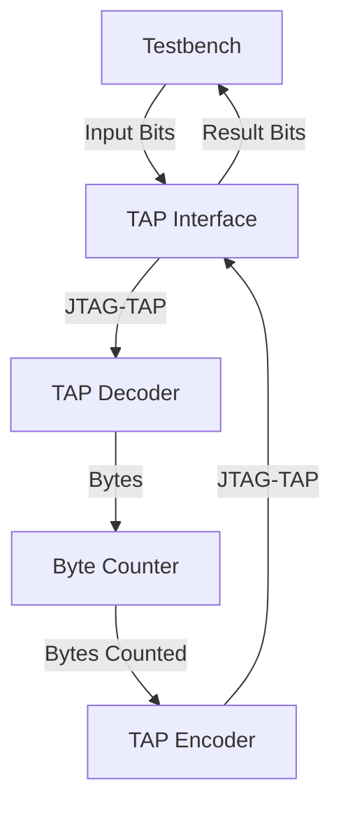

# Day 10: Factory

# Lessons Learnt

# Design Space Exploration

The puzzle input format is slightly more complex compared to others. The input contents consist in variable length lists, between four to ten elements with an average of about seven elements. The contents are spread on 162 lines with a total of 1150 elements.

Adding some margin for handling accounts with slightly different input contents, I assume the following sizing:

- Max number of entries: 200 (162 effective in my input)
- Max elements per entry: 10 effective in my input (complexity increases above ten because of multiple consecutive decimal digits being decoded)
- Max total elements: 2400 (1150 effective in my input)

Pulling an entry from the puzzle example contents:

```
[.##.] (3) (1,3) (2) (2,3) (0,2) (0,1) {3,5,4,7}
```

At some point, the data will need to be aligned:

```
[.##.] (3) (1,3) (2) (2,3) (0,2) (0,1) {3,5,4,7}
 |      |   |     |   |     |     |     discard
 0110   |   |     |   |     |     |
        |   0101  |   0011  1010  1100
        0001      0010
```

Simplest way would be to breakdown this operation into several elementary steps:

- Convert the first part to binary: `[.##.]` to `0110` and push it
- For each part in parentheses:
  - For each digit (assuming that I'm dealing with single digit numbers)
    - Perform a encoded to one-hot conversion, eg. `3` to `0001`
    - Accumulate the value and OR it with the following number after a comma
  - Push the accumulated value
- When encountering the open curly brace `{`, signal the end of the line and start over

# Implementation

## First Stage

Just like other puzzles, the first stage consists in copy-pasting the common design files.

| Module | Description | Complexity | Mindblowness | Remarks |
| --- | --- | --- | --- | --- |
| [`user_logic_tb`](user_logic_tb.sv) | Testbench | :large_blue_circle: | :kissing_smiling_eyes: | Small refactor and misc improvements |
| [`user_logic`](user_logic.sv) | Logic top-level | :large_blue_circle: | :kissing_smiling_eyes: | Wire harness |
| [`tap_decoder`](tap_decoder.sv) | BSCANE2 interface for inbound signals | :large_blue_circle: | :kissing_smiling_eyes: | Copy-paste from previous puzzle |
| [`tap_encoder`](tap_encoder.sv) | BSCANE2 interface for outbound signals | :large_blue_circle: | :kissing_smiling_eyes: | Copy-paste from previous puzzle | :kissing_smiling_eyes: |

### Design Iterations

Completed in a single pass.

| Target    | Status | Notes |
|-----------|--------|-------|
| Varilator | Pass   | None  |
| Iverilog  | Pass   | None  |
| Vivado    | Pass   | None  |

### Diagram



### Resource Usage

```
Detailed RTL Component Info : 
+---Registers : 
	               16 Bit    Registers := 2     
	                8 Bit    Registers := 1     
	                1 Bit    Registers := 2     
+---Muxes : 
	   4 Input   16 Bit        Muxes := 2     
	   2 Input   16 Bit        Muxes := 1     
```

## Second Stage

I added byte stream decoding through a dedicated module [`line_decoder`](line_decoder.sv). No difficulties encountered, quite the opposite with the encoded to one-hot conversion being easier than expected:

```verilog
always_ff @(posedge clk) begin: decode_buttons_wiring
    if (inbound_valid) begin
        case (inbound_byte)
            SPACE_CHAR: begin
                button_wiring <= '0;
            end
            default: begin
                if (is_digit(inbound_byte)) begin
                    button_wiring <= button_wiring + (1 << (inbound_byte - ZERO_CHAR));
                end
            end
        endcase
    end
end
```

The design I implemented is **limited to single digit positions**, meaning that the width of the light and thus button cannot exceed ten, which is what I deduced by running the Python script mentioned earlier. Adding this support would add some complexity for having to accumulate digits and convert the decimal value obtained into binary.

### Resource Usage

```
Module line_decoder
Detailed RTL Component Info :
+---Adders :
	   2 Input    6 Bit       Adders := 1
+---Registers :
	               12 Bit    Registers := 2
	                1 Bit    Registers := 3
+---Muxes :
	   2 Input    1 Bit        Muxes := 4
	   3 Input    1 Bit        Muxes := 1
```

The total remains very frugal:


|      |Cell    |Count |
|------|--------|------|
|1     |BSCANE2 |     1|
|2     |CARRY4  |     9|
|3     |LUT1    |     1|
|4     |LUT2    |    39|
|5     |LUT3    |    34|
|6     |LUT4    |     2|
|7     |LUT5    |    11|
|8     |LUT6    |     8|
|9     |FDRE    |    96|

## Third Stage

My approach is to implement a single combination solving unit ([`machine_wiring_solver`](machine_wiring_solver.sv)) first and defer the fanout of multiple combinations to a further stage.

The puzzle requires finding the *fewest button presses*, keyword being **fewest**. The operation involves two states which are inverted each time a bit from an element is set. This operation is akin to a XOR operation where each change flips a bit's state.

Thus the puzzle requires finding the solution involving the minimum number of active elements being XOR'ed each other. With a machine constituted of six elements, the solution space explored equates $$2^6 = 64$$ combinations. Worst case is 13 button wiring entries making it 16384 combinations, largely in the realm of what is reasonable.

Knowing that a realistic solution is available, the next step is to think about the interfaces. The following information is likely to be required:

- Solution, corresponding to the light wiring which is the first data value received from the line decoder unit.
- Each individual button wirings
- End of processing
- Strobe signal indicating a valid solution
- Number of enabled elements
