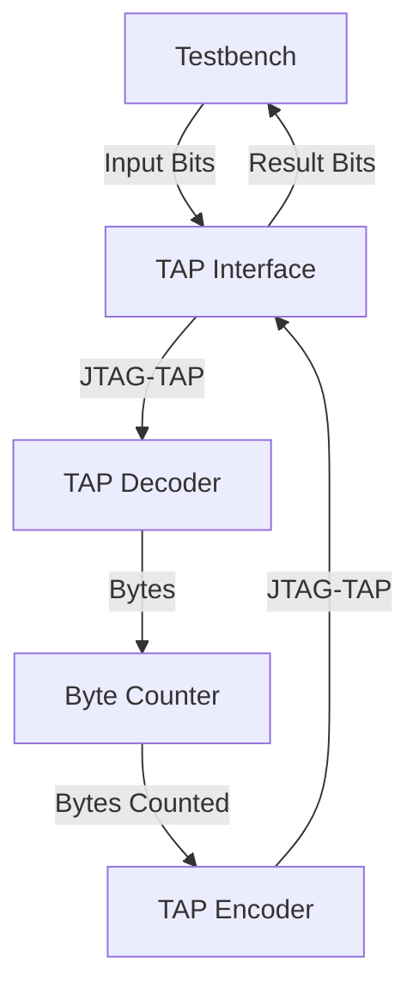

# Day 10: Factory

# Lessons Learnt

# Design Space Exploration

The puzzle input format is slightly more complex compared to others. The input contents consist in variable length lists, between four to ten elements with an average of about seven elements. The contents are spread on 162 lines with a total of 1150 elements.

Adding some margin for handling accounts with slightly different input contents, I assume the following sizing:

- Max number of entries: 200 (162 effective in my input)
- Max elements per entry: 12 (10 effective in my input)
- Max total elements: 2400 (1150 effective in my input)

Pulling an entry from the puzzle example contents:

```
[.##.] (3) (1,3) (2) (2,3) (0,2) (0,1) {3,5,4,7}
```

At some point, the data will need to be aligned:

```
[.##.] (3) (1,3) (2) (2,3) (0,2) (0,1) {3,5,4,7}
 |      |   |     |   |     |     |     discard
 0110   |   |     |   |     |     |
        |   0101  |   0011  1010  1100
        0001      0010
```

Simplest way would be to breakdown this operation into several elementary steps:

- Convert the first part to binary: `[.##.]` to `0110` and push it
- For each part in parentheses:
  - For each digit (assuming that I'm dealing with single digit numbers)
    - Perform a encoded to one-hot conversion, eg. `3` to `0001`
    - Accumulate the value and OR it with the following number after a comma
  - Push the accumulated value
- When encountering the open curly brace `{`, signal the end of the line and start over

# Implementation

## First Stage



Just like other puzzles, the first stage consists in copy-pasting the common design files.

| Module | Description | Complexity | Mindblowness | Remarks |
| --- | --- | --- | --- | --- |
| [`user_logic_tb`](user_logic_tb.sv) | Testbench | :large_blue_circle: | :kissing_smiling_eyes: | Small refactor and misc improvements |
| [`user_logic`](user_logic.sv) | Logic top-level | :large_blue_circle: | :kissing_smiling_eyes: | Wire harness |
| [`tap_decoder`](tap_decoder.sv) | BSCANE2 interface for inbound signals | :large_blue_circle: | :kissing_smiling_eyes: | Copy-paste from previous puzzle |
| [`tap_encoder`](tap_encoder.sv) | BSCANE2 interface for outbound signals | :large_blue_circle: | :kissing_smiling_eyes: | Copy-paste from previous puzzle | :kissing_smiling_eyes: |

| Target    | Status | Notes |
|-----------|--------|-------|
| Varilator | Pass   | None  |
| Iverilog  | Pass   | None  |
| Vivado    | Pass   | None  |
