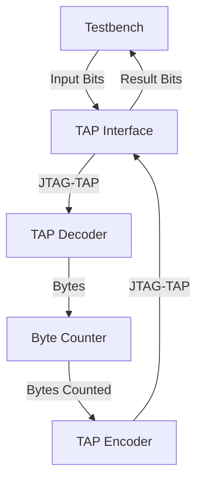

# Day 10: Factory

# Lessons Learnt

# Design Space Exploration

The puzzle input format is slightly more complex compared to others. The input contents consist in variable length lists, between four to ten elements with an average of about seven elements. The contents are spread on 162 lines with a total of 1150 elements.

Adding some margin for handling accounts with slightly different input contents, I assume the following sizing:

- Max number of entries: 200 (162 effective in my input)
- Max elements per entry: 10 effective in my input (complexity increases above ten because of multiple consecutive decimal digits being decoded)
- Max total elements: 2400 (1150 effective in my input)

Pulling an entry from the puzzle example contents:

```
[.##.] (3) (1,3) (2) (2,3) (0,2) (0,1) {3,5,4,7}
```

At some point, the data will need to be aligned:

```
[.##.] (3) (1,3) (2) (2,3) (0,2) (0,1) {3,5,4,7}
 |      |   |     |   |     |     |     discard
 0110   |   |     |   |     |     |
        |   0101  |   0011  1010  1100
        0001      0010
```

Simplest way would be to breakdown this operation into several elementary steps:

- Convert the first part to binary: `[.##.]` to `0110` and push it
- For each part in parentheses:
  - For each digit (assuming that I'm dealing with single digit numbers)
    - Perform a encoded to one-hot conversion, eg. `3` to `0001`
    - Accumulate the value and OR it with the following number after a comma
  - Push the accumulated value
- When encountering the open curly brace `{`, signal the end of the line and start over

# Implementation

## First Stage

Just like other puzzles, the first stage consists in copy-pasting the common design files.

| Module | Description | Complexity | Mindblowness | Remarks |
| --- | --- | --- | --- | --- |
| [`user_logic_tb`](user_logic_tb.sv) | Testbench | :large_blue_circle: | :kissing_smiling_eyes: | Small refactor and misc improvements |
| [`user_logic`](user_logic.sv) | Logic top-level | :large_blue_circle: | :kissing_smiling_eyes: | Wire harness |
| [`tap_decoder`](tap_decoder.sv) | BSCANE2 interface for inbound signals | :large_blue_circle: | :kissing_smiling_eyes: | Copy-paste from previous puzzle |
| [`tap_encoder`](tap_encoder.sv) | BSCANE2 interface for outbound signals | :large_blue_circle: | :kissing_smiling_eyes: | Copy-paste from previous puzzle | :kissing_smiling_eyes: |

### Design Iterations

Completed in a single pass.

| Target    | Status | Notes |
|-----------|--------|-------|
| Varilator | Pass   | None  |
| Iverilog  | Pass   | None  |
| Vivado    | Pass   | None  |

### Diagram



### Resource Usage

```
Detailed RTL Component Info : 
+---Registers : 
	               16 Bit    Registers := 2     
	                8 Bit    Registers := 1     
	                1 Bit    Registers := 2     
+---Muxes : 
	   4 Input   16 Bit        Muxes := 2     
	   2 Input   16 Bit        Muxes := 1     
```

## Second Stage

I added byte stream decoding through a dedicated module [`line_decoder`](line_decoder.sv). No difficulties encountered, quite the opposite with the encoded to one-hot conversion being easier than expected:

```verilog
always_ff @(posedge clk) begin: decode_buttons_wiring
    if (inbound_valid) begin
        case (inbound_byte)
            SPACE_CHAR: begin
                button_wiring <= '0;
            end
            default: begin
                if (is_digit(inbound_byte)) begin
                    button_wiring <= button_wiring + (1 << (inbound_byte - ZERO_CHAR));
                end
            end
        endcase
    end
end
```

The design I implemented is **limited to single digit positions**, meaning that the width of the light and thus button cannot exceed ten, which is what I deduced by running the Python script mentioned earlier. Adding this support would add some complexity for having to accumulate digits and convert the decimal value obtained into binary.

### Resource Usage

```
Module line_decoder
Detailed RTL Component Info :
+---Adders :
	   2 Input    6 Bit       Adders := 1
+---Registers :
	               12 Bit    Registers := 2
	                1 Bit    Registers := 3
+---Muxes :
	   2 Input    1 Bit        Muxes := 4
	   3 Input    1 Bit        Muxes := 1
```

The total remains very frugal:


|      |Cell    |Count |
|------|--------|------|
|1     |BSCANE2 |     1|
|2     |CARRY4  |     9|
|3     |LUT1    |     1|
|4     |LUT2    |    39|
|5     |LUT3    |    34|
|6     |LUT4    |     2|
|7     |LUT5    |    11|
|8     |LUT6    |     8|
|9     |FDRE    |    96|

## Third Stage

My approach is to implement a single combination solving unit ([`machine_wiring_solver`](machine_wiring_solver.sv)) first and defer the fanout of multiple combinations to a further stage.

The puzzle requires finding the *fewest button presses*, keyword being **fewest**. The operation involves two states which are inverted each time a bit from an element is set. This operation is akin to a XOR operation where each change flips a bit's state.

Thus the puzzle requires finding the solution involving the minimum number of active elements being XOR'ed each other. With a machine constituted of six elements, the solution space explored equates $$2^6 = 64$$ combinations. Worst case is 13 button wiring entries making it 16384 combinations, largely in the realm of what is reasonable.

Knowing that a realistic solution is available, the next step is to think about the interfaces. The following information is likely to be required:

- Solution, corresponding to the light wiring which is the first data value received from the line decoder unit.
- Each individual button wirings
- End of processing
- Strobe signal indicating a valid solution
- Number of enabled elements

### Puzzle Description Misunderstanding

The puzzle states:

> There are a few ways to correctly configure the first machine:
> 
>     [.##.] (3) (1,3) (2) (2,3) (0,2) (0,1) {3,5,4,7}
> 
> - You could press the first three buttons once each, a total of 3 button presses.
> - You could press (1,3) once, (2,3) once, and (0,1) twice, a total of 4 button presses.
> - You could press all of the buttons except (1,3) once each, a total of 5 button presses.
> 
> However, the fewest button presses required is 2. One way to do this is by pressing the last two buttons ((0,2) and (0,1)) once each.

Initial testing with the `example.txt` file showed the following solutions:

- 0x07, corresponding to the first three buttons
- 0x0A, corresponding to the buttons (1,3) once, (2,3) once
- 0x30, corresponding to the buttons (0,2) once, (0,1) once
- 0x3D, corresponding to all of the buttons except (1,3)


However the puzzle states (0,1) twice, which I have trouble understanding. A fundamental property of the XOR operator is that any pair of identical arguments will zero out each other, which in practice means that pressing (0,1) twice had no effect. Accordingly the puzzle statement overlooked the existence of the **(1,3) once, (2,3) once** solution.

Since the result is the minimum number of enabled buttons, this omission didn't change the final value, which may explain why it was not spotted in the first place.

## Four Stage

Knowing that the puzzle requires the lowest number of button presses, I thought that there should be a better way then trying all the combinations of button pushes using a binary counter, which would be inefficient for cases where the only the last button shall be pressed. After a bit of digging there is a very clever algorithm for producing codes starting with all the the combinations of the least bit sets: the [**Gosper's Hack**](https://rosettacode.org/wiki/Gosper%27s_hack#C++).

The money shoot is turning the following C++ method into RTL:

```cpp
uint32_t gospers_hack(const uint32_t& n) {
	const uint32_t c = n & -n;
	const uint32_t r = n + c;
	return ( ( ( r ^ n ) >> 2 ) / c ) | r;
}
```

I implemented the algorithm without trying to read much into it, and renamed the signals according to what I was able to make up by reading the waveform:


Resulting in the following snippet:

```verilog
always_comb begin
    max_x = ((1 << nb_bits_set) - 1) << ($bits(nb_bits_set)'(WIDTH) - nb_bits_set);
    lowest_set_bit = x & -x;
    increment = x + lowest_set_bit;
    flipped_bits = x ^ increment;
    alignment = (flipped_bits >> 2) / lowest_set_bit;
end
```

## Fifth Stage

As implemented, the time required for the module performing the machine wiring solving [`machine_wiring_solver`](machine_wiring_solver.sv) may at times take long enough that the light and button wirings of the following line arrive and cause havoc. With each line being fully independent, I simply opted to parallelize the processing by instantiating multiple instances of the `machine_wiring_solver` module.

### Resource Usage

Synthesizer estimates:

|      |Cell    |Count |
|------|--------|------|
|1     |BSCANE2 |     1|
|2     |CARRY4  |   297|
|3     |LUT1    |    61|
|4     |LUT2    |   856|
|5     |LUT3    |   264|
|6     |LUT4    |   916|
|7     |LUT5    |   100|
|8     |LUT6    |   264|
|9     |FDRE    |  1394|
|10    |FDSE    |     8|

Final usage:

| Ref Name | Used | Functional Category |
|----------|------|---------------------|
| FDRE     | 1385 |        Flop & Latch |
| LUT4     |  916 |                 LUT |
| LUT2     |  846 |                 LUT |
| CARRY4   |  295 |          CarryLogic |
| LUT6     |  264 |                 LUT |
| LUT3     |  264 |                 LUT |
| LUT5     |  100 |                 LUT |
| LUT1     |   61 |                 LUT |
| FDSE     |    8 |        Flop & Latch |
| BUFG     |    1 |               Clock |
| BSCANE2  |    1 |              Others |

### Verification

I had trouble validating the result using the custom `input.txt` puzzle contents. My design behaved as expected with the example and when running some basic test patterns. To avoid spending more time I decided to grab the implementation in Python from somebody else and bisect the contents for finding where is located the first unexpected behavior.

| Start Line | End Line | Reference | Simulation | On-board | Verdict |
|------------|----------|-----------|------------|----------|---------|
| 1          | 162      | 449       | 405        | 407      | Failed  |
| 1          | 81       | 233       | 210        | 213      | Failed  |
| 1          | 40       | 117       | 106        | 111      | Failed  |
| 1          | 20       | 67        | 55         | 56       | Failed  |
| 1          | 10       | 28        | 27         | 25       | Failed  |
| 1          | 5        | 16        | 12         | 12       | Failed  |
| 1          | 3        | 7         | 7          | 7        | OK      |
| 3          | 5        | 11        | 7          | 7        | Failed  |
| 4          | 5        | 9         | 5          | 5        | Failed  |
| 4          | 4        | 5         | 5          | 5        | OK      |
| 5          | 5        | 4         | 4          | 4        | OK      |

I observe two issues which may be unrelated. I will start by tacking the one occurring with the smallest number of inputs. They are:

```
[#.#.#..##] (0,2,4,5,6,7,8) (0,2,4,8) (0,1,4,5) (3,6,8) (2,6,8) (0,1,2,3,5,6) (0,5,7) (0,3,4,5) (2,4,5,6,8) (0,1,3,5) {78,40,73,52,50,88,79,25,63}
[###..#] (0,1,2,4,5) (0,4,5) (2,3) (1,3) (2,3,4,5) (0,1,4,5) (2,5) {33,38,44,37,46,51}
```

Reviewing the waveforms in the `machine_compute_units.sv` file, I noticed that the `compute_finished` was being set prematurely. This was due to the fact that the `end_of_file` signal was being set before all the `solver_ready` signals were asserted.

| Start Line | End Line | Reference | Simulation | On-board | Verdict |
|------------|----------|-----------|------------|----------|---------|
| 1          | 162      | 449       | 408        | tbd      | Failed  |
| 150        | 162      | 44        | 44         | tbd      | OK      |
| 1          | 20       | 67        | 65         | tbd      | Failed  |
| 1          | 10       | 28        | 27         | tbd      | Failed  |
| 1          | 10       | 28        | 27         | tbd      | Failed  |

Upon closer inspection, it appears that unused button wiring memorization units (implemented by the [`button_wiring`](button_wiring.sv) module) did not have their contents properly reset, meaning that machines with unused wiring diagrams can sometimes interfere causing incorrect results.

```diff
always_ff @(posedge clk) begin: button_wiring_capture
    if (reset) begin
        wiring_valid_out <= 1'b0;
        conf_was_captured <= 1'b0;
+        capture_wiring = '0;
    end else if (wiring_valid_in) begin
        if (!conf_was_captured) begin: capture_conf
            conf_was_captured <= 1'b1;
            capture_wiring <= wiring_data_in;
        end else begin
            wiring_valid_out <= 1'b1;
            wiring_data_out <= wiring_data_in;
        end
    end else begin
        wiring_valid_out <= 1'b0;
    end
end
```
