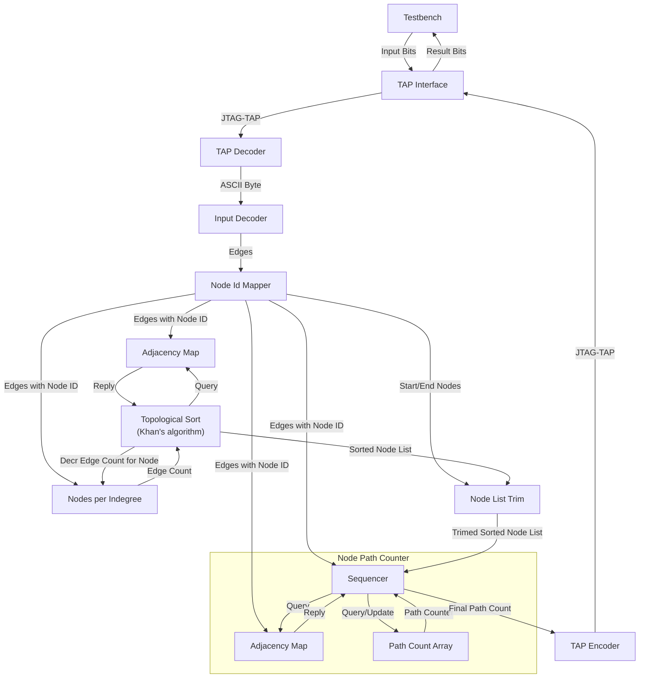
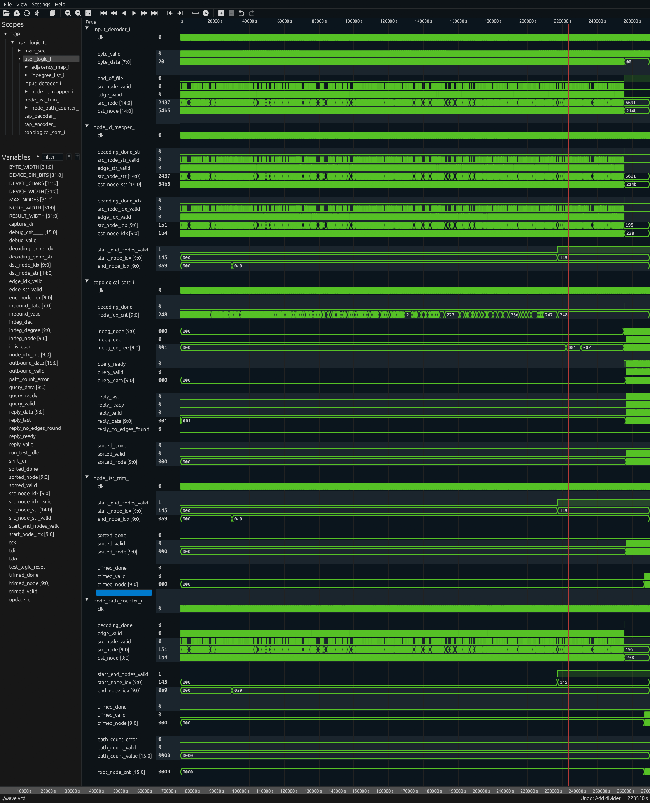
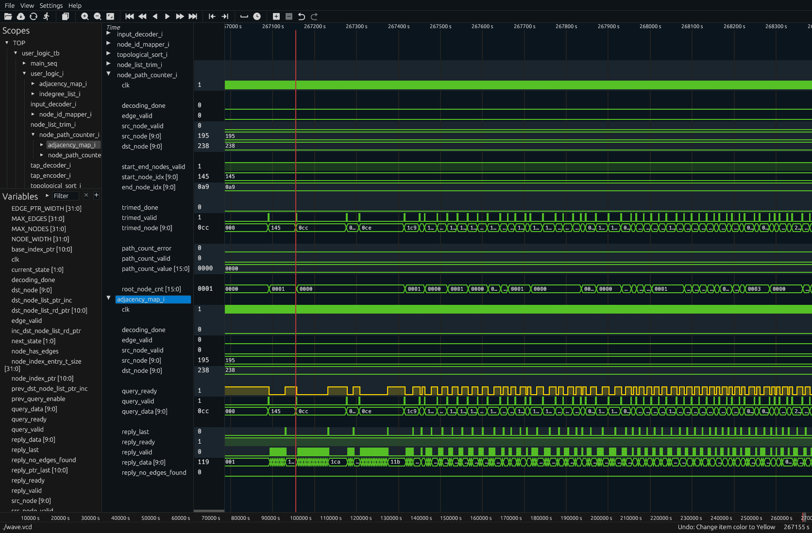

# Day 11: Reactor

# Design Space Exploration

## Input Data

The puzzle descriptions states the following key points, in which I emphasized details.

> Each line gives the name of a device, **the left-hand side (LHS)**, followed by **a colon `:`** and then a list of the devices **the right-hand side (RHS)** to which its outputs are attached.

```
kqg: kmt
amc: yge tez ckz
lgt: mvi lar xxm
xir: lkw
lvg: uey oau sag qzr ajd lof yvk lij jne oct mqi
egg: nmi
flf: wbz smt
```

The following is concluded after reviewing the example and cutom input data:

- LHS is a string of exactly three lower-case alphabetic characters
- RHS is a list of strings (separated by a single whitespace) each following the exact same rule as above
- LHS and RHS are separated by a colon followed by a single whitespace
- The length of the RHS is variable, never less than one and up to several dozens strings

## First Order Properties

As stated above, nodes are encoded on three ASCII characters corresponding to 24 bits of data. Being all lower-case alphabetic characters, they can be represented as three natural numbers in the range of 0 to 25 meaning **5 bits each**. This equates to a total of 15 bits or 32768 possible combinations.

- NODE_ASCII_WIDTH = 3*8 = 24
- NODE_ENCODED_WIDTH = 3*$clog2(26) = 15

The custom input file contains nearly 600 lines and about the same number of unique nodes. This means that 10 bits (1024 combinations) are sufficient to encode all unique nodes. A number of nodes have a first character far from the start of the alphabet, indicating that node strings are not contiguous. With less then 1024 nodes of a universe of 32768 possible combinations, the **density is very low** at under 3 %.

- NODE_INDEX_WIDTH = $clog2(1024) = 10

An other important metric is the total number of edges which connect two adjacent nodes (respectively *connections* and *devices* in the puzzle vernacular). Analyzing the custom input file using a Python script [`analyze_input.py`](analyze_input.py) yields a trove of information.

- MAX_EDGES = 2048
- EDGE_WIDTH = $clog2(MAX_EDGES) = 11
- MAX_EDGES_PER_NODE = 32
- EDGE_PER_NODE_CNT_WIDTH = $clog2(MAX_EDGES_PER_NODE) = 5

# Computation Algorithm

Rather than going down the beaten path of implementing a [depth-first search](https://en.wikipedia.org/wiki/Depth-first_search) (DFS), I was eager to try something different which I could learn from. I remember some Advent of Code puzzles from several years ago which required **dynamic programming** (DP) to be solved in reasonable time. I relied on the explanations provided in [an introductory article on dynamic programming](https://www.geeksforgeeks.org/dsa/introduction-to-dynamic-programming-data-structures-and-algorithm-tutorials/).

And boy! As I was looking for something a bit challenging, implementing dynamic programming on an FPGA didn't disappoint :trollface:

# Implementation

The design consists in a pipeline containing the following main steps:

- Mapping of the arbitrary node names into sequential node IDs, see [`node_id_mapper.sv`](node_id_mapper.sv)
- Topological sorting of the nodes using [Khan's algorithm](https://en.wikipedia.org/wiki/Topological_sorting#Kahn's_algorithm), see [`topological_sort.sv`](topological_sort.sv)
- Nodes preceding and trailing respectively the start and end nodes are trimmed, see [`node_trim.sv`](node_trim.sv)
- The trimmed and sorted node list is then iterated over to count the number of possible distinct paths, see [`node_path_counter.sv`](node_path_counter.sv)

## Diagram



## Waveforms

Looking at the complete run, the sorting process runs in a fraction of the time required for uploading the input contents (13 clocks per byte due bit deserialization and JTAG TAP state machine overhead).



The final downstream stage `node_path_counter` has execution time headroom (materialized by `query_ready` being high while waiting for `trimed_valid` to be asserted high), Optimizing the sorting process would thus compress the overall execution time.



## Resource Usage

| Ref Name | Used | Functional Category |
|----------|------|---------------------|
| RAMD64E  |  992 |  Distributed Memory |
| LUT6     |  567 |                 LUT |
| FDRE     |  459 |        Flop & Latch |
| LUT3     |  143 |                 LUT |
| MUXF7    |   90 |               MuxFx |
| LUT4     |   73 |                 LUT |
| LUT2     |   60 |                 LUT |
| LUT5     |   44 |                 LUT |
| MUXF8    |   39 |               MuxFx |
| CARRY4   |   19 |          CarryLogic |
| RAMB36E1 |   13 |        Block Memory |
| LUT1     |   11 |                 LUT |
| FDSE     |    9 |        Flop & Latch |
| RAMB18E1 |    3 |        Block Memory |
| BUFG     |    1 |               Clock |
| BSCANE2  |    1 |              Others |

Quite a bunch of MUXF7 :turtle: and worse MUXF8 :snail: instances. Not a concern at 50 MHz though, but interesting :monocle_face:

```tcl
Vivado% foreach c [get_cells -hier -filter {REF_NAME == MUXF7}] { puts $c}
user_logic_i/adjacency_map_i/dst_node_list_rd_ptr_reg_rep[0]_i_2
user_logic_i/adjacency_map_i/dst_node_list_rd_ptr_reg_rep[0]_i_3
# (...)
user_logic_i/adjacency_map_i/node_has_edges_reg_i_2
user_logic_i/adjacency_map_i/node_has_edges_reg_i_3
user_logic_i/adjacency_map_i/reply_ptr_last_reg[0]_i_2
user_logic_i/adjacency_map_i/reply_ptr_last_reg[0]_i_3
# (...)
user_logic_i/node_path_counter_i/adjacency_map_i/dst_node_list_rd_ptr_reg_rep[0]_i_2
user_logic_i/node_path_counter_i/adjacency_map_i/dst_node_list_rd_ptr_reg_rep[0]_i_3
# (...)
user_logic_i/node_path_counter_i/adjacency_map_i/reply_ptr_last_reg[0]_i_2
user_logic_i/node_path_counter_i/adjacency_map_i/reply_ptr_last_reg[0]_i_3
# (...)
```

```tcl
Vivado% foreach c [get_cells -hier -filter {REF_NAME == MUXF8}] { puts $c}
user_logic_i/adjacency_map_i/dst_node_list_rd_ptr_reg_rep[10]_i_3
user_logic_i/adjacency_map_i/dst_node_list_rd_ptr_reg_rep[2]_i_2
# (...)
user_logic_i/adjacency_map_i/node_has_edges_reg_i_1
user_logic_i/adjacency_map_i/reply_ptr_last_reg[0]_i_1
user_logic_i/adjacency_map_i/reply_ptr_last_reg[10]_i_1
# (...)
user_logic_i/node_path_counter_i/adjacency_map_i/dst_node_list_rd_ptr_reg_rep[10]_i_3
user_logic_i/node_path_counter_i/adjacency_map_i/dst_node_list_rd_ptr_reg_rep[2]_i_2
# (...)
user_logic_i/node_path_counter_i/adjacency_map_i/reply_ptr_last_reg[0]_i_1
user_logic_i/node_path_counter_i/adjacency_map_i/reply_ptr_last_reg[10]_i_1
# (...)
user_logic_i/node_path_counter_i/adjacency_map_i/reply_ptr_last_reg
```

### Per-Module

Unsurprisingly, the largest modules are the two `adjacency_map` instances.

|             Instance             |          Module          | Total LUTs | Logic LUTs | LUTRAMs | SRLs | FFs | RAMB36 | RAMB18 | DSP Blocks |
|----------------------------------|--------------------------|------------|------------|---------|------|-----|--------|--------|------------|
| shell                            |                    (top) |       1814 |        822 |     992 |    0 | 458 |     13 |      3 |          0 |
|   (shell)                        |                    (top) |          0 |          0 |       0 |    0 |   0 |      0 |      0 |          0 |
|   user_logic_i                   |               user_logic |       1814 |        822 |     992 |    0 | 458 |     13 |      3 |          0 |
|     adjacency_map_i              |         adjacency_map__1 |        782 |        270 |     512 |    0 |  63 |      1 |      0 |          0 |
|     indegree_list_i              |            indegree_list |         41 |         41 |       0 |    0 |  22 |      0 |      1 |          0 |
|       (indegree_list_i)          |            indegree_list |         41 |         41 |       0 |    0 |  22 |      0 |      0 |          0 |
|       dpram_i                    |      indegree_list_dpram |          0 |          0 |       0 |    0 |   0 |      0 |      1 |          0 |
|     input_decoder_i              |            input_decoder |         29 |         29 |       0 |    0 |  44 |      0 |      0 |          0 |
|     node_id_mapper_i             |           node_id_mapper |         41 |         41 |       0 |    0 |  85 |     11 |      0 |          0 |
|       (node_id_mapper_i)         |           node_id_mapper |         41 |         41 |       0 |    0 |  85 |      0 |      0 |          0 |
|       node_id_mapper_dpram_i     |     node_id_mapper_dpram |          0 |          0 |       0 |    0 |   0 |     11 |      0 |          0 |
|     node_list_trim_i             |           node_list_trim |         16 |         16 |       0 |    0 |  13 |      0 |      0 |          0 |
|     node_path_counter_i          |        node_path_counter |        830 |        350 |     480 |    0 | 134 |      1 |      1 |          0 |
|       (node_path_counter_i)      |        node_path_counter |         86 |         86 |       0 |    0 |  73 |      0 |      0 |          0 |
|       adjacency_map_i            |            adjacency_map |        744 |        264 |     480 |    0 |  61 |      1 |      0 |          0 |
|       node_path_counter_sdpram_i | node_path_counter_sdpram |          0 |          0 |       0 |    0 |   0 |      0 |      1 |          0 |
|     tap_decoder_i                |              tap_decoder |          2 |          2 |       0 |    0 |   9 |      0 |      0 |          0 |
|     tap_encoder_i                |              tap_encoder |         10 |         10 |       0 |    0 |  32 |      0 |      0 |          0 |
|     topological_sort_i           |         topological_sort |         63 |         63 |       0 |    0 |  56 |      0 |      1 |          0 |


### RAM

| Memory Name                                                                 | Array Size | RAM_STYLE | Memory Type | Port 1 Dimension / Map | Port 2 Dimension / Map |
|-----------------------------------------------------------------------------|------------|-----------|-------------|------------------------|------------------------|
| user_logic_i/node_id_mapper_i/node_id_mapper_dpram_i/node_lut               |     360448 |           | RAM_TDP     | 32768x11               | 32768x11               |
|  user_logic_i/node_id_mapper_i/node_id_mapper_dpram_i/node_lut_reg_0_0      |      32768 |      AUTO |             |  A:A:32768x1           |  B:B:32768x1           |
|  user_logic_i/node_id_mapper_i/node_id_mapper_dpram_i/node_lut_reg_0_1      |      32768 |      AUTO |             |  A:A:32768x1           |  B:B:32768x1           |
|  user_logic_i/node_id_mapper_i/node_id_mapper_dpram_i/node_lut_reg_0_2      |      32768 |      AUTO |             |  A:A:32768x1           |  B:B:32768x1           |
|  user_logic_i/node_id_mapper_i/node_id_mapper_dpram_i/node_lut_reg_0_3      |      32768 |      AUTO |             |  A:A:32768x1           |  B:B:32768x1           |
|  user_logic_i/node_id_mapper_i/node_id_mapper_dpram_i/node_lut_reg_0_4      |      32768 |      AUTO |             |  A:A:32768x1           |  B:B:32768x1           |
|  user_logic_i/node_id_mapper_i/node_id_mapper_dpram_i/node_lut_reg_0_5      |      32768 |      AUTO |             |  A:A:32768x1           |  B:B:32768x1           |
|  user_logic_i/node_id_mapper_i/node_id_mapper_dpram_i/node_lut_reg_0_6      |      32768 |      AUTO |             |  A:A:32768x1           |  B:B:32768x1           |
|  user_logic_i/node_id_mapper_i/node_id_mapper_dpram_i/node_lut_reg_0_7      |      32768 |      AUTO |             |  A:A:32768x1           |  B:B:32768x1           |
|  user_logic_i/node_id_mapper_i/node_id_mapper_dpram_i/node_lut_reg_0_8      |      32768 |      AUTO |             |  A:A:32768x1           |  B:B:32768x1           |
|  user_logic_i/node_id_mapper_i/node_id_mapper_dpram_i/node_lut_reg_0_9      |      32768 |      AUTO |             |  A:A:32768x1           |  B:B:32768x1           |
|  user_logic_i/node_id_mapper_i/node_id_mapper_dpram_i/node_lut_reg_0_10     |      32768 |      AUTO |             |  A:A:32768x1           |  B:B:32768x1           |
| user_logic_i/adjacency_map_i/dst_node_list                                  |      20480 |           | RAM_SDP     | 2048x10                | 2048x10                |
|  user_logic_i/adjacency_map_i/dst_node_list_reg                             |      20480 |      AUTO |             |  A:A:2048x10           |  B:B:2048x10           |
| user_logic_i/node_path_counter_i/adjacency_map_i/dst_node_list              |      20480 |           | RAM_SDP     | 2048x10                | 2048x10                |
|  user_logic_i/node_path_counter_i/adjacency_map_i/dst_node_list_reg         |      20480 |      AUTO |             |  A:A:2048x10           |  B:B:2048x10           |
| user_logic_i/node_path_counter_i/node_path_counter_sdpram_i/path_count      |      16384 |           | RAM_SDP     | 1024x16                | 1024x16                |
|  user_logic_i/node_path_counter_i/node_path_counter_sdpram_i/path_count_reg |      16384 |      AUTO |             |  A:A:1024x16           |  B:B:1024x16           |
| user_logic_i/indegree_list_i/dpram_i/indegree_cnt_per_node                  |      10240 |           | RAM_TDP     | 1024x10                | 1024x10                |
|  user_logic_i/indegree_list_i/dpram_i/indegree_cnt_per_node_reg             |      10240 |      AUTO |             |  A:A:1024x10           |  B:B:1024x10           |
| user_logic_i/topological_sort_i/zero_indeg_nodes_fifo                       |      10240 |           | RAM_SDP     | 1024x10                | 1024x10                |
|  user_logic_i/topological_sort_i/zero_indeg_nodes_fifo_reg                  |      10240 |      AUTO |             |  A:A:1024x10           |  B:B:1024x10           |

### Timings

Although 50 MHz is *walk in the park* for a 7-series FPGA, fan-out figures are higher then expected:

| Net Name                                                                              | Fanout | Driver Type | Worst Slack(ns) | Worst Delay(ns) |
|---------------------------------------------------------------------------------------|--------|-------------|-----------------|-----------------|
| user_logic_i/node_id_mapper_i/src_node_idx[0]                                         |   1249 | FDRE        |          12.010 |           7.588 |
| user_logic_i/node_id_mapper_i/src_node_idx[1]                                         |   1249 | FDRE        |          10.550 |           8.671 |
| user_logic_i/node_id_mapper_i/src_node_idx[2]                                         |   1249 | FDRE        |          12.554 |           6.881 |
| user_logic_i/node_id_mapper_i/src_node_idx[3]                                         |   1249 | FDRE        |          12.840 |           6.274 |
| user_logic_i/node_id_mapper_i/src_node_idx[4]                                         |   1249 | FDRE        |          13.568 |           5.620 |
| user_logic_i/node_id_mapper_i/src_node_idx[5]                                         |   1249 | FDRE        |          13.700 |           5.599 |

## Final Ratings

| Module | Description | Complexity | Mindblowness | Remarks |
| --- | --- | --- | --- | --- |
| [`user_logic_tb`](user_logic_tb.sv) | Testbench | :green_circle: | :kissing_smiling_eyes: | Small refactor and misc improvements |
| [`user_logic`](user_logic.sv) | Logic top-level | :large_blue_circle: | :kissing_smiling_eyes: | Wire harness |
| [`tap_decoder`](tap_decoder.sv) | BSCANE2 interface for inbound signals | :large_blue_circle: | :kissing_smiling_eyes: | Copy-paste from previous puzzle |
| [`input_decoder`](input_decoder.sv) | Simple text parser | :green_circle: | :kissing_smiling_eyes: | Extra non-text char required for end-of-file flag |
| [`node_id_mapper`](node_id_mapper.sv) | Converts encoded (15-bit) node names into sequential identifiers | :yellow_circle: | :slightly_smiling_face: | Single-cycle lookup or new assignation |
| [`adjacency_map`](adjacency_map.sv) | Adjacent outbound nodes per node | :orange_circle: | :raised_eyebrow: | Backpressure with staged memories |
| [`indegree_list`](indegree_list.sv) | Track inbound edges per node | :green_circle: | :slightly_smiling_face: | Dual-port RAM |
| [`topological_sort`](topological_sort.sv) | Pipelined implementation of Kahn's algorithm | :black_circle: | :face_with_spiral_eyes: | Trouble with parallel requests/replies orchastration, late addition of backpressure |
| [`node_list_trim`](node_list_trim.sv) | Removed nodes preceeding a given start node | :green_circle: | :kissing_smiling_eyes: | Trivial |
| [`node_path_counter`](node_path_counter.sv) | Path counting using bottom-up dynamic programming | :red_circle: | :exploding_head: | Source code appears deceptively simple, waveforms not so much :upside_down_face: |
| [`tap_encoder`](tap_encoder.sv) | BSCANE2 interface for outbound signals | :large_blue_circle: | :kissing_smiling_eyes: | Copy-paste from previous puzzle | :kissing_smiling_eyes: |

## Encountered Issues

### BRAM Inference

Got a ominous error message pertaining to a RAM inference issue:

```
INFO: [Synth 8-5858] RAM node_lut_reg from Abstract Data Type (record/struct) for this pattern/configuration is not supported. This will most likely be implemented in registers
WARNING: [Synth 8-11357] Potential Runtime issue for 3D-RAM or RAM from Record/Structs for RAM  node_lut_reg with 720896 registers
```

The word *Runtime* is capitalized, suggesting that somebody thought worth adding the word *Potential* to the warning message.

The memory in question is `node_lut` from `node_id_mapper.sv`:

```verilog
typedef struct packed {
    logic index_assigned;
    node_idx_t node_index;
} node_index_entry_t;

node_index_entry_t node_lut[2**NODE_STR_WIDTH-1:0];
```

My bad, further then declaring a RAM from struct, I hadn't considered that partial word writes (except if alignment perfectly matches byte boundaries) would not be supported. Some rework is inevitable. After which a new error message appeared:

```
ERROR: [Synth 8-2914] Unsupported RAM template [/home/mm/Documents/aoc-rtl/25/11/node_id_mapper.sv:50]
ERROR: [Synth 8-5743] Unable to infer RAMs due to unsupported pattern.
```

The term *unsupported pattern* is rather opaque, by experience RAM inference usually fails when the design is too smart resulting in the inferrence heuristics getting confused. A larger rework is required and I'm afraid that an extra cycle will have to be conceded.

Throwing an extra cycle (without reworking the logic making it obvious incorrect) clears this inference error, breaking all the logic since everything is off by one cycle. After tying all the pieces the `node_id_mapper` is now both logically correct and digestible by the synthesis tool.

### New BRAM Issue

At least this time Vivado didn't allocate all my computer's RAM and the error message conveys usefull information:

```
INFO: [Synth 8-5858] RAM node_index_reg from Abstract Data Type (record/struct) for this pattern/configuration is not supported. This will most likely be implemented in registers
WARNING: [Synth 8-11357] Potential Runtime issue for 3D-RAM or RAM from Record/Structs for RAM  node_index_reg with 23552 registers
Read & Write Range Direction Mismatch

(...) much further down

ERROR: [Synth 8-2914] Unsupported RAM template [/home/mm/Documents/aoc-rtl/25/11/node_id_mapper.sv:50]
ERROR: [Synth 8-2914] Unsupported RAM template [/home/mm/Documents/aoc-rtl/25/11/indegree_list.sv:20]
ERROR: [Synth 8-5743] Unable to infer RAMs due to unsupported pattern.
```

After reviewing the source code, I realized that the RAM data was accessed using four different addresses, which caused the RAM inference to fail (obvious, but hindsight is always 20/20). Modifying the logic for using a common address for each port solved this issue.

A remaining issue which I have yet to explain is with the following construct:

```verilog
// Signals width, type and RAM declaration are all legit.

always @(posedge clk) begin: read_decr_node_port
    if (prev_decrement_degree) begin
        indegree_cnt_per_node[node_sel_hold] <= output_node_degree;
    end
    prev_node_degree <= indegree_cnt_per_node[node_sel_hold];
end

always @(posedge clk) begin: incr_node_port
    if (prev_edge_valid) begin
        indegree_cnt_per_node[dst_node_hold] <= incr_dst_node_indegree;
    end
    prev_dst_node_indegree <= indegree_cnt_per_node[dst_node_hold];
end
```

Although the above snippet conforms exactly with the DPRAM template (save for the common clock, but using a dual clock didn't change a thing), this was causing Vivado to fail with an error message rather lacking substance:

```
ERROR: [Synth 8-2914] Unsupported RAM template [/home/mm/Documents/aoc-rtl/25/11/indegree_list.sv:20]
```

The only solution I came with was to move this logic into a separate module [`indegree_list_dpram.sv`](indegree_list_dpram.sv). Doing so was enough to make the inferrence logic happy and complete the firmware build.

### Discrepancies with Board-testing vs Simulation

The result data during board runs does not match the simulation results. In such case with modest designs, the divide and conquer approach is usually a good solution for narrowing the root cause.

| Check | Simulation | On-board | Verdict |
|-------|------------|----------|---------|
| `input_decoder` egress edge count | 1725 | 1725 | :white_check_mark: Pass |
| (1) `node_list_trim` egress edge count | 150 | 2 | :x: Fail |
| (1) `node_list_trim` egress edge count | 10 (example.txt) | 2 | :x: Fail |
| (1) `topological_sort` egress edge count | 584 | 2 | :x: Fail |
| (1) `topological_sort` egress edge count | 11 (example.txt) | 2 | :x: Fail |
| `node_id_mapper` egress edge count | 1724 | 1724 | :white_check_mark: Pass |
| `node_id_mapper` egress edge count | 16 (example.txt) | 16 | :white_check_mark: Pass |
| (1) `node_id_mapper` egress edge count | 1725 | 1 | :x: Fail |
| (1) `input_decoder` egress edge count | 1725 | 1 | :x: Fail |
| (2) `tap_decoder` egress edge count | 9816 | 10 | :x: Fail |

(1) I was using the `_done` signal which logic may be not behaving as expected. The `input_decoder` module is quite simple and seeing an erroneous count at the time the `decoding_done` output is asserted makes it very likely that the text character format which is processed by the FPGA differs from simulation. A closer inspection of the JTAG serialization process is warranted.

(2) Counter is stopped when `decoding_done_str` is asserted. The result of ten (10) points toward the end of the first line being misinterpreted as the end of the file.

```
zzt: ujd
       ^ eighth character
```

Looking into the logic responsible for uploading the input file contents, I noticed that the TAP controller was instructed to go through the `PAUSE-DR` (DRPAUSE) then `IDLE` states. This would cause it to pass through the `UPDATE-DR` thus committing a byte readout out of the `tap_decoder` module. Simply removing two lines solved this issue.

```diff
foreach line $lines {
    set len [string length $line]
    for {set i 0} {$i<$len} {incr i} {
        scan [string index $line $i] %c char
        set hex_char [format "0x%02x" $char]
        scan_dr_hw_jtag 9 -tdi ${hex_char}
        run_state_hw_jtag IDLE; # run through state `UPDATE`
        incr bytes_uploaded
    }
    scan_dr_hw_jtag 9 -tdi $new_line
    run_state_hw_jtag IDLE; # run through state `UPDATE`
    incr bytes_uploaded
-    run_state_hw_jtag DRPAUSE
-    run_state_hw_jtag IDLE
}
```

I reworked the JTAG result readout which now loops until a non-zero result is obtained. The main benefit is being agnostic from any processing delays.

| Check | Simulation | On-board | Verdict |
|-------|------------|----------|---------|
| `tap_decoder` egress edge count on `decoding_done` | 9816 | 9816 | :white_check_mark: Pass |
| `input_decoder` egress edge count on `decoding_done` | 1725 | 1725 | :white_check_mark: Pass |
| `node_id_mapper` egress edge count on `decoding_done_idx` | 1725 | 1725 | :white_check_mark: Pass |
| `topological_sort` egress edge count on `sorted_done` | 584 | 584 | :white_check_mark: Pass |
| `node_list_trim` egress edge count on `trimed_done` | 150 | 584 | :x: Fail |
| `end_node_idx` output of the `node_id_mapper` | 0x0a9 | 0x0a9 | :white_check_mark: Pass |
| `start_node_idx` output of the `node_id_mapper` | 0x145 | 0x145 | :white_check_mark: Pass |
| `node_list_trim` egress edge count on `trimed_done` with `start_node_idx` hardcoded to `0x191` (1) | 92 | 92 | :white_check_mark: Pass |
| `node_list_trim` egress edge count on `trimed_done` with `start_node_idx` hardcoded to `0x145` (2) | 150 | 150 | :white_check_mark: Pass |

(1) Randomly picked valid node ID in the trimed region from the simulation waveform.
(2) Statically assigning the start node identifier yields the expected results, making things interesting.

The last discrepancy was solved after fixing all initialization issues appearing in Icarus Verilog. Being a four-state (`X` and `Z` in addition to the usual `0` and `1`) simulator, it requires initialization of all signals to a known state before simulation starts. Conversely, Verilator is a two-state simulator and does not require initialization of signals similar to Vivado. This similarity starts to break down when dealing with higher-level constructs (enums, FSM, and of course RAM and DSP inference).

# Take Aways

- Dynamic programming is astonishingly powerful, however it expects strict prerequisites such as acyclic and ordered input structure.
- A robust backpressure support will eventually be required for any moderately complex design when several query / replies are dispatched in parallel.
- Verilator is awesome.
- Beware that Vivado's DPRAM inferrence has some serious quirks and be prepared to handle them.
- Don't assume that copy-pasted modules or script which previously worked are that trustworthy.
