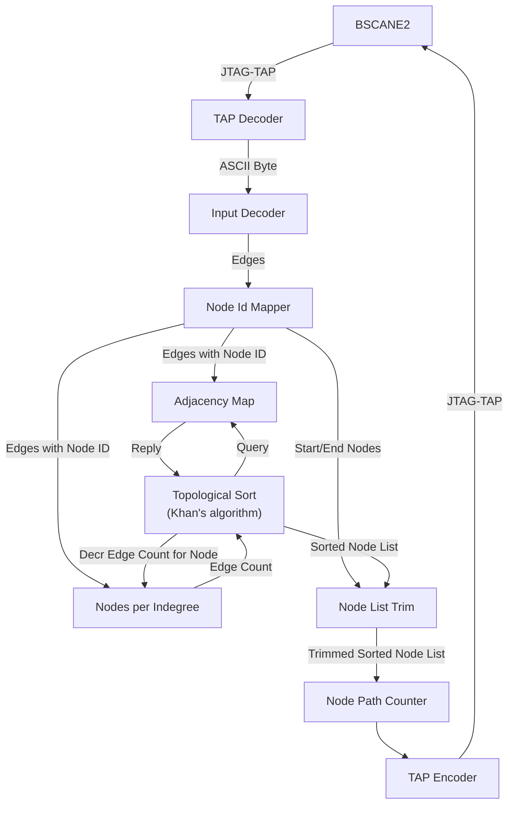

# Day 11: Reactor

# Design Space Exploration

## Input Data

File properties:

| Property     | Example | Input   |
| ------------ | ------- | ------- |
| Size (bytes) | 118     | 9815    |
| Rows         | 10      | 583     |
| Max Entries  | 3       | 24      |
| Unique IDs   | 26**3   | 26**3   |

Having a closer look at the file contents, we can derive the following important values:

- Device with the most connections: 24
- Average number of connections per device: 2.96

The average number of connections per device is two orders of magnitude smaller than the number of devices, meaning that the directed acyclic graph (DAG) is very sparse. In such cases it is strongly recommended to use an Adjacency List (AL) instead of an Adjacency Matrix (AM) for the graph representation of the incoming edges of each device. Furthermore a lookup table must be used for assigning increment IDs to each device.

## Derived Constants

Each row in the file corresponds to a unique device identifier. The device pointer width is derived from the number of lines.

| Constant          | Type    | Value   |
| ----------------- | ------- | ------- |
| MAX_DEVICES       | Integer | 1024    |
| DEVICE_ADDR_WIDTH | Integer | 10      |

Knowing the file length and the number of rows (ie. number of newline characters), we can calculate the number of devices listed in the file. Subtracting the length corresponding to the number of devices from the left hand side (LHS), we can calculate the number of connected devices listed in the file.

- File length: 9815 bytes
- Number of rows (newline chars): 583
- Device length + separator: (3 + 1) bytes
- Number of devices: (9815 - 583)/(3 + 1) = 2308
- LHS devices: 583
- RHS devices: 2308 - 583 = 1725
- Average RHS devices per row: 1725 / 583 = 2.96

For storing a map of output devices per each device a memory with a 11-bit wide data in order to store enough cells for all RHS devices.

| Constant           | Type    | Value   |
| ------------------ | ------- | ------- |
| DEV_MAP_ADDR_WIDTH | Integer | 15      |
| DEV_MAP_DATA_WIDTH | Integer | 11      |

A second memory is required for storing the list of connected devices. Conversingly, its address and data width are swapped from the device map.

| Constant            | Type    | Value   |
| ------------------- | ------- | ------- |
| DEV_LIST_ADDR_WIDTH | Integer | 11      |
| DEV_LIST_DATA_WIDTH | Integer | 15      |

# Computation Algorithm

Rather then going the conventional way of implementing a simple breadth-first search, I thought it would more interesting to design a bidirectional parallel strategy. This means doubling the storage requirements for the device map and list.

The first leg of the strategy involves populating the map between devices and a pointer corresponding to their first entry in the list, this logic is performed by the `node_id_mapper` module.

# Implementation Details

