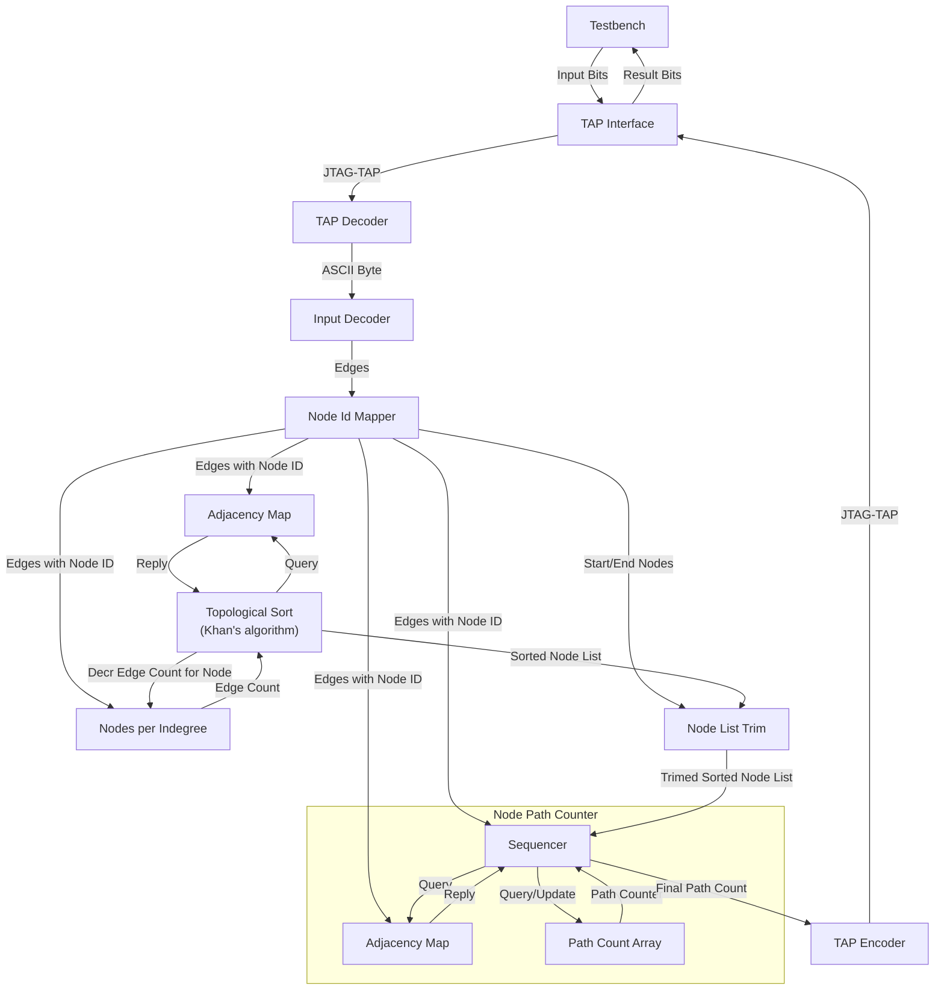

# Day 11: Reactor

# Design Space Exploration

## Input Data

The puzzle descriptions states the following key points, in which I emphasized details.

> Each line gives the name of a device, **the left-hand side (LHS)**, followed by **a colon `:`** and then a list of the devices **the right-hand side (RHS)** to which its outputs are attached.

```
kqg: kmt
amc: yge tez ckz
lgt: mvi lar xxm
xir: lkw
lvg: uey oau sag qzr ajd lof yvk lij jne oct mqi
egg: nmi
flf: wbz smt
```

The following is concluded after reviewing the example and cutom input data:

- LHS is a string of exactly three lower-case alphabetic characters
- RHS is a list of strings (separated by a single whitespace) each following the exact same rule as above
- LHS and RHS are separated by a colon followed by a single whitespace
- The length of the RHS is variable, never less than one and up to several dozens strings

## First Order Properties

As stated above, nodes are encoded on three ASCII characters corresponding to 24 bits of data. Being all lower-case alphabetic characters, they can be represented as three natural numbers in the range of 0 to 25 meaning **5 bits each**. This equates to a total of 15 bits or 32768 possible combinations.

- NODE_ASCII_WIDTH = 3*8 = 24
- NODE_ENCODED_WIDTH = 3*$clog2(26) = 15

The custom input file contains nearly 600 lines and about the same number of unique nodes. This means that 10 bits (1024 combinations) are sufficient to encode all unique nodes. A number of nodes have a first character far from the start of the alphabet, indicating that node strings are not contiguous. With less then 1024 nodes of a universe of 32768 possible combinations, the **density is very low** at under 3 %.

- NODE_INDEX_WIDTH = $clog2(1024) = 10

An other important metric is the total number of edges which connect two adjacent nodes (respectively *connections* and *devices* in the puzzle vernacular). Analyzing the custom input file using a Python script [`analyze_input.py`](analyze_input.py) yields a trove of information.

- MAX_EDGES = 2048
- EDGE_WIDTH = $clog2(MAX_EDGES) = 11
- MAX_EDGES_PER_NODE = 32
- EDGE_PER_NODE_CNT_WIDTH = $clog2(MAX_EDGES_PER_NODE) = 5

# Computation Algorithm

Rather than going down the beaten path of implementing a [depth-first search](https://en.wikipedia.org/wiki/Depth-first_search) (DFS), I was eager to try something different which I could learn from. I remember some Advent of Code puzzles from several years ago which required **dynamic programming** (DP) to be solved in reasonable time.

And boy! Looking for something challenging, implementing DP on an FPGA didn't disappoint :trollface:

# Implementation



| Module | Description | Complexity | Mindblowness | Remarks |
| --- | --- | --- | --- | --- |
| [`user_logic_tb`](user_logic_tb.sv) | Testbench | :green_circle: | :kissing_smiling_eyes: | Small refactor and misc improvements |
| [`user_logic`](user_logic.sv) | Logic top-level | :blue_circle: | :kissing_smiling_eyes: | Wire harness |
| [`tap_decoder`](tap_decoder.sv) | BSCANE2 interface for inbound signals | :blue_circle: | :kissing_smiling_eyes: | Copy-paste from previous puzzle |
| [`input_decoder`](input_decoder.sv) | Simple text parser | :green_circle: | :kissing_smiling_eyes: | Extra non-text char required for end-of-file flag |
| [`node_id_mapper`](node_id_mapper.sv) | Converts encoded (15-bit) node names into sequential identifiers | :yellow_circle: | :slightly_smiling_face: | Single-cycle lookup or new assignation |
| [`adjacency_map`](adjacency_map.sv) | Adjacent outbound nodes per node | :orange_circle: | :raised_eyebrow: | Backpressure with staged memories |
| [`indegree_list`](indegree_list.sv) | Track inbound edges per node | :green_circle: | :slightly_smiling_face: | Dual-port RAM |
| [`topological_sort`](topological_sort.sv) | Pipelined implementation of Kahn's algorithm | :black_circle: | :face_with_spiral_eyes: | Trouble with parallel requests/replies orchastration, late addition of backpressure |
| [`node_list_trim`](node_list_trim.sv) | Removed nodes preceeding a given start node | :green_circle: | :kissing_smiling_eyes: | Trivial |
| [`node_path_counter`](node_path_counter.sv) | Path counting using bottom-up dynamic programming | :red_circle: | :exploding_head: | Source code appears deceptively simple, waveforms not so much :upside_down_face: |
| [`tap_encoder`](tap_encoder.sv) | BSCANE2 interface for outbound signals | :blue_circle: | :kissing_smiling_eyes: | Copy-paste from previous puzzle | :kissing_smiling_eyes: |

## Take Aways

- Dynamic programming is astonishingly powerful, however it expects strict prerequisites such as acyclic and ordered input structure.
- A robust backpressure support will eventually be required for any moderately complex design when several query / replies are dispatched in parallel.
- Verilator is awesome.
