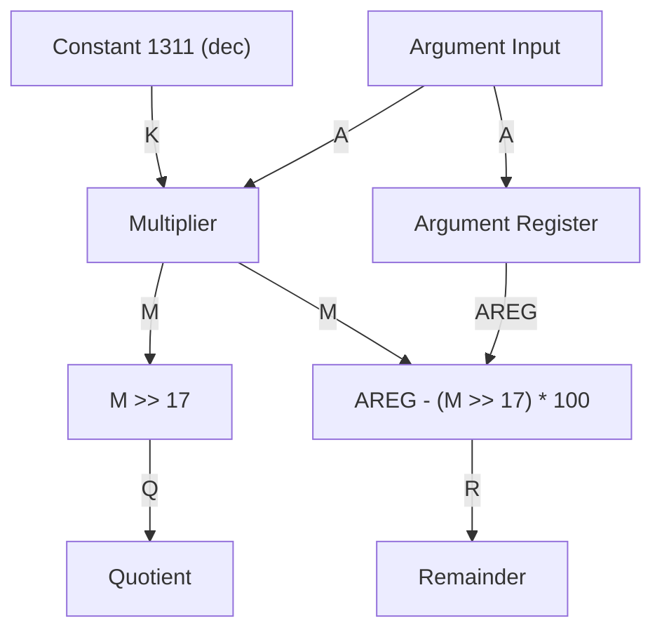
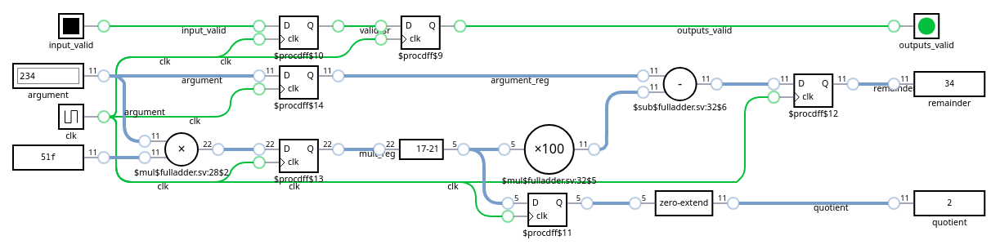
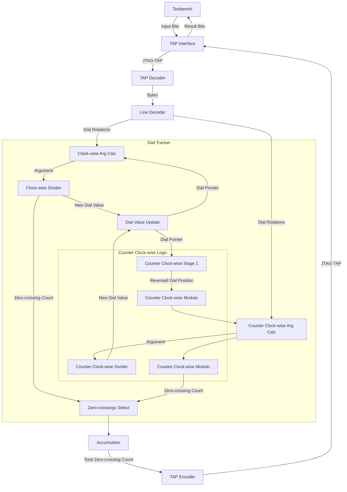

# Day 1: Secret Entrance - Part 2

# Lessons Learnt

- Signed arithmetics get complex quite fast, especially when mixed with fixed point multiplication. Using tricks or hacks for having to deal with natural numbers may be worth considering.

# Design Space Exploration

I created a Python script ([`explore.py`](explore.py)) for getting a sense of the puzzle input contents and appropriately size the FPGA implementation.

```
Performing Design Space Exploration...
Total: 4059 rotations
Clicks: min=1, max=996
```

The largest number of clicks per rotation is 996, thus a 10-bit unsigned integer is warranted.

# Implementation

## Content Decoding

Compared to [part 1](/25/1/), the puzzle solving logic can no longer take the shortcut of mirroring the counter-clockwise rotation to the corresponding clockwise rotation. Thus, the line contents decoding logic requires some amount of reworking.

The easiest approach would consist in adding a dedicated single-bit signal indicating the direction of rotation.

### Resource Usage

```
Module line_decoder
Detailed RTL Component Info :
+---Adders :
	   3 Input   10 Bit       Adders := 1
	   2 Input   10 Bit       Adders := 1
+---Registers :
	               10 Bit    Registers := 1
	                8 Bit    Registers := 1
	                1 Bit    Registers := 3
+---Multipliers :
	               4x10  Multipliers := 1
+---Muxes :
	   2 Input   10 Bit        Muxes := 1
	   2 Input    1 Bit        Muxes := 4
```

## Dial Tracker

I used a hack in the first part where instead of rotating counter-clockwise the dial, I moved clockwise by an amount computed for resulting in the same position.

$$CW_{steps} = 100 - CCW_{steps}$$

The solution in the second part requires counting the number of times the hundred boundary is crossed, this shortcut no longer works. This means that the functions `x % 100` and `x / 100` be implemented.

Assuming $$Clicks = Quotient*100 + Remainder$$ we get:

$$Quotient = \lfloor Clicks / 100 \rfloor = \lfloor Clicks \times \frac{1}{100} \rfloor$$

Since the max rotation is limited to three digits and assuming the dial position at 99 for the worst case scenario, a fixed-point multiplier followed by a right shift will do the job just fine and would be much faster then performing an euclidean division.

$$Quotient = \lfloor Clicks \times \frac{1}{100} \rfloor = Clicks \times \frac{M}{D} = (Clicks \times M) \gg \log_2 D$$

In practice the following table lists the constants for a divide by 100:

| Multiplier $$M$$ | Divider $$D$$ | Right Shift $$\log_2 D$$ | Error (ppm) |
|------------------|---------------|--------------------------|-------------|
| 164              | 16384         | 14                       | 976.56      |
| 328              | 32768         | 15                       | 976.56      |
| 656              | 65536         | 16                       | 976.56      |
| 1311             | 131072        | 17                       | 213.62      |

The error corresponds to the ratio of the difference between 1/100 and M/D divided by 1/100:

$$Error (ppm) = 10^6 \times \frac{\frac{1}{100} - \frac{M}{D}}{\frac{1}{100}}$$

The worst case corresponds to division of the highest possible value, which is 999 obtained from the puzzle contents inputs added to a dial position of 99. Thus:

$$Max Error(ppm) < 10^6 \times \frac{1}{999+99} = 910.74$$

According to the previous table, the appropriate values for the multiplier and divider are respectively 1311 and 131072 corresponding to right shift of 17.

For reference with a ppm value of 213.62, the maximum divisor argument is 1820 after which the division returns incorrect results:

$$Max Arg = 10^6 \times \frac{1}{213.62} = 4681.43$$

The core of the divider logic is:

```verilog
always_ff @(posedge clk) begin
    mult_reg <= MULT_WIDTH'(argument) * MULT_WIDTH'(MUILTIPLIER);

    quotient <= ARG_WIDTH'(mult_reg >> RIGHT_SHIFT);
    argument_reg <= argument;
    remainder <= ARG_WIDTH'(argument_reg - ((mult_reg >> RIGHT_SHIFT) * 7'd100));
end
```

The corresponding diagram helps illustrate understanding the logic:



This logic implements nicely:



Vivado picked-up the arithmetic operations and inferred DSPs:

```
DSP Final Report (the ' indicates corresponding REG is set)
+--------------------+-------------+--------+--------+--------+--------+--------+------+------+------+------+-------+------+------+
|Module Name         | DSP Mapping | A Size | B Size | C Size | D Size | P Size | AREG | BREG | CREG | DREG | ADREG | MREG | PREG | 
+--------------------+-------------+--------+--------+--------+--------+--------+------+------+------+------+-------+------+------+
|fixed_point_div_100 | (A*B)'      | 11     | 11     | -      | -      | 22     | 0    | 0    | -    | -    | -     | 0    | 1    | 
|fixed_point_div_100 | (C'-(A*B))' | 5      | 7      | 11     | -      | 11     | 0    | 0    | 1    | -    | -     | 0    | 1    | 
|fixed_point_div_100 | (A*B)'      | 11     | 11     | -      | -      | 22     | 0    | 0    | -    | -    | -     | 0    | 1    | 
|fixed_point_div_100 | (C'-(A*B))' | 5      | 7      | 11     | -      | 11     | 0    | 0    | 1    | -    | -     | 0    | 1    | 
|fixed_point_div_100 | ((A*B)')'   | 11     | 11     | -      | -      | 22     | 0    | 0    | -    | -    | -     | 1    | 1    | 
|fixed_point_div_100 | (A*B)'      | 11     | 11     | -      | -      | 22     | 0    | 0    | -    | -    | -     | 0    | 1    | 
|fixed_point_div_100 | (C'-(A*B))' | 5      | 7      | 11     | -      | 11     | 0    | 0    | 1    | -    | -     | 0    | 1    | 
+--------------------+-------------+--------+--------+--------+--------+--------+------+------+------+------+-------+------+------+
```

### Diagram



### Resource Usage

| Ref Name | Used | Functional Category |
|----------|------|---------------------|
| FDRE     |  153 |        Flop & Latch |
| LUT2     |   85 |                 LUT |
| LUT3     |   41 |                 LUT |
| CARRY4   |   23 |          CarryLogic |
| LUT4     |   20 |                 LUT |
| LUT6     |   12 |                 LUT |
| DSP48E1  |    7 |    Block Arithmetic |
| LUT5     |    3 |                 LUT |
| LUT1     |    2 |                 LUT |
| BUFG     |    1 |               Clock |
| BSCANE2  |    1 |              Others |

### Final Ratings

| Module                                          | Description                      | Complexity          | Thoughts       | Remarks  |
|-------------------------------------------------|----------------------------------|---------------------|----------------|----------|
| [`user_logic_tb`](user_logic_tb.sv)             | Testbench                        | :large_blue_circle: | :kissing_smiling_eyes: Copy-paste from previous puzzle | |
| [`user_logic`](user_logic.sv)                   | Logic top-level                  | :large_blue_circle: | :relaxed: Wire harness and trivial logic | |
| [`tap_decoder`](tap_decoder.sv)                 | JTAG TAP deserializer            | :large_blue_circle: | :kissing_smiling_eyes: Copy-paste from previous puzzle | |
| [`line_decoder`](line_decoder.sv)               | Converts bytes to dial clicks    | :large_blue_circle: | :relaxed: Simple decimal converter | Quite happy with the simple code and low resource usage |
| [`dial_tracker`](dial_tracker.sv)               | Calculates new dial position     | :red_circle:        | :face_with_head_bandage: Modulo arithmetics hurts | Had to pause for sizing the right amount of precision for the division by fixed point multiplication |
| [`fixed_point_div_100`](fixed_point_div_100.sv) | Converts bytes to tile positions | :yellow_circle:     | :hot_face: Simple decimal converter | Tried signed division computation, but thought better and worked around doing so :grin: |
| [`tap_encoder`](tap_encoder.sv)                 | JTAG TAP serializer              | :large_blue_circle: | :kissing_smiling_eyes: Copy-paste from previous puzzle | |
