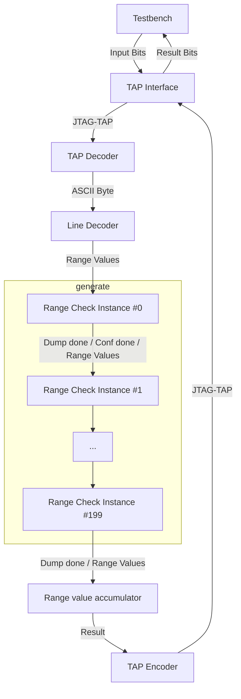

# Day 5: Cafeteria - Part 2

# Lessons Learnt

*To be completed*

# Implementation

The takeaway from reading the puzzle statement for the second part is the strong similarity between both parts of the puzzle.

## Line Decoder

Formerly `input_decoder`, I opted to rename it to `line_decoder` which better reflects its purpose. A key difference however is that the second part of the input contents is no longer relevant and thus must be discarded. I added an `end_of_line` flag which has proven to simplify quite a lot the end of processing detection logic.

## Core Algorithm: First (Bad) Attempt

> [!IMPORTANT]
> Algorithm below is flawed, skip to the next section for the final implementation.

The keyword in the second part of this puzzle is that **all of the IDs** must be detected, which is a significant departure from the first part which consisted of running a large list of given numbers.

My custom puzzle input contains large numbers requiring a 49 bits representation. Bruteforcing the solution would thus not be practical. Circling back to my implementation of the first part, I figured that a similar approach could work.

Imagining a simple setting:

```
.....AAAA...
....aAAAAa..
....a....a..
.....1234...
```

The core concept is to use not range but the immediates values off-by-one. Cascading these values down the chain of `range_check` units we get the extremes ranges left plus the ones from the intermediate `range_check` units.

```
.....AAAA...
...BBBB..a..
..b....b.a..
..b....b.a..
       ^
       Bad range value
```

The obvious problem here is that we are left by the intermediate ranges extremes coming from `range_check` later down the chain. My intuition is to run the process in reverse and correlate the range values which appear in both runs:

```
...BBBB.....
..b..AAAA...
..b.a....a..
..b.a....a..
    ^
    Bad range value


..b....b.a..     first run A before B
..b.a....a..     second run B before A`
correlate both values:
..b......a..     no more bad range values!
```

While thinking of how to simply arranging the flow of the range values my first thought was to execute two runs:

```
A -> B -> C
C -> B -> A
```

However this approach is subject to resource constraints: there was not much margin for the design to fit in the Zynq 7020 and the simulation runtimes, especially Icarus Verilog, were getting long (about a minute :grin:). Thinking more about the problem my intuition is that this problem is not associative, but rather cumlative (if this makes sense). This lead me to believe that running the data two times should result in the same results as running it once forward and once backward.

```
A -> B -> C -> A -> B -> C
```

The stop condition is simple: a counter at the end of the chain counts the number of range values which passed through. Conversely, the start condition is simply the end-of-file flag.

## Core Algorithm: Second Correct Attempt

Thinking things through, the purposed algorithms has some flaws which become quickly obvious. For starters, the trailing `range_check` units in the double loop implementation described above will have there range directly present in the final output. These ranges may very well be smaller then upstream ranges causing the results to be incorrect.

A better solution consists in merging ranges on the fly. Intuitively this requires that each `range_check` units see the complete merged ranges, resulting in two main steps:

- Configuration step where each module captures its own range values and once captured will try to opportunistically merge range values it receives afterwords.
- Dump step, where each module starting from the most upstream one will dump its own range, the module downstream also tries to opportunistically merge range values it receives during this dump phase.

I implemented this algorithm in the Python script [`explore.py`](explore.py). The remaining task is coming up with a RTL implementation.

## Results Discrepancy

Although running the simulation against `example.txt` yielded the expected results, this was no longer the case using `input.txt`.

Personally I find these situations the most interesting as they inevitably lead to find a bug lurking in the code and learn something new.

The expected and actual computed values are in the same ballpark, from experience bisecting the input data length until the discrepancy disappears is most likely the most efficient way for locating this issue.

| Inputs Lines | Expected        | Actual          | Difference    | Remarks   |
|--------------|-----------------|-----------------|---------------|-----------|
| 182          | 334714395325710 | 338813045514402 | 4098650188692 | Full size |
| 81           | 159495093305261 | 161283462775444 | 1788369470183 |           |
| 40           | 85871586883115  | 87659956353325  | 1788369470210 |           |
| 20           | 37630698286885  | 39419067757109  | 1788369470234 |           |
| 10           | 17110269629766  | 18898639100000  | 1788369470234 |           |
| 4            | 11730763334530  | 13519132804770  | 1788369470240 |           |
| 3            | 6655443634006   | 8443813104247   | 1788369470241 |           |
| 2            | 5887019659033   | 7675389129275   | 1788369470242 |           |
| 1            | 1788369470245   | 3576738940488   | 1788369470243 |           |

At least the bug shouldn't be hard to spot.

Having a look at the waveforms, the issue is obvious: unused `range_check` modules in the chain are not behaving as expected: instead of simply forwarding the ranges during the dump step, they capture the range as configuration data. The fix is straightforward.

```diff
always_ff @(posedge clk) begin: range_forward
    downstream_valid <= 1'b0;
    if (!upstream_conf_done) begin: configuration_phase
        if (range_set && upstream_valid) begin
            if (!range_overlap) begin: cfg_no_overlap
                downstream_valid <= 1'b1;
                downstream_lower_id <= upstream_lower_id;
                downstream_upper_id <= upstream_upper_id;
            end
        end
    end else if (!upstream_dump_done) begin: dump_phase
        if (upstream_valid) begin
-            if (!range_overlap) begin: dump_no_overlap
+            if (!range_set || !range_overlap) begin: dump_unset_or_no_overlap
                downstream_valid <= 1'b1;
                downstream_lower_id <= upstream_lower_id;
                downstream_upper_id <= upstream_upper_id;
            end
        end
    end else if (!range_dumped) begin: dump_done
+        range_dumped <= 1'b1;
        if (range_set) begin: dump_local_range
            downstream_valid <= 1'b1;
            downstream_lower_id <= lower_id;
            downstream_upper_id <= upper_id;
-            range_dumped <= 1'b1;
        end
    end else begin
        downstream_dump_done <= 1'b1;
    end
end
```

Following the fix, the results match the expected values!

## Icarus Verilog Support

When using a `genvar` to index an unpacked array, Iverilog appears to have trouble unrolling the logic into resolved members of the array. Conversely, it handles packed vectors fine.

```diff
-logic dump_done_array[0:RANGE_CHECK_INSTANCES];
-logic conf_done_array[0:RANGE_CHECK_INSTANCES];
-logic valid_array[0:RANGE_CHECK_INSTANCES];
+logic [RANGE_CHECK_INSTANCES:0] dump_done_array;
+logic [RANGE_CHECK_INSTANCES:0] conf_done_array;
+logic [RANGE_CHECK_INSTANCES:0] valid_array;
```

##Diagram



## Resource Usage

| Ref Name |  Used | Functional Category |
|----------|-------|---------------------|
| LUT4     | 58265 |                 LUT |
| FDRE     | 40527 |        Flop & Latch |
| CARRY4   |  5668 |          CarryLogic |
| LUT2     |  2028 |                 LUT |
| LUT3     |   599 |                 LUT |
| LUT6     |   410 |                 LUT |
| LUT5     |   407 |                 LUT |
| FDSE     |    82 |        Flop & Latch |
| LUT1     |     4 |                 LUT |
| BUFG     |     1 |               Clock |
| BSCANE2  |     1 |              Others |

Total LUT usage is stretching Vivado's legs (from `failfast.txt`):

| Criteria                                                  | Guideline | Actual | Status |
|-----------------------------------------------------------|-----------|--------|--------|
| LUT                                                       | 70%       | 77.84% | REVIEW |
| FD                                                        | 50%       | 38.17% | OK     |

### Final Ratings

| Module                                          | Description                      | Complexity          | Thoughts       | Remarks  |
|-------------------------------------------------|----------------------------------|---------------------|----------------|----------|
| [`user_logic_tb`](user_logic_tb.sv)             | Testbench                        | :large_blue_circle: | :kissing_smiling_eyes: Copy-paste from previous puzzle | |
| [`user_logic`](user_logic.sv)                   | Logic top-level                  | :green_circle:      | :raised_eyebrow: Unexpected issue with Icarus Verilog | |
| [`tap_decoder`](tap_decoder.sv)                 | JTAG TAP deserializer            | :large_blue_circle: | :kissing_smiling_eyes: Copy-paste from previous puzzle | |
| [`line_decoder`](line_decoder.sv)               | Converts bytes to ID ranges      | :green_circle:      | :pensive: Had to rework along the way | End result being much simpler |
| [`range_check`](range_check.sv)                 | Range capture / merge and dump   | :yellow_circle:     | :hot_face: Nearly got mixed up while trying to debug unexpected results | A FSM may have resulted in a simpler implementation |
| [`tap_encoder`](tap_encoder.sv)                 | JTAG TAP serializer              | :large_blue_circle: | :kissing_smiling_eyes: Copy-paste from previous puzzle | |
