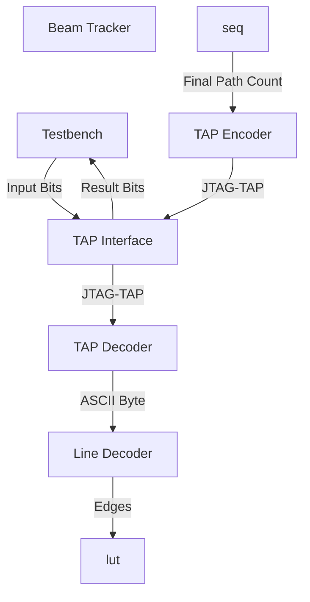

# Day 7: Laboratories

# Design Space Exploration

## Puzzle Description

> How many times will the beam be split?

The puzzle question is suspiciously short. However the example contains a twist.

```
.......S.......
.......|.......
......|^|......
......|.|......
.....|^|^|.....
.....|.|.|.....
....|^|^|^|....
....|.|.|.|....
...|^|^|||^|...
...|.|.|||.|...
..|^|^|||^|^|..
..|.|.|||.|.|..
.|^|||^||.||^|.
.|.|||.||.||.|.
|^|^|^|^|^|||^| <--.
|.|.|.|.|.|||.|    |
                   |
         ^---------+-- Non-effective splitter
```

A simple algorithm would consist in memorizing the prior line and counting columns containing both a beam and splitter.

## Input Data

The input data is a rectangular array of fixed number of rows and columns.

| Contents | Rows | Columns |
|----------|------|---------|
| Example  | 16   | 15      |
| Input    | 142  | 142     |

Ignoring the `S` character, only a few others are used:

| Character | Description |
|-----------|-------------|
| `S`       | First beam  |
| `^`       | Splitter    |
| `|`       | Beam        |
| `.`       | Empty       |

## Design Properties

One of every two rows is filled with blank `.` characters, meaning that only half the rows are effective. Conversely, all columns are effective. Using a binary representation of the beams and splitters, using **160** as the maximum number of supported columns makes the data value 40 hexstring digits long which is quite convininent.

- LINE_WIDTH: 160

Regarding the number of splitters, the final row is limited to half of the columns. The maximum number of splitters is therefore (142/2) * (142/2) / 2 = **2521**. Therefore, a 16-bit wide result is adequate.

- RESULT_WIDTH: 16

# Computation Algorithm

Considering the puzzle question:

```
How many times will the beam be split?
```

The keyword here is **split**, for which to occur two conditions must be met:

1. A beam must be present in the prior line at a given column.
2. A splitter must be present in the current line at the same column.

The heart of the logic is in the following snippets:

```verilog
assign activated_splitters = beams & line_data;
assign deactivated_splitters = ~beams & line_data;
assign unaffected_beams = beams & ~line_data;
```

The `line_data` vector represents the position of the splitters. Splitting a beam results in two beams being created, thus shifting left and right by a single bit. The initial split is a special case since the design starts with zero beams. Thus the first splitter is assumed to be always illuminated.

```verilog
always_ff @(posedge clk) begin
    if (line_valid) begin
        if (!(|beams)) begin: initial_splitter
            active_splitters_valid <= 1'b1;
            active_splitters_data <= line_data;
            beams <= (line_data << 1) | (line_data >> 1);
        end else begin: active_splitter
            active_splitters_valid <= 1'b1;
            active_splitters_data <= activated_splitters;
            beams <= unaffected_beams | (activated_splitters << 1) | (activated_splitters >> 1);
        end
    end else begin
        active_splitters_valid <= 1'b0;
        active_splitters_data <= '0;
    end
end
```

# Implementation



| Module | Description | Complexity | Mindblowness | Remarks |
| --- | --- | --- | --- | --- |
| [`user_logic_tb`](user_logic_tb.sv) | Testbench | :green_circle: | :kissing_smiling_eyes: | Small refactor and misc improvements |
| [`user_logic`](user_logic.sv) | Logic top-level | :large_blue_circle: | :kissing_smiling_eyes: | Wire harness |
| [`tap_decoder`](tap_decoder.sv) | BSCANE2 interface for inbound signals | :large_blue_circle: | :kissing_smiling_eyes: | Copy-paste from previous puzzle |
| [`line_decoder`](line_decoder.sv) | Simple text parser | :large_blue_circle: | :kissing_smiling_eyes: | Discards empty lines and detects end-of-file |
| [`beam_tracker`](beam_tracker.sv) | Memoize beam positions | :green_circle: | :exploding_head: | Evaluate beam and splitter intersections and perform left/right shifts |
| [`tap_encoder`](tap_encoder.sv) | BSCANE2 interface for outbound signals | :large_blue_circle: | :kissing_smiling_eyes: | Copy-paste from previous puzzle | :kissing_smiling_eyes: |

## Resource Usage

### Aggregate

| Ref Name | Used | Functional Category |
|----------|------|---------------------|
| FDRE     |  542 |        Flop & Latch |
| LUT3     |  335 |                 LUT |
| LUT6     |  281 |                 LUT |
| LUT4     |  189 |                 LUT |
| LUT5     |   50 |                 LUT |
| CARRY4   |   22 |          CarryLogic |
| LUT2     |   14 |                 LUT |
| LUT1     |    1 |                 LUT |
| BUFG     |    1 |               Clock |
| BSCANE2  |    1 |              Others |


### Module tap_decoder 

- Register `valid_reg` of size 1-bit
- Register `data_reg` of size 8-bit

### Module line_decoder 

- Register `end_of_file_reg` of size 1-bit
- Register `line_has_splitters_reg` of size 1-bit
- Register `line_valid_reg` of size 1-bit
- Comparator `char_is_splitter` of operand size {<const>, 8 Bit} at Line:35
- Register `line_data_reg` of size 160-bit

### Module beam_tracker 

- Register `active_splitters_valid_reg` of size 1-bit
- Register `beams_reg` of size 160-bit
- Register `active_splitters_data_reg` of size 160-bit

### Module tap_encoder 

- Register `data_r_reg` of size 16-bit
- Register `shift_reg_reg` of size 16-bit

### Module user_logic 

- Adder `outbound_data0` of operand size {1 Bit, 1 Bit, (...), 2 Bit, 16 Bit} at Line:77
- Register `outbound_data_reg` of size 16-bit
- Register `outbound_valid_reg` of size 1-bit
