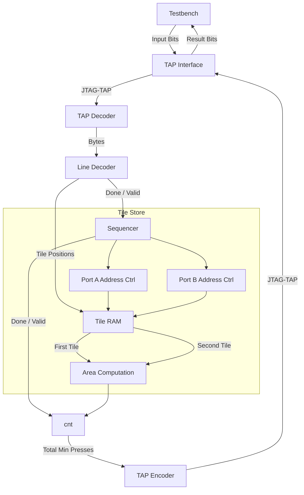

# Day 9: Movie Theater

# Lessons Learnt

- Different initial values is a common cause for synthesis / simulation mismatches. Also applies between simulators.

# Design Space Exploration

I created a Python script ([`explore.py`](explore.py)) for getting a sense of the puzzle input contents and appropriately size the FPGA implementation. Looking at the input data, instead of random points I noticed that the coordinates were presenting small differences which was changing ever so slightly. Plotting these points on a array I noticed that they formed a circular pattern.

```
Performing Design Space Exploration...
Total: 496 tiles
Rows: min=1650, max=98415
Cols: min=1706, max=98315
Max possible area: 9348369885 (bits=34)
..........oooooooooooooooooo............
.......oooo................ooooo........
.....ooo.......................ooo......
...ooo...........................ooo....
..oo...............................oo...
.oo.................................oo..
oo...................................oo.
o.....................................o.
o.....................................o.
o....................................ooo
o.....................................oo
o.....................................o.
oo...................................oo.
.oo.................................oo..
..ooo..............................oo...
....oo...........................ooo....
.....ooo.......................ooo......
.......ooooo...............ooooo........
...........ooooooooooooooooo............
....................o...................
```

Max row and column map 17-bit values and with a total of 496 points this will have no problem fitting in a FPGA RAM block.

Computing the area is simply a matter of subtracting, rectifying and multiplying the differences, without omitting adding an extra count (ie. the infamous *off-by-one* error).

# Implementation

## Content Decoding

First step is to copy-paste a cradle from an other puzzle implementation, on top of which I added a content parser ([`line_decoder`](line_decoder.sv)) specific to this puzzle.

### Resource Usage

|      Instance      |    Module    | Total LUTs | Logic LUTs | FFs |
|--------------------|--------------|------------|------------|-----|
| shell              |        (top) |        134 |        134 | 122 |
|   (shell)          |        (top) |          0 |          0 |   0 |
|   user_logic_i     |   user_logic |        134 |        134 | 122 |
|     (user_logic_i) |   user_logic |         52 |         52 |  17 |
|     line_decoder_i | line_decoder |         70 |         70 |  64 |
|     tap_decoder_i  |  tap_decoder |          2 |          2 |   9 |
|     tap_encoder_i  |  tap_encoder |         10 |         10 |  32 |

Specifically:

```
Detailed RTL Component Info : 
+---Adders : 
	   3 Input   18 Bit       Adders := 1     
+---Registers : 
	               18 Bit    Registers := 3     
	                8 Bit    Registers := 1     
	                1 Bit    Registers := 2     
+---Multipliers : 
	               4x18  Multipliers := 1     
+---Muxes : 
	   2 Input   18 Bit        Muxes := 1     
	   2 Input    1 Bit        Muxes := 5     
	   4 Input    1 Bit        Muxes := 3     
```

I expected seeing the x10 multiplier being converted in a x5 followed by a reassignation (left-shift by one), likely done later during optimization. For reference, I obtained the above results by adding some dummy computation for preserving the upstream logic from being pruned:

```diff
always_ff @(posedge tck) begin
    if (test_logic_reset) begin
        outbound_valid <= 1'b0;
        outbound_data <= '0;
    end else begin
        outbound_valid <= end_of_file;
+        if (tile_valid) begin
+            outbound_data <= outbound_data + $countones(tile_row) + $countones(tile_col);
+        end
    end
end
```

### Ratings

| Module                              | Description                      | Complexity          | Thoughts       | Remarks  |
|-------------------------------------|----------------------------------|---------------------|----------------|----------|
| [`user_logic_tb`](user_logic_tb.sv) | Testbench                        | :large_blue_circle: | :kissing_smiling_eyes: Copy-paste from previous puzzle | |
| [`user_logic`](user_logic.sv)       | Logic top-level                  | :large_blue_circle: | :relaxed: Wire harness and trivial logic | |
| [`tap_decoder`](tap_decoder.sv)     | JTAG TAP deserializer            | :large_blue_circle: | :kissing_smiling_eyes: Copy-paste from previous puzzle | |
| [`line_decoder`](line_decoder.sv)   | Converts bytes to tile positions | :large_blue_circle: | :relaxed: Simple decimal converter | Quite happy with the simple code and low resource usage |
| [`tap_encoder`](tap_encoder.sv)     | JTAG TAP serializer              | :large_blue_circle: | :kissing_smiling_eyes: Copy-paste from previous puzzle | |

## Contents Storage

As metioned earlier, the contents fit in 512 17-bit entries.

Got bitten by a behavior mismatch caused by different initial values for an enum type. Reordering the enum didn't change (although with non-init values all bets are off).

```diff
typedef enum logic [1:0] {
    TILE_FILLING,
    TILE_READBACK
} tile_mode_t;
-tile_mode_t addr_a_sel, prev_addr_a_sel;
+tile_mode_t addr_a_sel, prev_addr_a_sel = TILE_FILLING;

(...)

always_ff @(posedge clk) begin: addr_a_update
(...)
    prev_addr_a_sel <= addr_a_sel;
end

```

### Diagram



# Resource Usage

| Ref Name | Used | Functional Category |
|----------|------|---------------------|
| FDRE     |  263 |        Flop & Latch |
| LUT2     |  131 |                 LUT |
| LUT4     |  115 |                 LUT |
| LUT3     |   79 |                 LUT |
| CARRY4   |   59 |          CarryLogic |
| LUT6     |   30 |                 LUT |
| LUT5     |   21 |                 LUT |
| LUT1     |    5 |                 LUT |
| RAMB36E1 |    1 |        Block Memory |
| DSP48E1  |    1 |    Block Arithmetic |
| BUFG     |    1 |               Clock |
| BSCANE2  |    1 |              Others |

### Final Ratings

| Module                                              | Description | Complexity | Thoughts       | Remarks  |
|-----------------------------------------------------|-------------|------------|----------------|----------|
| [`user_logic_tb`](user_logic_tb.sv)                 | Testbench | :large_blue_circle: | :kissing_smiling_eyes: Copy-paste from previous puzzle | |
| [`user_logic`](user_logic.sv)                       | Logic top-level | :large_blue_circle: | :relaxed: Wire harness and trivial logic | |
| [`tap_decoder`](tap_decoder.sv)                     | BSCANE2 interface for inbound signals | :large_blue_circle: | :kissing_smiling_eyes: Copy-paste from previous puzzle | |
| [`line_decoder`](line_decoder.sv)                   | Converts bytes to tile positions | :large_blue_circle: | :kissing_smiling_eyes: Copy-paste from previous puzzle with trivial changes | |
| [`tile_store`](tile_store.sv)                       | Stores tile positions | :green_circle: | :thinking: Mismatch between Verilator and Iverilog | Different initial values for a non-explicit enum type |
| [`tap_encoder`](tap_encoder.sv)                     | BSCANE2 interface for outbound signals | :large_blue_circle: | :kissing_smiling_eyes: | Copy-paste from previous puzzle | :kissing_smiling_eyes: |
