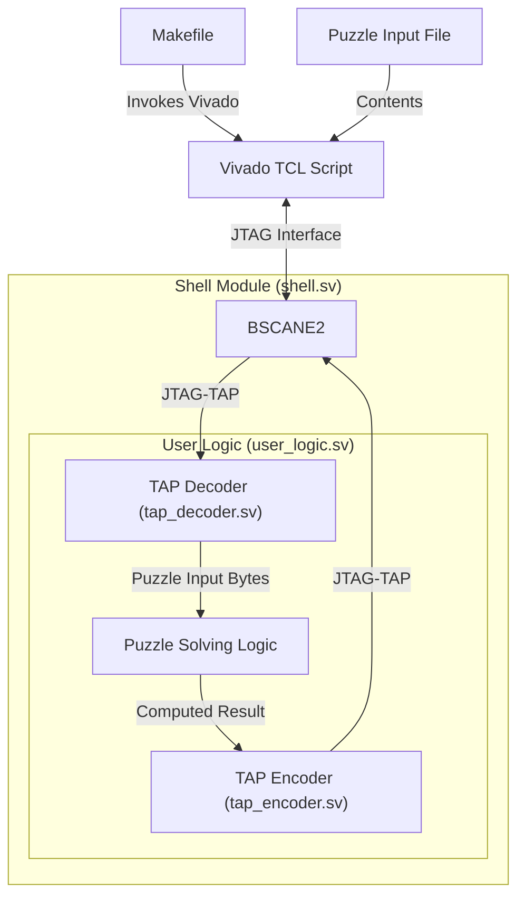

# Advent of Code on FPGA

Below are some designs solving select Advent of Code (AoC) puzzles.

## Design Philosophy

Each puzzle follows a common base structure illustrated below:



These implementations share the following common features:

- Source code in vanilla System Verilog
- The generated firmware can run on any board featuring a Xilinx 7-series FPGA, assuming the device density is enough to fit the design
- The source code **does not embedded the puzzle input contents**, meaning that changing the contents does not require re-building the firmware
- All the puzzles are solved in matter of seconds, be it on board or in simulation
  - Applicable for both simulation and synthesized firmware

## Porting to Other Targets

As mentioned earlier, the default target device is a Xilinx Zynq 7020. Due to the usage of a **BSCANE2** primitive, small changes may be required to port the design to UltraScale devices (if I recall correctly, these devices use a different BSCANE2 clock constraint: `INTERNAL_TCK`). For Versal families, the porting may be more involved with BSCANE2 primitives being superseded by the **CIPS** component.

Porting to other vendors should also be straightforward, as the design is written in System Verilog and the only primitive requiring instantiating is a JTAG TAP controller.

## Tools Used

- Text editors: Zed, VSCodium, PyCharm
- FPGA tools: Vivado 2025.2, [Yosys online schematic viewer](https://digitaljs.tilk.eu/)
- Simulators: Verilator 5, Icarus Verilog 12

## Getting Started

Apart from copy/paste issues, all the puzzles contain a makefile that supports the following commands.

### Simulation with Verilator

```
make sim [INPUT_FILE=filename]
```

- `INPUT_FILE`: puzzle contents input file, default is `input.txt` 

### Synthesis / configuration / execution with Vivado

```
make synth [VVD_MODE=batch] [PART=part] [VVD_TASK=task] [INPUT_FILE=filename]
```

- `VVD_MODE`: Vivado invocation mode, default `batch` 
- `PART`: FPGA targeted part, default is `xc7z020clg484-1`
- `VVD_TASK`: tasks executed in the `vivado.tcl`, default is `all` 
  - `all`: all tasks below
  - `build`: synthesis, pnr and bitstream generation
  - `program`: configures FPGA with current bitstream
  - `run`: `program`, load puzzle contents into the FPGA and readback results
  - `lint`: run the Vivado linting tool
- `INPUT_FILE`: puzzle contents input file, default is `input.txt` 

### Simulation with Icarus Verilog

Available in select puzzles.

```
make isim [INPUT_FILE=filename]
```

- `INPUT_FILE`: puzzle contents input file, default is `input.txt` 

# 2025 Season Puzzles

I opted to focus my efforts on the first part of the puzzles, thus most of them haven't the second part done.

| Puzzle           | Simulation                                  | Synthesis                                  | On-board                                        | Remarks                               |
|------------------|---------------------------------------------|--------------------------------------------|-------------------------------------------------|---------------------------------------|
| [1.1](25/1/)     | :yellow_circle: Design creation             | :green_circle: Integrate BSCANE2 primitive | :yellow_circle: Get familiar with JTAG TAP      | First attempts were rough 
| [1.2](25/1p2/)   | :yellow_circle: Modulo arithmetics          | :large_blue_circle: Synthesized right away | :large_blue_circle: Right out of the box        | Part 2
| [4.1](25/4/)     | :yellow_circle: Used smarter algorithm      | :large_blue_circle: Synthesized right away | :large_blue_circle: Right out of the box        | Two-dimensional neighboors comparison
| [5.1](25/5/)     | :large_blue_circle: Brute force approach    | :yellow_circle: Barely fits in a Zynq-7020 | :large_blue_circle: Right out of the box        | Comparison of value ranges
| [6.1](25/6/)     | :green_circle: Simple array-based design    | :yellow_circle: Some rework required       | :large_blue_circle: Right out of the box        | Arithmetics
| [7.1](25/7/)     | :large_blue_circle: Combinatorial algorithm | :large_blue_circle: Synthesized right away | :large_blue_circle: Right out of the box        | Binary graph
| [9.1](25/9/)     | :green_circle: Storage and readback         | :large_blue_circle: Synthesized right away | :green_circle: Initialy got a sim/syn mismatch  | Mismatch due to non initialized enum types 
| [10.1](25/10/)   | :red_circle: Forgot to check a blind side   | :large_blue_circle: Synthesized right away | :large_blue_circle: Initialy got a sim mismatch | Processing load fan-out accross multiple units making it running at line rate                              | 
| [11.1](25/11/)   | :black_circle: Hello *dynamic programming*  | :black_circle: cursed DPRAM inference      | :black_circle: Severe sim / synth mismatch      | DAG with bottom-up **dynamic programming** :exploding_head:

| Symbol              | Level       | Description      | Remarks                           |
|---------------------|-------------|------------------|-----------------------------------|
| :large_blue_circle: | Trivial     | Straightforward  | Copy-paste; wiring or basic logic |
| :green_circle:      | Easy        | No surprises     | Worked as expected                |
| :yellow_circle:     | Average     | Some thoughts    | Required multiple iterations
| :red_circle:        | Challenging | Serious thinking | Required some serious thinking |
| :black_circle:      | Tedious     | Cursed puzzle    | Much harder than expected; learnt something new

## Achivements

- Found an issue with the `run_state_hw_jtag` Vivado TCL command and opened a [support request](https://adaptivesupport.amd.com/s/question/0D5Pd00001772mvKAA/)
