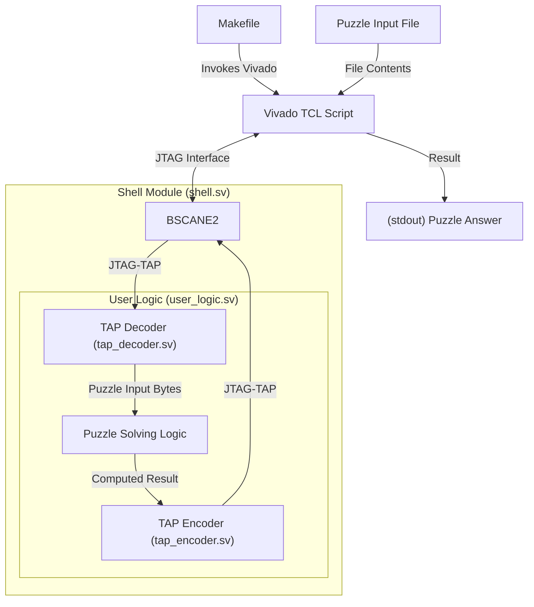

# Advent of Code on FPGA

Below are some designs solving select Advent of Code (AoC) puzzles.

## Design Philosophy

Each puzzle follows a common base structure illustrated below:



These implementations share the following common features:

- All the puzzle FPGA firmwares **only use the JTAG interface**. The `vivado.tcl` TCL script uses the `scan_dr_hw_jtag` command for transfering the puzzle input contents via a `BSCANE2` primitive instantiated in the firmware in the `shell.sv` top-level module
  - Puzzle contents are NOT embedded in the firmware bitstream
  - No UART interfaces are used
  - No IOs nor external clocks are used (see `constraints.xdc`), thus all the puzzle firmwares **are agnostic of the board**
- Source code in plain/vanilla SystemVerilog
- The puzzle firmwares can be built and run on any board featuring a Xilinx 7-series FPGA, assuming the device density is enough to fit the design
- All the puzzles are solved on-board in a fraction of seconds, simulating most of them takes a few seconds with Verilator (compilation times usually largely being a bit longer)

## Porting to Other Targets

The default target device is a Xilinx Zynq 7020. Different devices or families may have a different JTAG chains (with or without ARM DAP and PS TAP, single die or multi-SLR) resulting in different instruction register (IR) and data register (DR) lengths. Both are defined in the `vivado.tcl` script:

```tcl
set zynq7_ir_length 10; # must match FPGA device family / SLR count
set zynq7_ir_user4 0x3e3; # same thing
set zynq7_dr_length_byte 9; # zynq7: extra bit for ARM DAP bypass reg
```

Due to the usage of a **BSCANE2** primitive, small changes may be required to port the design to UltraScale devices (if I recall correctly, these devices use a different BSCANE2 clock constraint: `INTERNAL_TCK`). For Versal families, the porting may be more involved with BSCANE2 primitives being superseded by the **CIPS** component.

Porting to other vendors should also be straightforward, as the design is written in System Verilog and the only primitive requiring instantiating is a JTAG TAP controller and updating the three variables mentioned above.

## Tools Used

- Text editors: Zed, VSCodium, PyCharm
- FPGA tools: Vivado 2025.2, [Yosys online schematic viewer](https://digitaljs.tilk.eu/)
- Simulators: Icarus Verilog 12, Verilator 5, Vivado 2025.2 (xsim)
- VCD viewers: Surfer, Vaporview, GTKWave

## Getting Started

Each puzzle directory includes a Makefile supporting the following make targets.

### Simulation with Icarus Verilog

```
make isim [INPUT_FILE=input.txt]
```

- `INPUT_FILE`: puzzle contents input file, default is `input.txt` 

### Simulation with Verilator

```
make sim [INPUT_FILE=input.txt]
```

- `INPUT_FILE`: puzzle contents input file, default is `input.txt` 

### Simulation with Vivado Xsim

> [!NOTE]
> The Vivado xsim simuation target is only available on select puzzles (the ones in the [`15/`](/15/) directory).

```
make xsim [INPUT_FILE=input.txt]
```

- `INPUT_FILE`: puzzle contents input file, default is `input.txt` 

### Synthesis / configuration / execution with Vivado

```
make synth [VVD_MODE=batch] [PART=xc7z020clg484-1] [VVD_TASK=all] [INPUT_FILE=input.txt]
```

- `VVD_MODE`: Vivado invocation mode, default `batch` 
- `PART`: FPGA targeted part, default is `xc7z020clg484-1`
- `VVD_TASK`: tasks executed in the `vivado.tcl`, default is `all` 
  - `all`: all tasks below except `lint`
  - `build`: synthesis, pnr and bitstream generation
  - `program`: configures FPGA with current bitstream
  - `run`: `program`, load puzzle contents into the FPGA and readback results
  - `lint`: run the Vivado linting tool
- `INPUT_FILE`: puzzle contents input file, default is `input.txt` 

### Python Exploration Script

Available in select puzzles.

```
explore.py [filename]
```

- `filename`: puzzle contents input file, default is `input.txt` 

# Puzzles

## 2025 Season

I opted to focus my efforts on the first part of the puzzles, thus most of them haven't the second part done.

| Puzzle           | Simulation                                  | Synthesis                                  | On-board                                        | Remarks                               |
|------------------|---------------------------------------------|--------------------------------------------|-------------------------------------------------|---------------------------------------|
| [1.1](25/1/)     | :yellow_circle: Design creation             | :green_circle: Integrate BSCANE2 primitive | :yellow_circle: Get familiar with JTAG TAP      | First attempts were rough 
| [1.2](25/1p2/)   | :yellow_circle: Modulo arithmetics          | :large_blue_circle: Synthesized right away | :large_blue_circle: Right out of the box        | Part 2
| [4.1](25/4/)     | :yellow_circle: Used smarter algorithm      | :large_blue_circle: Synthesized right away | :large_blue_circle: Right out of the box        | Two-dimensional neighboors comparison
| [5.1](25/5/)     | :large_blue_circle: Brute force approach    | :yellow_circle: Barely fits in a Zynq-7020 | :large_blue_circle: Right out of the box        | Comparison of value ranges
| [5.2](25/5p2/)   | :yellow_circle: Wrong initial intuition     | :green_circle: Barely fits in a Zynq-7020  | :large_blue_circle: Right out of the box        | Part 2
| [6.1](25/6/)     | :green_circle: Simple array-based design    | :yellow_circle: Some rework required       | :large_blue_circle: Right out of the box        | Arithmetics
| [7.1](25/7/)     | :large_blue_circle: Combinatorial algorithm | :large_blue_circle: Synthesized right away | :large_blue_circle: Right out of the box        | Binary graph
| [9.1](25/9/)     | :green_circle: Storage and readback         | :large_blue_circle: Synthesized right away | :green_circle: Initialy got a sim/syn mismatch  | Mismatch due to non initialized enum types 
| [10.1](25/10/)   | :red_circle: Forgot to check a blind side   | :large_blue_circle: Synthesized right away | :large_blue_circle: Initialy got a sim mismatch | Processing load fan-out accross multiple units making it running at line rate                              | 
| [11.1](25/11/)   | :black_circle: Hello *dynamic programming*  | :black_circle: cursed DPRAM inference      | :black_circle: Had to fix sim / synth mismatch  | DAG with bottom-up **dynamic programming** :exploding_head:

## 2015 Season

Figured I shall start from the ground up.

| Puzzle           | Simulation                                  | Synthesis                                  | On-board                                        | Remarks                               |
|------------------|---------------------------------------------|--------------------------------------------|-------------------------------------------------|---------------------------------------|
| [1.1](15/1-1/)   | :large_blue_circle: Added Xilinx Xsim       | :large_blue_circle: Synthesized right away | :large_blue_circle: Right out of the box        | Didn't expect xsim to be so pedantic  |
| [1.2](15/1-2/)   | :large_blue_circle: Simple changes          | :large_blue_circle: Synthesized right away | :large_blue_circle: Right out of the box        | Easiest part 2                        |
| [2.1](15/2-1/)   | :large_blue_circle: Math ops pipelining     | :large_blue_circle: Synthesized right away | :large_blue_circle: Right out of the box        | Read description a bit too fast       |
| [2.2](15/2-2/)   | :large_blue_circle: Math ops pipelining     | :large_blue_circle: Synthesized right away | :large_blue_circle: Right out of the box        | Even easier part 2       |
| [3.1](15/3-1/)   | :large_blue_circle: Quite simple            | :large_blue_circle: Synthesized right away | :large_blue_circle: Right out of the box        | Completely overhauled the JTAG TAP serialization logic |
| [3.2](15/3-2/)   | :green_circle: Got a reset corner-case      | :large_blue_circle: Synthesized right away | :large_blue_circle: Right out of the box        | Mismatch from reset handling |

## Symbology

| Symbol              | Level       | Description      | Remarks                           |
|---------------------|-------------|------------------|-----------------------------------|
| :large_blue_circle: | Trivial     | Straightforward  | Copy-paste; wiring or basic logic |
| :green_circle:      | Easy        | No surprises     | Worked as expected                |
| :yellow_circle:     | Average     | Some thoughts    | Required multiple iterations
| :red_circle:        | Challenging | Serious thinking | Required some serious thinking |
| :black_circle:      | Tedious     | Cursed puzzle    | Much harder than expected; learnt something new

## Achievements

- Found an issue with the `run_state_hw_jtag` Vivado TCL command and opened a [support request](https://adaptivesupport.amd.com/s/question/0D5Pd00001772mvKAA/)
