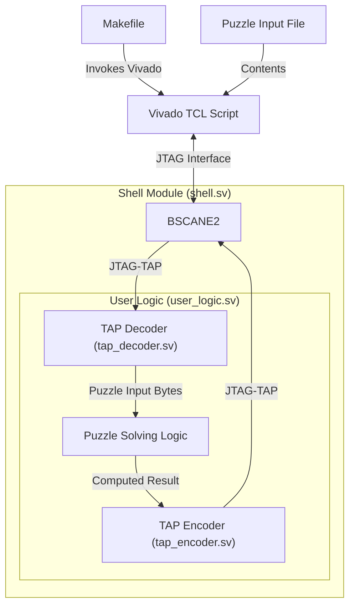

# Advent of Code on FPGA

Below are some designs solving select Advent of Code (AoC) puzzles.

## Design Philosophy

These implementations share the following common features:

- Written in System Verilog
- The input contents are NOT embedded but read from the testbench or TCL script. **The same firmware is capable of processing all inputs**.
- Simulated using [Verilator](https://www.veripool.org/verilator)
- Synthesized using [Vivado](https://www.xilinx.com/products/design-tools/vivado.html)

## Porting to Other Targets

The only vendor primitive used for synthesis is the **BSCANE2**, which allows JTAG TAP access to the user logic design. Most other vendors offer a similar primitives.

Same remark with the TCL script used for generating the bitstream, although Xilinx specific porting to a different vendor should not be difficult.

# 2025 Season Puzzles

| Puzzle         | Simulation | Synthesis  | On-board | Remarks |
| -------------- | ---------- | ---------- | -------- | ------- |
| [1.1](25/1/)   | ⭐⭐⭐ Done | ⭐⭐ Done | ⭐ Done |
| 2.1            | ⏳         | ⏳         | ⏳       | Repeating pattern matching
| 3.1            | ⏳         | ⏳         | ⏳       | Char sweep and comparison
| [4.1](25/4/)   | ⭐⭐ Done  | ⭐ Done    | ⭐⭐ Done | Two-dimensional neighboors comparison
| [5.1](25/5/)   | ⭐ Done    | ⭐ Done    | ⭐ Done   | Comparison of value ranges
| [6.1](25/6/)   | ⭐ Done    | ⭐⭐ Done  | ⭐ Done   | Arithmetics
| 7.1            | ⏱         | ⏳         | ⏳        | Binary graph
| 8.1            | ⏳         | ⏳         | ⏳        | 
| 9.1            | ⏳         | ⏳         | ⏳        | 
| 10.1           | ⏳         | ⏳         | ⏳        | 
| [11.1](25/11/) | :face_with_spiral_eyes: Done         | :face_with_spiral_eyes: ⏱ | :sob: ⏱        | DAG with bottom-up **dynamic programming** :exploding_head:

## Achivements

- Found an issue with the `run_state_hw_jtag` Vivado TCL command and opened a [support request](https://adaptivesupport.amd.com/s/question/0D5Pd00001772mvKAA/)

| Tag | Description
| --- | ---
| ⏳ | Not started
| ⏱ | In progress
| ⭐ | Like a breaze
| ⭐⭐ | Had to give some thoughts
| ⭐⭐⭐ | Challenging
| ⭐⭐⭐⭐ | Mind-blowing
