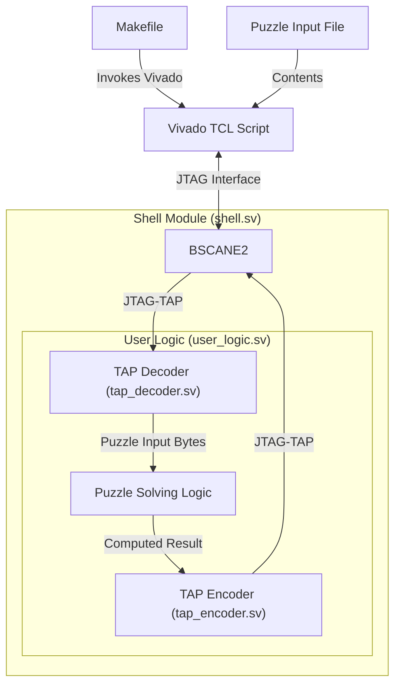

# Advent of Code on FPGA

Below are some designs solving select Advent of Code (AoC) puzzles.

## Design Philosophy

These implementations share the following common features:

- Written in plain System Verilog
- Puzzle input contents are NOT embedded but read from the testbench or TCL script
  - **The same firmware** is capable of processing all input (example, inputs from different accounts)
  - Applicable for both simulation and synthesized firmware
- Simulated using [Verilator](https://www.veripool.org/verilator)
  - Some puzzles also add [Icarus Verilog](http://iverilog.icarus.com/) target for 4-state (with `x` and `z` states) logic simulation, helpful for debugging initial behavior
- Synthesized using [Vivado](https://www.xilinx.com/products/design-tools/vivado.html), all firmwares can be built targeting license-free FPGAs (eg. Zynq 7020)

## Porting to Other Targets

The only vendor primitive used for synthesis is the **BSCANE2**, which allows JTAG TAP access to the user logic design. Most other vendors offer a similar primitives.

Same remark with the TCL script used for generating the bitstream, although Xilinx specific porting to a different vendor should not be difficult.

# 2025 Season Puzzles

Unless stated otherwise, I focused only the first part of the following puzzles.

| Puzzle         | Simulation                                  | Synthesis                                  | On-board                                   | Remarks                               |
|----------------|---------------------------------------------|--------------------------------------------|--------------------------------------------|---------------------------------------|
| [1.1](25/1/)   | :yellow_circle: Design creation             | :green_circle: Integrate BSCANE2 primitive | :yellow_circle: Get familiar with JTAG TAP | First attempts were rough 
| 2.1            | *To be done*                                | *To be done*                               | *To be done*                               | Repeating pattern matching
| 3.1            | *To be done*                                | *To be done*                               | *To be done*                               | Char sweep and comparison
| [4.1](25/4/)   | :yellow_circle: Used smarter algorithm      | :large_blue_circle: Synthesized right away | :large_blue_circle: Right out of the box   | Two-dimensional neighboors comparison
| [5.1](25/5/)   | :large_blue_circle: Brute force approach    | :yellow_circle: Barely fits in a Zynq-7020 | :large_blue_circle: Right out of the box   | Comparison of value ranges
| [6.1](25/6/)   | :green_circle: Simple array-based design    | :yellow_circle: Some rework required       | :large_blue_circle: Right out of the box   | Arithmetics
| [7.1](25/7/)   | :large_blue_circle: Combinatorial algorithm | :large_blue_circle: Synthesized right away | *To be done*                               | Binary graph
| 8.1            | *To be done*                                | *To be done*                               | *To be done*                               | 
| 9.1            | *To be done*                                | *To be done*                               | *To be done*                               | 
| 10.1           | *To be done*                                | *To be done*                               | *To be done*                               | 
| [11.1](25/11/) | :black_circle: Hello *dynamic programming*  | :black_circle: cursed DPRAM inference      | *To be done* :black_circle: Severe sim / synth mismatch | DAG with bottom-up **dynamic programming** :exploding_head:

| Symbol              | Level       | Description      | Remarks                           |
|---------------------|-------------|------------------|-----------------------------------|
| :large_blue_circle: | Trivial     | Straightforward  | Copy-paste; wiring or basic logic |
| :green_circle:      | Easy        | No surprises     | Worked as expected                |
| :yellow_circle:     | Average     | Some thoughts    | Required multiple iterations
| :red_circle:        | Challenging | Serious thinking | Required some serious thinking |
| :black_circle:      | Tedious     | Cursed puzzle    | Much harder than expected; learnt something new

## Achivements

- Found an issue with the `run_state_hw_jtag` Vivado TCL command and opened a [support request](https://adaptivesupport.amd.com/s/question/0D5Pd00001772mvKAA/)
